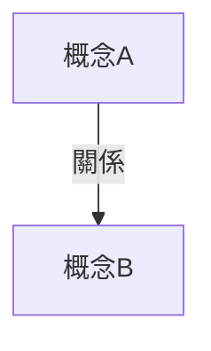

# {{主題}}

## 💡 為什麼要學？（Start with Why）
> 先想「為什麼」，再學「是什麼」——點燃動機與好奇心。
> - **回答什麼問題／解決什麼困惑**：學這個是為了搞懂什麼？
> - **用在哪裡**：生活中、其他科目、未來（升學/職涯/看世界的角度）。
> - **學會的價值**：能讓你看懂什麼、做到什麼、想通什麼？
> - 一個勾起好奇的鉤子（驚奇事實／反直覺提問）。
> ⚠️ 應用與好處必須真實，不為了動機而誇大或杜撰（內容檢查會驗證）。

## 📌 一句話總結
> 用一句話講完整個主題的核心，讓孩子閉眼就能想起。

## 🎯 核心概念
- 概念一：……
- 概念二：……
（條列，每點一句，避免長段落）

## 🗺 圖解
> 用一張 Mermaid 圖把關係視覺化（流程/狀態/時序/心智圖/圓餅/時間軸/類別）。
> 節點含中文或括號標點時，文字務必用 "..." 包住，確保 Obsidian 能渲染。

## 🌏 生活連結（記憶錨點）
> 名師風格 Agent 在此放生活化比喻。⚠️ 比喻必須通過內容檢查，不能建立錯誤直覺。

## 🧠 記憶法 / 口訣
- 口訣：……
- 圖像／聯想：……

## ⭐ 考試重點
- [ ] **必背**：公式 / 定義 / 年代……
- [ ] **常考題型**：……
- [ ] **學測落點**：（哪一冊、近年是否考過）

## ⚠️ 易錯點 / 陷阱
- 易混淆：A 與 B 的差別在……
- 常見錯誤：……

## 🔗 跨科連結
- [[向量]]（牛頓力學用到向量分解）
- [[相關主題]]

## 📝 一分鐘自我檢測
> 先遮住下方答案，自己想，再對照。
1. Q：……？　A：……
2. Q：……？　A：……
3. Q：……？　A：……

---
> 📋 待確認項（內容檢查 Agent 填寫，人工複核後刪除）：
> -
