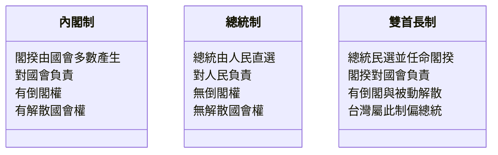

# 政府體制比較

## 💡 為什麼要學？（Start with Why）
> 為什麼有些國家總統權力超大，有些國家總統只是「橡皮圖章」？為什麼台灣常吵「閣揆該聽總統還是聽國會」？搞懂政府體制，你就能看懂新聞裡的政治攻防、知道自己手上那張選票到底在選什麼、也更能判斷一個制度為何卡住或運作順暢。這不只是考題——是你身為公民，理解社會怎麼運轉、權力如何被制衡的基礎。

## 📌 一句話總結
> 政府體制的核心差別全看「行政權對誰負責」——對國會負責是內閣制、對人民負責是總統制、兩邊都沾是雙首長制，而台灣是偏總統的雙首長制。

## 🎯 核心概念
- 內閣制：行政權（內閣）由國會多數黨組成，閣揆對國會負責，國會可倒閣、內閣可解散國會，行政與立法合一。
- 總統制：總統由人民選出，身兼國家元首與行政首長，與國會分立制衡，任期固定；原則上國會不能倒閣、總統不能解散國會。
- 雙首長制（半總統制）：總統民選且有實權，同時設有對國會負責的內閣（閣揆），行政權由總統與閣揆共享。
- 權力分立程度：總統制最徹底、內閣制行政立法合一、雙首長制介於兩者之間。
- 台灣現行體制：總統民選、行政院長由總統任命且毋須立法院同意、立法院可提不信任案（倒閣）、總統可被動解散立法院——通說歸為「偏總統制的雙首長制」。

## 🗺 圖解
> 三制當「類別」、特徵當「屬性」一眼對照。

## 🌏 生活連結（記憶錨點）
> 把國家想成一家公司：
> - 內閣制＝董事會（國會）選出 CEO（閣揆），幹不好董事會直接換人（倒閣）。
> - 總統制＝股東（人民）直接票選 CEO（總統），董事會不能中途開除，只能任期到了再選。
> - 雙首長制＝股東選了董事長（總統），董事長再指派 CEO（閣揆）管營運，權力兩人分。
> ⚠️ 比喻破功處：公司 CEO 可隨時被解雇，但總統任期固定、只有彈劾（極高門檻）能拉下台；且政府三權分立是為防濫權的「制衡」，不是單純上下指揮。

## 🧠 記憶法 / 口訣
- 三制一句記：「**內閣靠國會、總統靠人民、雙首長兩邊靠**」。
- 倒閣＋解散成對出現 ＝ 偏內閣精神（內閣制、雙首長制有；純總統制沒有）。
- 台灣定位：「**民選總統、任命閣揆、立院倒閣、總統解散**」四件事一背就定位成雙首長制。

## ⭐ 考試重點
- [ ] **必背**：三制對照表（行政首長產生方式、對誰負責、有無倒閣權、有無解散國會權、行政立法關係）。
- [ ] **必背**：台灣四大制度特徵（總統直選、閣揆由總統任命無須立院同意、倒閣、總統被動解散立院）。
- [ ] **常考題型**：給情境/新聞判斷屬何體制；台灣體制歸類爭議；「覆議」vs「不信任案」的區別。

## ⚠️ 易錯點 / 陷阱
- 「總統由人民選」就當總統制？錯——雙首長制總統也民選，關鍵看有無「對國會負責的閣揆＋倒閣機制」。
- 倒閣（不信任案，政治責任、門檻較低、內閣總辭）vs 彈劾（法律責任、門檻極高）。
- 解散國會（針對國會）vs 罷免/彈劾總統（針對總統）。
- 台灣行政院長修憲後已不需立法院同意（1997 年第四次修憲，憲法增修條文第 3 條第 1 項：由總統任命之）。
- 雙首長制 ≠ 總統與閣揆權力對等，台灣偏總統優位。

## 🔗 跨科連結
- [[憲法與修憲程序]]
- [[選舉與民主參與]]
- [[戰後台灣的民主化]]

## 📝 一分鐘自我檢測
> 先遮答案再想。
1. Q：「行政首長由國會多數黨產生、對國會負責、國會可倒閣」是哪種體制？　A：內閣制。
2. Q：總統民選且任期固定、國會無權倒閣、總統無權解散國會，是哪一制？　A：總統制。
3. Q：倒閣和彈劾差在哪？　A：倒閣追究政治責任、門檻較低、結果內閣總辭；彈劾追究違法失職的法律責任、門檻極高。

---
> 📋 待確認項（內容檢查 Agent 填寫，人工複核後刪除）：
> - 【低風險，語用問題】課綱／課本對台灣體制的標準稱呼。學界與課本常見「雙首長制」「半總統制」「改良式雙首長制」並用，本筆記已並列「雙首長制（半總統制）」，請人工確認所用版本教科書的主用詞。來源：總統府憲法簡介稱「改良式的雙首長制」https://www.president.gov.tw/Page/328
> - 【已查證，供人工複核】台灣機制條文細節已核對無誤：行政院長由總統任命不需立院同意＝增修條文第 3 條第 1 項；倒閣（不信任案）＝增修條文第 3 條第 2 項第 3 款（全體立委 1/3 連署提案、1/2 通過，閣揆 10 日內辭職並得同時呈請總統解散立院）；總統解散立院須以「倒閣案通過」為前提＝增修條文第 2 條第 5 項。皆為 1997 年第四次修憲後現行條文。來源：全國法規資料庫 https://law.moj.gov.tw/LawClass/LawAll.aspx?pcode=A0000002
> - 【建議補充，非錯誤】「冊別代碼」欄位本筆記未標（front-matter 僅有「課綱對應」），如需對應冊別請人工補上。
>
> 【內容檢查 Agent 註記】Mermaid 已驗：classDiagram 語法正確，類別名與成員均為純中文、無括號等特殊字元，可於 Obsidian 渲染；類型選用尚可（以「類別＋屬性」呈現三制對照），未發現誤導。逐字校對未發現錯別字、用詞混淆、單位或全半形問題。Why 段宣稱（看懂政治新聞、理解選票與制衡）屬實、不誇大。
