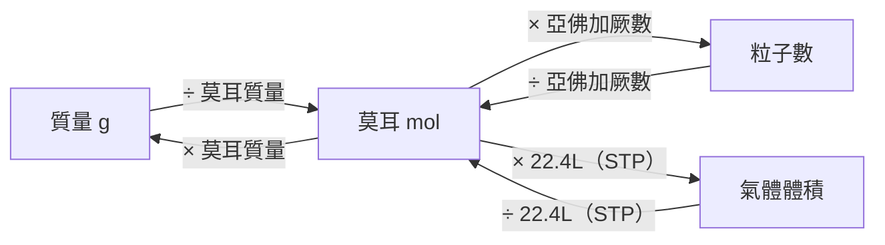

# 莫耳與化學計量

## 💡 為什麼要學？（Start with Why）
> 原子小到不可能一顆顆數，化學家怎麼知道一杯水裡有幾顆分子？靠「莫耳」這個超大包裝單位。莫耳是所有化學計算的橋樑——配藥劑量、工廠配方、空污濃度都靠它換算。搞懂莫耳，化學計算從此有一條通用的換算路，不再是背不完的公式。

## 📌 一句話總結
> 莫耳是化學家用來「數原子分子」的計量單位，把肉眼看不到的微觀粒子換算成磅秤量得到的克數，是貫穿所有化學計算的橋樑。

## 🎯 核心概念
- 1 莫耳 = 亞佛加厥數個粒子 = 6.02 × 10²³ 個（部分版本用 6.022 × 10²³）。
- 莫耳質量（g/mol）數值上等於該物質的原子量或分子量。
- 物質的量(mol) = 質量(g) ÷ 莫耳質量(g/mol)。
- 粒子數 = 莫耳數 × 亞佛加厥數。
- 氣體在 STP（0°C、1 atm）下，1 莫耳氣體體積約 22.4 L（屬必修化學核心）。
- 化學式（實驗式/分子式）由各元素莫耳比推得：質量百分比→莫耳數→最簡整數比。
- 平衡反應式中的係數比 = 反應物與生成物的莫耳數比，是計量計算核心。

## 🗺 圖解
> 換算中樞：莫耳是質量、粒子數、氣體體積之間的轉運站。

## 🌏 生活連結（記憶錨點）
> - 「莫耳」像「一打＝12 個」「一令紙＝500 張」，只是這包特別大，一包 6.02 × 10²³ 個。化學家不可能一顆顆數原子，故用「莫耳」這個超大包裝點貨。
> - 換算像「換匯」：粒子數、莫耳數、質量、氣體體積是四種貨幣，莫耳是中央銀行，所有兌換都要先換成莫耳。
> ⚠️ 比喻破功處：「一打」裡每個一樣大，但不同物質「1 莫耳」質量不同（1 mol 水 18 g、1 mol 鐵 56 g）——莫耳數相同不代表質量/體積相同；22.4 L 也僅在特定溫壓、近似理想氣體時成立，液固體不適用。

## 🧠 記憶法 / 口訣
- 換算心法：「**質量 ÷ 莫耳質量 = 莫耳；莫耳 × 亞佛加厥 = 粒子**」——先問手上是哪種貨幣、要換到哪種，中間一定經過莫耳。
- 求實驗式四步：「**百分變克、克變莫耳、莫耳求比、比化整數**」。
- 反應式計量：「**先平衡、找已知、看係數、算未知**」。

## ⭐ 考試重點
- [ ] **必背**：亞佛加厥數 6.02 × 10²³、莫耳三大換算（質量 ↔ 莫耳 ↔ 粒子數）。
- [ ] **常考題型**：質量↔莫耳↔粒子數互換、實驗式與分子式推導、由反應式求產物量、氣體體積計量、實驗數據算莫耳數。
- [ ] **高頻**：限量試劑——先各自換莫耳、除以係數比較，數值小者為限量試劑。

## ⚠️ 易錯點 / 陷阱
- 「分子數」vs「原子數」：1 mol O₂ 有 6.02×10²³ 個 O₂ 分子，但有 2×6.02×10²³ 個 O 原子。
- 質量要「除以」莫耳質量（不是乘）。
- 實驗式 ≠ 分子式：實驗式只給最簡整數比，需用分子量÷實驗式量求倍數（CH₂O → 葡萄糖 C₆H₁₂O₆）。
- 22.4 L 套在非 STP 或液固體 → 錯。
- 限量試劑誤以為「質量少的就是」，須換莫耳再除係數比較。

## 🔗 跨科連結
- [[原子結構與週期表]]
- [[化學反應式與平衡]]
- [[科學記號與指數律]]

## 📝 一分鐘自我檢測
> 先遮答案再想。
1. Q：18 g 水（分子量18）有幾莫耳？幾個水分子？　A：1 mol；6.02×10²³ 個。
2. Q：含碳40%、氫6.7%、氧53.3%，求實驗式。　A：C:40/12≈3.33、H:6.7、O:53.3/16≈3.33 → 1:2:1 → CH₂O。
3. Q：N₂+3H₂→2NH₃，有 2 mol N₂ 與 3 mol H₂，何者限量？　A：N₂ 需 6 mol H₂，只有 3 mol，故 H₂ 為限量試劑。

---
> 📋 複核紀錄：
> - ✅【已確認｜2026-06-28 人工複核】莫耳（莫耳濃度、氣體體積 22.4 L）與化學計量（限量試劑）在 108 課綱**屬「必修化學」核心，非選修延伸**——它們是高二、高三選修化學（氣體定律、熱化學、酸鹼滴定、平衡常數）的地基；地基不穩，後續選修無法推進。frontmatter 定位「必修」正確，本筆記範圍無誤。
> - 〔次要待確認〕學測自然科是否於卷末附原子量表：建議查大考中心當年度自然考科作答說明。
> - 〔提醒，非錯誤〕STP 定義有版本差異：台灣高中採 0°C／1 atm → 22.4 L（本筆記採此）；IUPAC 現行為 0°C／100 kPa → 22.7 L。
>
> 【硬事實查證皆正確】亞佛加厥數 6.02×10²³、莫耳三大換算、STP 22.4 L、限量試劑判定、自我檢測實驗式推導（→ CH₂O），皆查證無誤；Mermaid 語法正確、無錯字、Why 真實不誇大。
