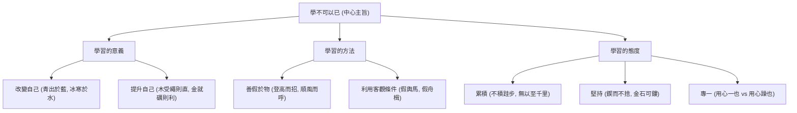

# 勸學

## 💡 為什麼要學？（Start with Why）

為什麼有些學霸看起來沒特別聰明，卻能一直考高分？為什麼古人說「學習」可以改變命運？荀子的《勸學》早在兩千多年前就破解了這個秘密——學習不是比誰天生聰明，而是比誰會「累積」和「借力」。這篇文章不僅是古文測驗的常客，更是教你如何把普通天賦發揮到極致的學霸秘笈！

## 📌 一句話總結

《勸學》的核心思想是「學不可以已」，強調學習能改變本性（化性起偽），並透過不斷「累積」與「堅持」來達到君子的境界。

## 🎯 核心概念

- **學不可以已**：學習是永無止境的過程，不能半途而廢。
- **後天學習改變本性（化性起偽）**：荀子性惡論的核心。主張透過後天的教育與禮義，改造天生的惡性（青出於藍、木受繩則直）。
  - **字義拆解**：化（改造變化）、性（天生本性）、起（興起）、偽（**人為的努力與教化**；「人+為」，高頻考點：非現代虛偽之意）。
  - **與孟子比較**：孟子「性善」主張擴充本有善端；荀子「性惡」主張以後天學習重新塑造。
- **善假於物**：聰明人懂得利用外在資源與環境來提升自己（君子生非異也，善假於物也）。
  - **登高而招**：站在高處招手，手臂沒變長，但遠處的人看得清楚。比喻借助高處優勢，擴大影響。
  - **順風而呼**：順著風向呼喊，聲音沒變大，但聽的人聽得清楚（聞者彰）。比喻善用環境條件，事半功倍。
- **累積與堅持**：學習的成效來自不間斷的微小累積（不積跬步，無以至千里；鍥而不捨，金石可鏤）。
- **專一**：學習必須專心致志，不可浮躁分心。以強烈對比說明決定成就的是專注度而非天賦。
  - **蚯蚓（螾無爪牙之利，用心一也）**：無強健爪牙筋骨，卻能上食埃土、下飲黃泉，因為心志專一（逆襲成功）。
  - **螃蟹（蟹六跪而二螯，用心躁也）**：有六腿雙螯良好裝備，無蛇鱔之穴卻無處安身，因為心志浮躁（一事無成）。

## 🗺 圖解

## 🌏 生活連結（記憶錨點）

**善假於物 = 「懂得裝備神兵利器的現代玩家」**
就像打遊戲，空手打怪很慢，但懂得裝備神兵利器（假於物）就能快速升級。荀子說的「假舟楫者，非能水也，而絕江河」，就像現代人不會自己跑得比馬快，但會搭高鐵一樣。善用工具和環境（如 AI 工具、好的讀書環境）就是最聰明的學習法。

> ⚠️ 比喻哪裡會破功：打遊戲裝備可以瞬間換上，但荀子強調的「假於物」還要配合長期的「累積與堅持」，不是走捷徑。

## 🧠 記憶法 / 口訣

- **結構口訣**：「意、方、態」——學習的**意**義（改變本性）、學習的**方**法（善假於物）、學習的**態**度（累積、堅持、專一）。
- **核心四譬喻**：青、冰、木、金（說明後天學習能提升超越、規矩磨練能去瑕成器）。

| 譬喻名句     | 素材 ➔ 成品   | 關鍵字解讀           | 深層寓意（學習效果）         |
| -------- | --------- | --------------- | ------------------ |
| **青出於藍** | 藍草 ➔ 靛青染料 | 於：介詞「比」         | **超越**：能力超越原生條件或老師 |
| **冰寒於水** | 水 ➔ 冰塊    | 為：凝結／於：比        | **昇華**：經過凝練達到更高的品質 |
| **木受繩直** | 粗木 ➔ 直木   | 繩：墨線（法度規範）      | **匡正**：依循規範約束以修正瑕疵 |
| **金就礪利** | 鈍刀劍 ➔ 利刃  | 金：刀劍（非黃金）／礪：磨刀石 | **磨練**：經過淬鍊打磨方能成器  |

## ⭐ 考試重點

- [ ] **必背**：四大核心佳句（青出於藍、不積跬步、鍥而不捨、善假於物）。

| 核心佳句     | 完整名句         | 關鍵字考點             | 學習意義                   |
| -------- | ------------ | ----------------- | ---------------------- |
| **青出於藍** | 青，取之於藍，而青於藍  | 於：介詞「比」           | **超越**：後天學習超越原本基礎或老師   |
| **不積跬步** | 不積跬步，無以至千里   | 跬（ㄎㄨㄟˇ）：半步／無以：無法  | **累積**：再遠目標都靠微小努力累積    |
| **鍥而不捨** | 鍥而不捨，金石可鏤    | 鍥（刻）／舍（捨棄）／鏤（雕刻）  | **堅持**：持之以恆，金石也能雕琢成功   |
| **善假於物** | 君子生非異也，善假於物也 | 生：通「性」（資質）／假：憑藉利用 | **方法**：善用工具、環境與好老師協助進步 |

- [ ] **常考題型**：字音字義速查（「假」輿馬、「中」繩、「跬」步、「勸」學）。

| 字詞 | 讀音 | 精確字義 | 原文與句意 | 現代常見誤解陷阱 |
|---|---|---|---|---|
| **「假」輿馬** | ㄐㄧㄚˇ | 憑藉、利用 | 「假輿馬者，非利足也，而致千里。」 ➔ 憑藉車馬的人，腳走得並不快，卻能到達千里遠。 | 誤解為「假的／假裝」 |
| **「中」繩** | ㄓㄨㄥˋ *(四聲)* | 符合、合乎 | 「木直中繩，輮以為輪，其曲中規。」 ➔ 木材彎曲的程度符合規矩墨線的標準。 | 誤讀為一聲「當中／中間」 |
| **「跬」步** | ㄎㄨㄟˇ | 半步 *(單腳一步)* | 「不積跬步，無以至千里。」 ➔ 不一步步（半步半步）地累積，就無法到達千里之外。 | 誤解為「一大步」 *(古代一跬＝半步，兩跬＝一步)* |
| **「勸」學** | ㄑㄩㄢˋ | 鼓勵、勉勵 | 「勸學」 ➔ 勉勵大家持續努力學習。 | 誤解為現代的「勸阻」 |

- [ ] **常考題型**：譬喻修辭對應（四大動物與學習態度對應）。

| 動物名稱 | 原文關鍵佳句 | 先天條件與行為 | 比喻／象徵學習態度 | 大考解析與學習啟示 |
|---|---|---|---|---|
| **騏驥** *(駿馬)* | 騏驥一躍，不能十步 | 天資極優異，但只跳躍一下 | 戒**「三分鐘熱度」** | 天賦再高，若不持續累積，連十步也走不遠。 |
| **駑馬** *(劣馬)* | 駑馬十駕，功在不舍 | 天資平庸，但堅持拉車十天 | 貴在**「持之以恆（堅持）」** | 天資普通，只要堅持不懈（功在不舍），也能到達遠方。 |
| **螾** *(蚯蚓)* | 螾無爪牙之利……用心一也 | 無爪牙與強健筋骨，卻能貫通天地 | 主張**「專心致志（專一）」** | 先天條件再差，只要心志專一，就能創造奇蹟。 |
| **蟹** *(螃蟹)* | 蟹六跪而二螯……用心躁也 | 有六腿雙螯極佳裝備，卻無穴可居 | 戒**「心志浮躁（浮躁）」** | 條件/天賦再好，若心浮氣躁，連基礎都打不好（寄人籬下）。 |

- [ ] **常考題型**：儒家三聖（孔子 vs 孟子 vs 荀子）學習觀與人性論跨文本對比。

| 比較維度       | [論語為學篇](論語為學篇.md)（孔子）                            | [孟子性善論](孟子性善論.md)（孟子）                              | [勸學](勸學.md)（荀子）                                                      |
| ---------- | ---------------------------------------- | ------------------------------------------ | --------------------------------------------------------------- |
| **人性假設**   | **性相近，習相遠** *(人天生相近，後天拉開距離)*          | **人性本善** *(天生內建仁義禮智四端)*                 | **人性本惡** *(天生有欲望自私，善是後天加工)*                                  |
| **學習核心作用** | **「學思並重、知行合一」** 涵養君子品德與實踐能力           | **「擴充善端、求其放心」** 把丟失的本心找回來並發揚光大          | **「化性起偽、去瑕成器」** 用後天的規範與教育重新塑造自己                              |
| **學習方法關鍵** | 1. 學思並重（學而不思則罔） 2. 溫故知新 3. 三人行必有我師 | 1. 存心養性，自我覺察 2. 順應本性（勿揠苗助長） 3. 養浩然之氣 | 1. **善假於物**（善用資源工具） 2. **微小累積**（不積跬步） 3. **專一持之以恆**（用心一也） |
| **經典比喻**   | 為山、逝者如斯夫                                 | 水之就下、孺子入井、牛山之木                             | 青出於藍、木受繩直、金就礪利、騏驥駑馬、蚯蚓螃蟹                                        |

## ⚠️ 易錯點 / 陷阱

- **「勸」學的「勸」**：是**鼓勵、勉勵**，不是現代的「勸阻」。
- **「金」就礪則利的「金」**：指**金屬製的刀劍**，不是黃金。
- **「用心一也」的「一」**：是專一；「用心躁也」的「躁」是浮躁。
- **課綱範圍**：《勸學》在舊課綱為 30 篇核心古文，但在 108 課綱中**不屬於 15 篇推薦選文**，學測若考出通常會提供部分文本或作為跨文本比較素材。

## 🔗 跨科連結

- 諸子思想（儒墨道法）
- [孟子性善論](孟子性善論.md)（儒家「性善 vs 性惡」核心爭辯，學測高頻對讀）
- [論語為學篇](論語為學篇.md)（孔子「學思並重」對照荀子「化性起偽」為學觀）
- [跨文本比較閱讀](跨文本比較閱讀.md)
- [師說](師說.md)（同為論「學」經典，可對讀）

## 📝 一分鐘自我檢測

> 先遮住下方答案，自己想，再對照。

1. Q：《勸學》中的「勸」字，最精確的解釋是什麼？
   A：鼓勵、勉勵（勉力）。
2. Q：「假舟楫者，非能水也，而絕江河」中的「假」是什麼意思？這句話要說明什麼道理？
   A：「假」是憑藉、利用。說明君子善於利用外在事物（善假於物）來達到目的。
3. Q：請說出《勸學》中用來比喻「學習態度必須專一」的兩種動物？
   A：蚯蚓（螾無爪牙之利...用心一也）和螃蟹（蟹六跪而二螯...用心躁也）。

---

## 🔍 查核結論（2026-07-26）

### 已確認正確的硬事實
| 項目 | 筆記內容 | 查核結果 |
|------|----------|----------|
| 課綱範圍 | 不屬於 108 課綱 15 篇推薦選文 | 正確。已核對 15 篇名單，確認《勸學》非 15 篇核心古文，列為延伸選文。 |
| 字義解讀 | 勸：鼓勵/勉勵；金：金屬刀劍 | 正確。符合教育部國語辭典及高中課本注釋。 |
| 文本譬喻 | 蚯蚓代表專一、螃蟹代表浮躁 | 正確。符合原文「螾無爪牙之利...用心一也；蟹六跪而二螯...用心躁也」。 |

### 待確認項
無。

### 錯字 / 用詞修正清單
無。
