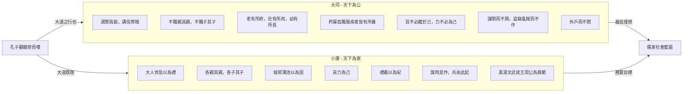

# 大同與小康

## 💡 為什麼要學？（Start with Why）

**🤔 這種完美的社會可能存在嗎？**
你有沒有想過——如果這個世界每個人都能被照顧到，沒有人餓死街頭、老人不用怕沒人養、每扇門都不用上鎖——這種社會可能嗎？兩千多年前孔子就思考過這個問題，而且他給了兩個版本的答案：一個是「終極理想」（大同），一個是「現實還不錯的退而求其次」（小康）。

**📝 不只是必考古文，更是寫作彈藥庫**
這篇〈大同與小康〉是 108 課綱 15 篇核心古文之一。讀懂它，你不只能應付文言文閱讀與默寫；當你在國寫遇到「公平正義」、「社會福利」、「理想社會」等議題時，有兩千年前的哲學家幫你撐腰！

**✨ 看懂現代政策背後的古代藍圖**
更重要的是，當你了解大同社會的願景後，再去看看現代的社會住宅、全民健保、長照制度，你會驚訝地發現：孔子早就在講同樣的事！

## 📌 一句話總結
孔子以「天下為公」的大同世界為最高理想，以「天下為家」的小康社會為務實目標，透過兩者對比，勾勒出儒家對社會制度的終極藍圖。

## 🎯 核心概念

### 1. 文本背景與孔子態度
- **出處與體裁**：出自《禮記・禮運》。孔子觀魯國蠟祭（年終祭典）而嘆息，與弟子言偃（子游）對話，發表對理想社會的看法。屬「語錄體」記言之文。
- **孔子的態度**：對大同是「嚮往但知道回不去」（喟然而嘆），對小康是「退而求其次的務實肯定」——心懷最高理想，腳踏實地做能做的事。

### 2. 理想境界：大同（天下為公）
- **政治運作**：「大道之行也，天下為公。選賢與能，講信修睦。」天下是所有人共有，領導人非世襲，人人講求信用和睦。
- **社會照顧**：「故人不獨親其親，不獨子其子...」照顧推及所有人，讓老、壯、幼、弱勢皆有所養。
- **財產與勞動**：「貨惡其棄於地也，不必藏於己；力惡其不出於身也，不必為己。」物資不私藏，勞動不自利。
- **社會治安**：「是故謀閉而不興，盜竊亂賊而不作，故外戶而不閉。」沒有陰謀與盜竊，門不上鎖（治安極佳）。

### 3. 務實目標：小康（天下為家）
- **政治運作**：「今大道既隱，天下為家。各親其親，各子其子。貨力為己。」天下變成家族私有，人只顧自己親人，財力皆為私利。
- **維繫秩序**：「大人世及以為禮，城郭溝池以為固。禮義以為紀。」靠世襲繼承、築城防禦，並以「禮義」的外在規範來維持社會秩序。
- **禮義的作用**：「以正君臣，以篤父子...」規範五倫與制度。但也因私心「以功為己」，導致陰謀與戰爭發生。
- **代表聖王**：「禹、湯、文、武、成王、周公」。他們在不完美的世界中，靠禮義做到最好的典範。

### 4. 核心對比
- **主權歸屬**：天下為公 vs 天下為家
- **權力傳承**：選賢與能 vs 大人世及（世襲）
- **人際關係**：不獨親其親 vs 各親其親
- **防禦治安**：外戶不閉 vs 城郭溝池以為固

## 🗺 圖解

## 🌏 生活連結（記憶錨點）
**大同 ＝ 理想中的「人人都有社會安全網」的國家**
想像一個社會：全民健保 cover 所有人（矜寡孤獨廢疾者皆有所養）、政治人物由能力選出而非家族世襲（選賢與能）、大家繳稅不心痛因為知道稅金會照顧每個人（貨不必藏於己）、治安好到不用裝監視器（外戶而不閉）。這就是孔子的大同——古代版的「北歐式社會福利國家夢想」。

**小康 ＝ 現實世界「靠規則和制度運轉」的社會**
現實中人會自私、會搶資源，所以我們需要法律、警察、軍隊、契約——這就是小康。想想你家門會上鎖（城郭溝池以為固）、你努力念書是為了「自己」考上好學校（貨力為己）、選舉雖然不是世襲但也充滿各種算計（謀用是作）——小康不是壞事，而是承認人性弱點後的「最佳方案」。

> ⚠️ 比喻哪裡會破功：北歐國家仍有貧富差距與社會問題，並非真正的「大同」；孔子的大同是一種終極理想願景，不完全等於任何現代制度。

## 🧠 記憶法 / 口訣
- **大同 vs 小康核心對比口訣**：「**公家 vs 私家**」——大同「天下為**公**」、小康「天下為**家**」，一字之差，天壤之別。
- **大同社會四大特徵口訣**：「**選信養安**」——**選**賢與能、講**信**修睦、弱勢皆有所**養**、外戶不閉（社會**安**定）。
- **小康六君子口訣**：「**禹湯文武成周**」——禹、湯、文王、武王、成王、周公（按時代順序排列）。
- **記住「大道之行 → 大同」「大道既隱 → 小康」**：大道「行」的時候天下太平（大同），大道「隱」（躲起來了）就只能靠規則撐著（小康）。

| 對比項目 | 大同（天下為公） | 小康（天下為家） |
|----------|------------------|------------------|
| 政權傳承 | 選賢與能 | 大人世及（世襲） |
| 人際關係 | 不獨親其親，不獨子其子 | 各親其親，各子其子 |
| 財產觀念 | 貨不必藏於己 | 貨力為己 |
| 社會秩序 | 外戶而不閉（自然和諧） | 城郭溝池以為固（靠防禦） |
| 維繫方式 | 大道自行 | 禮義以為紀 |
| 代表時代 | 五帝（堯、舜） | 禹、湯、文、武、成王、周公 |

## ⭐ 考試重點
- [ ] **必背名句**：
  - 「大道之行也，天下為公。選賢與能，講信修睦。」
  - 「故人不獨親其親，不獨子其子。使老有所終，壯有所用，幼有所長，矜寡孤獨廢疾者皆有所養。」
  - 「貨惡其棄於地也，不必藏於己；力惡其不出於身也，不必為己。」
  - 「是故謀閉而不興，盜竊亂賊而不作，故外戶而不閉。是謂大同。」
  - 「今大道既隱，天下為家。各親其親，各子其子。貨力為己。」
- [ ] **必背字詞解釋**：

| 字詞 | 讀音 | 精確字義 | 原文語境 | 常見誤解 |
|------|------|----------|----------|----------|
| **與（選賢與能）** | ㄐㄩˇ | 通「舉」，推舉、選拔 | 選拔賢德有能力的人 | 誤讀為ㄩˇ（給予）或ㄩˊ（和） |
| **矜** | ㄍㄨㄢ | 通「鰥」，老而無妻者 | 矜寡孤獨廢疾者皆有所養 | 誤讀為ㄐㄧㄣ（矜持） |
| **修** | ㄒㄧㄡ | 講求、追求 | 講信修睦 | 誤解為「修理」 |
| **閉** | ㄅㄧˋ | 杜絕、阻絕 | 謀閉而不興 | 誤解為「關閉」(此處指陰謀被阻絕) |
| **作** | ㄗㄨㄛˋ | 興起、發生 | 盜竊亂賊而不作 | 混淆現代「做」的用法 |
| **外戶** | — | 門從外面關（表示不上鎖） | 外戶而不閉 | 誤解為「外面的門」 |
| **世及** | — | 父死子繼為「世」，兄終弟及為「及」 | 大人世及以為禮 | 誤解為只是「世襲」單一含義 |
| **紀** | ㄐㄧˋ | 綱紀、規範 | 禮義以為紀 | 誤解為「記錄」 |

- [ ] **常考題型**：
  - 大同與小康特徵對比分析（選擇題／表格填充題）
  - 文意理解：判斷某句屬於描述「大同」還是「小康」
  - 字義辨析：「與」「矜」「世及」「外戶」等關鍵字詞
  - 國寫延伸：以「你認為大同社會可能實現嗎？」為題的論述寫作
  - 跨文本比較：與《桃花源記》的理想世界觀對讀

- [ ] **學測落點**：108 課綱 15 篇核心古文，高頻出題。鮮少單獨考整篇，但常與其他先秦諸子（如《老子》小國寡民）進行跨文本比較閱讀。

## ⚠️ 易錯點 / 陷阱
- **「選賢與能」的「與」**：讀 ㄐㄩˇ，通「舉」＝推舉，**不是「和」也不是「給」**。這是字音字義的超高頻考點。
- **「矜寡孤獨」的「矜」**：讀 ㄍㄨㄢ，通「鰥」（老而無妻），**不是 ㄐㄧㄣ（矜持的矜）**。「矜寡孤獨」四字分指：老無妻、老無夫、幼無父、老無子。
- **大同 ≠ 無政府**：大同仍有領導者，只是由「選賢與能」產生，而非世襲；是公天下而非沒有治理。
- **小康 ≠ 壞的社會**：孔子對小康是肯定的（禹湯文武都是聖王），只是認為它不如大同完美。考試常設陷阱讓你以為孔子否定小康。
- **「外戶而不閉」≠「把門開著」**：「外戶」指門從外面關上但不上鎖（閂），重點是「不需要防盜」。
- **「大人世及以為禮」的「世及」**：「世」＝父子相傳，「及」＝兄弟相繼，兩者合稱世襲制度的完整型態。不能只解釋為「世代繼承」。
- **篇名混淆**：是出自《禮記・禮運》，不是《禮記・大同》——「大同與小康」是後人節選的篇名。

## 🔗 跨科連結
- [[桃花源記]]（同為「理想社會」想像，但陶淵明的桃源偏向避世、孔子的大同偏向入世治理）
- [[孟子性善論]]（儒家對人性的基本假設，影響「大同為何可能」的思考）
- [[諸子思想（儒墨道法）]]（先秦儒學：孔子思想體系中，禮治與仁政的關係）
- [[民主政治與選舉制度]]（公民科：「選賢與能」vs 現代民主選舉制度的對照）
- [[社會福利與社會安全制度]]（公民科：「矜寡孤獨廢疾者皆有所養」vs 現代社會福利政策）
- [[先秦思想與百家爭鳴]]（歷史科：禮崩樂壞的時代背景，孔子為何嚮往「大同」）

## 📝 一分鐘自我檢測
> 先遮住下方答案，自己想，再對照。
1. Q：「大道之行也，天下為公」中，「天下為公」是什麼意思？與小康的「天下為家」有何不同？
   A：「天下為公」指天下是天下人共有的，領導人由選賢與能產生；「天下為家」指天下變成統治者家族的私有物，政權以世襲方式傳承（大人世及）。
2. Q：「選賢與能」的「與」讀什麼音？是什麼意思？
   A：讀 ㄐㄩˇ，通「舉」，意思是推舉、選拔。整句意為「選拔有賢德和有能力的人（來治理天下）」。
3. Q：「矜寡孤獨」各指哪四種人？
   A：矜（鰥）＝老而無妻的男子；寡＝老而無夫的女子；孤＝幼年喪父的孩子；獨＝老而無子的人。
4. Q：孔子認為小康社會的代表人物是哪六位？請按時代排列。
   A：禹、湯、文王、武王、成王、周公。
5. Q：〈大同與小康〉出自哪一本經典的哪一篇？
   A：出自《禮記》的〈禮運〉篇。

---
