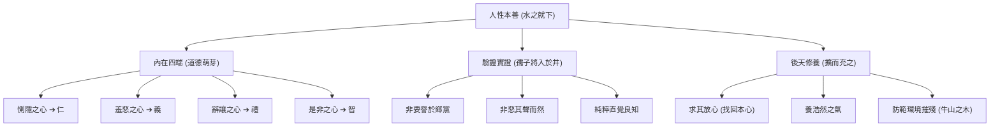

# 孟子性善論

## 💡 為什麼要學？（Start with Why）

你有沒有過這種經驗？看到新聞上路人毫不猶豫衝去救跌倒的老人、或看電視看到感人畫面鼻子一酸——這些「不求回報的善意」到底是哪裡來的？是後天被逼出來的，還是我們基因裡本來就有的？

兩千多年前的「亞聖」孟子，面對戰國時代的兵荒馬亂與人性醜陋，斬釘截鐵地說：**「人天生就是善良的！」** 孟子的「性善論」不僅是儒家思想最震撼的宣言，更是台灣高中國文、文化基本教材與學測國寫知性題的必考核心。搞懂性善論與「四端說」，你就能瞬間掌握儒家道德論的底層邏輯，在寫作與閱讀題中展現出色的思辨深度！

## 📌 一句話總結

孟子主張「人性本善」（人皆有四端），行善是出於天生本能而非利害算計，學習的目的在於將天生的善端「擴充」並實踐於生活與仁政中。

## 🎯 核心概念

- **性善論**：人天生具備善的種子（仁義禮智），「人性之善也，猶水之就下也」。人與禽獸的根本差別，就在於這微小的道德自覺（幾希）。
- **四端說（《公孫丑上》）**：道德不是外在強加的，而是源於內心四種天生的情感萌芽（端）：
  - **惻隱之心 ➔ 仁之端**：對他人痛苦產生的同情與不忍。
  - **羞惡之心 ➔ 義之端**：對自身不善感到羞恥、對他人不善感到厭惡。
  - **辭讓之心 ➔ 禮之端**：謙遜推讓、尊重規範。
  - **是非之心 ➔ 智之端**：能夠明確分辨對錯真偽。
- **孺子將入於井（關鍵證明）**：路人突然看到小孩快掉進井裡，會瞬間產生驚恐同情（怵惕惻隱）。這種反應不夾雜名利或算計，純粹是本能良知的顯現。
- **求其放心與擴充**：善性雖是天生，但若不經保養修養，也會被壞環境（牛山之木）摧殘丟失；因此學習的關鍵是「求其放心」（把丟失的善心找回來）並「擴而充之」。

## 🗺 圖解

## 🌏 生活連結（記憶錨點）

**四端 = 「手機出廠內建的原生 App」**
孟子認為「仁義禮智」不是你長大後付費下載的第三方軟體，而是手機出廠時就**「內建硬體軟體」**（四端）。只要你不去亂下載病毒（社會惡習壞環境），也不把手機丟在路邊不充電（不擴充保養），這個原生系統預設就是正常且善良的。

> ⚠️ 比喻哪裡會破功：手機原生 App 如果不更新可能會過時，但孟子的四端是永恆不變的道德良知，只需「保養與擴充」，不需重新發明。

## 🧠 記憶法 / 口訣

- **四端對應速記口訣**：「惻仁、羞義、辭禮、是智」（**「側人修意，辭理是智」**）。
- **關鍵三經典比喻**：
  - **水之就下**（比喻人性向善如水往低處流）。
  - **孺子入井**（證明善意是直覺無利害算計）。
  - **牛山之木**（說明善性被壞環境摧殘丟失的過程）。

## ⭐ 考試重點

- [ ] **必背**：四端對應表（惻隱➔仁、羞惡➔義、辭讓➔禮、是非➔智）。

| 四端情感 | 對應道德 | 人性內涵與舉例 |
|---|---|---|
| **惻隱之心** | **仁** | 同情憐憫、不忍人之心（如：見孺子入井而驚恐同情） |
| **羞惡之心** | **義** | 羞己之不善、惡人之不善（如：路不拾遺、恥食嗟來之食） |
| **辭讓之心** | **禮** | 謙遜推讓、尊卑有節（如：敬老尊賢、長幼有序） |
| **是非之心** | **智** | 清楚辨別善惡對錯（如：明辨是非、不隨波逐流） |

- [ ] **常考題型**：孟子 vs 荀子 思想跨文本對比。

| 比較項目 | 孟子（性善論） | 荀子（性惡論／化性起偽） |
|---|---|---|
| **核心主張** | 人性本善（天生具備四端） | 人性本惡（天生好利與欲望） |
| **學習與教育的作用** | **「擴充」與「求放心」**（發揚內在固有善端） | **「改造」與「化性起偽」**（用後天禮樂重塑） |
| **經典比喻** | 水之就下、孺子入井、牛山之木 | 青出於藍、木受繩直、金就礪利 |
| **修養目標** | 養浩然之氣、成聖成賢 | 遵禮守法、改過遷善 |

- [ ] **常考題型**：字音字義速查。

| 字詞 | 讀音 | 精確字義 | 原文句意說明 |
|---|---|---|---|
| **「乍」**見 | ㄓㄚˋ | 突然、忽地 | 「乍見孺子將入於井」➔ 突然看見小孩快掉進井裡 |
| **「怵惕」** | ㄔㄨˋ ㄊㄧˋ | 驚恐、害怕 | 「皆有怵惕惻隱之心」➔ 瞬間感到驚恐與同情 |
| **「要」**譽 | ㄧㄠ | 求取、邀請 | 「非所以要譽於鄉黨」➔ 不是為了向鄉里討好求取名聲 |
| 求其**「放心」** | ㄈㄤˋ ㄒㄧㄣ | 丟失散失的心 | 「學問之道無他，求其放心而已矣」➔ 把丟失的良知找回來 |

## ⚠️ 易錯點 / 陷阱

- **「放心」古今異義**：古義指**丟失、散放的善良本心**；現代指「安心、不擔心」。
- **「要譽」的「要」**：讀 ㄧㄠ（同「邀」），意思是**求取**，不是現代「想要」或「重要」。
- **「四端」不是完全體**：「端」是**萌芽、開端**。孟子強調有了萌芽還必須經過後天「擴而充之」，若不擴充，也會枯萎。

## 🔗 跨科連結

- [[勸學]]（荀子性惡論對讀，感受儒家內在分歧）
- [[論語為學篇]]（孔子「學思並重、知行合一」為學觀）
- [[中華文化基本教材（論語）]]（孔子「性相近，習相遠」對照孟子「性善」）
- [[公民與社會]]（人性論與法律、政治制度設計：性善論傾向信任人性道德；性惡論傾向法治規範）

## 📝 一分鐘自我檢測

> 先遮住下方答案，自己想，再對照。

1. Q：孟子「四端說」中，「羞惡之心」對應的是四德中的哪一個？
   A：義（羞惡之心，義之端也）。
2. Q：孟子舉「孺子將入於井」的例子，主要為了證明什麼？
   A：證明人的同情惻隱之心是純粹、直覺、不夾雜名利算計的本能，進而證明「人性本善」。
3. Q：請說明孟子「求其放心」這句話中「放心」的精確古義？
   A：指「丟失、散失的良知本心」（把受誘惑而丟失的善良本心找回來）。

---

## 🔍 查核結論（2026-07-26）

### 已確認正確的硬事實
| 項目 | 筆記內容 | 查核結果 |
|------|----------|----------|
| 四端對應 | 惻隱➔仁、羞惡➔義、辭讓➔禮、是非➔智 | 正確。符合《孟子·公孫丑上》原文。 |
| 孺子入井邏輯 | 非要譽於鄉黨、非惡其聲而然 | 正確。經典直覺良知論證，無爭議。 |
| 孟荀對比 | 孟子擴充性善；荀子化性起偽 | 正確。符合 108 課綱中華文化基本教材標準分類。 |

### 待確認項
無。

### 錯字 / 用詞修正清單
無。
