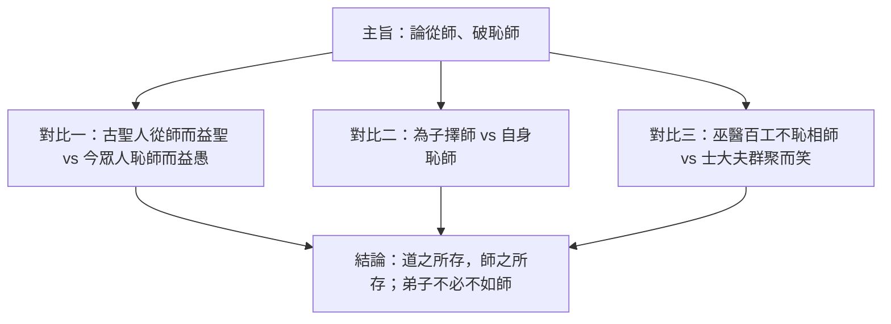

# 師說

## 💡 為什麼要學？（Start with Why）
> 你會不會「不敢問問題，怕被笑很菜」？一千兩百年前韓愈就在罵這種風氣。〈師說〉回答的是「到底該不該從師、跟誰學」——主張「道之所存，師之所存」，誰懂就跟誰學，不看年紀地位。讀懂它，不只應付默寫與閱讀題，更是學會一種「不恥下問、終身學習」的底氣。

## 📌 一句話總結
> 韓愈寫〈師說〉，借「贈李蟠」之名，公開打臉中唐「恥於從師」的歪風，重新確立「老師存在的理由是傳道，不是看年紀地位」。

## 🎯 核心概念
- 主旨：論「從師問學」的必要與正當，破除「恥學於師」的風氣。
- 師者定義：「師者，所以傳道、受業、解惑也」——傳道為首，授業解惑次之。
- 擇師標準：「無貴無賤，無長無少，道之所存，師之所存也」——以「道」論師，不以身分年紀。
- 核心對比：「古之聖人」從師而益聖／「今之眾人」恥師而益愚。
- 三層批判：對「為子擇師、己卻恥師」者、對「士大夫之族」、對「巫醫樂師百工」的對照論證。
- 師生新論：「弟子不必不如師，師不必賢於弟子，聞道有先後，術業有專攻。」
- 背景：中唐士大夫以從師為恥，韓愈以古文運動領袖身分逆風發聲。

## 🗺 圖解
> 論證結構：一個主旨，用三組對比支撐，導向結論。

## 🌏 生活連結（記憶錨點）
> - 「恥學於師」＝現在「不敢在群組問問題，怕被說很菜」——韓愈就是那個說「問才是強者」的人。
> - 「道之所存，師之所存」＝你會為了學剪輯去追一個比你小的 YouTuber：誰會誰就是師，跟年紀無關。
> - 「聞道有先後，術業有專攻」＝每個人都有自己的主修，沒人全圖鑑點滿，互相當對方的攻略。

## 🧠 記憶法 / 口訣
- 師者三職：「**傳、受、解**」→ 傳道、受（授）業、解惑（順序不可亂，傳道為先）。
- 三組對比：「**聖愚、子身、巫士**」——聖人對眾人、為子擇師對自身恥師、巫醫百工對士大夫。
- 主旨一句：「論『從師』，破『恥師』。」

## ⭐ 考試重點
- [ ] **必背名句**：「師者，所以傳道、受業、解惑也」「道之所存，師之所存也」「弟子不必不如師……術業有專攻」。
- [ ] **常考字詞**：「受」通「授」；「所以」＝「用來……的（憑藉/方法）」，非現代因果連詞；「吾師道也」的「師」為動詞。
- [ ] **常考論證**：對比論證、層遞批判——能指出「拿誰跟誰比、比出什麼結論」。
- [ ] **混合題趨勢**：可能「填表整理三組對比」＋「問答闡述主旨」。

## ⚠️ 易錯點 / 陷阱
- 「所以傳道」的「所以」＝「用來……的方法/憑藉」，不是「因此」。
- 「受業」的「受」＝「授」（給予、教授），不是「接受」。
- 「小學而大遺」：學了小的（句讀）卻丟了大的（解惑傳道），是批評不是稱讚。
- 「巫醫樂師百工之人，君子不齒」——韓愈是「反諷」士大夫的勢利，不是他本人瞧不起百工。
- 主旨誤判：本文是論「該不該從師」的風氣問題，不是談「尊師」道德教條。

## 🔗 跨科連結
- [[勸學]]（同為論「學」經典，可對讀）
- [[中唐社會與科舉門第風氣]]
- [[古文運動]]

## 📝 一分鐘自我檢測
> 先遮答案再想。
1. Q：「師者，所以傳道、受業、解惑也」的「所以」是什麼意思？　A：用來……的（憑藉/方法），非「因此」。
2. Q：韓愈用哪三組對比批判恥師風氣？　A：①古聖人 vs 今眾人 ②為子擇師 vs 自身恥師 ③巫醫百工 vs 士大夫。
3. Q：「受業」的「受」怎麼解釋？為什麼？　A：通「授」＝教授、給予；因主詞是老師，對學生是「給予學業」。

---
> 📋 待確認項（內容檢查 Agent 填寫，人工複核後刪除）：
> - 〔已查證，建議補入內文〕寫作年代：多數資料記為唐德宗貞元十八年（西元 802 年）、韓愈時任國子監四門博士、文以贈李蟠。💡 段「一千兩百年前」與此相符（2026−802≈1224 年）。來源：教育部/各家國文教材、維基文庫〈師說〉。可考慮在背景段補上「貞元十八年」具體年份。
> - 〔課綱/冊別待人工確認〕本筆記 frontmatter 標「核心古文 15 篇」。提醒：108 課綱推薦選文為 15 篇，但各版本教科書（南一/翰林/龍騰/三民等）將〈師說〉編入的冊別不一，無法以單一來源斷定；冊別與並列篇目請依貴校採用版本目錄核對，本 Agent 不臆測。
> - 〔原文標點提醒，非錯誤〕「師者，所以傳道受業解惑也」原文（維基文庫/EDB 範文本）句中三項間無頓號；本筆記為利記憶寫成「傳道、受業、解惑」屬常見現代標點化處理，語意正確，惟若需與課本默寫版本一致，請核對採用版本標點。
> - 文中「之、其、乎」等虛詞逐句用法歸納（原列項，仍待補充）。
>
> 【事實查證結果】以下硬事實已查證無誤，可採信：
> - 「道之所存，師之所存也」「弟子不必不如師，師不必賢於弟子，聞道有先後，術業有專攻」原文正確。
> - 「受」通「授」、「巫醫樂師百工之人，君子不齒」、「句讀之不知……小學而大遺」原文與釋義正確。
> - 韓愈為唐代古文運動領袖、藉贈李蟠闡發師道，背景敘述正確。
>
> 【錯字／用詞修正清單】逐字校對未發現錯別字、音近形近誤用、單位符號或亂碼缺字問題，無需修正。
>
> 【Mermaid 檢查】flowchart TD 語法正確，所有含中文與標點之節點文字均以 "..." 包住，可於 Obsidian 正常渲染；圖內三組對比與內文一致，無誤導。
>
> 【💡 動機段檢查】置於開頭、具體可引發動機（連結「不敢問問題怕被笑」之真實情境），所述「不恥下問、終身學習」價值真實未誇大、未杜撰應用。
