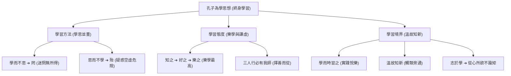

# 論語為學篇

## 💡 為什麼要學？（Start with Why）

你是不是也覺得上課聽懂了，回回家寫題目還是卡住？或者每天背一堆公式單字，卻覺得無聊又迷惘？

兩千五百多年前，萬世師表孔子早就看穿了現代學生的讀書痛點！他在《論語》中留下的「為學」智慧，不是硬梆邦的死板教條，而是一套**終極學霸學習法**——告訴你如何兼顧「輸入（學）」與「輸出（思）」、如何把讀書變成快樂的事（樂學），以及如何從生活細節中隨時吸收養分（三人行必有我師）。這篇文章不僅是國文大考字音字義、跨文本比較的常客，更是陪伴你度過備考歲月的必備學習指南！

## 📌 一句話總結

孔子主張「學思並重、知行合一、樂在其中」，強調學習必須兼顧吸收與批判思考，並在溫故知新與生活實踐中達到終身學習的境界。

## 🎯 核心概念

- **學思並重**：「學而不思則罔，思而不學則殆。」只吸收不思考會迷惘無所得（罔）；只空想不學習會陷入危機空虛（殆）。
- **實踐與熱情**：
  - 「學而時習之，不亦說乎？」➔ 學習後在適當時候複習實踐，獲得內化與成長的樂趣（說，通「悅」）。
  - 「知之者不如好之者，好之者不如樂之者。」➔ 學習最高境界是「樂在其中」（樂學）。
- **溫故知新**：「溫故而知新，可以為師矣。」複習舊經驗並能融會貫通產生新領悟，才有資格教導他人。
- **謙虛與隨處學習**：「三人行，必有我師焉。擇其善者而從之，其不善者而改之。」身邊每個人都是借鏡，取長補短。
- **生命學習歷程**：「吾十有五而志於學，三十而立，四十而不惑，五十而知天命，六十而耳順，七十而從心所欲，不踰矩。」孔子自述一生隨年齡增長、學習與道德內化的漸進境界。

## 🗺 圖解

## 🌏 生活連結（記憶錨點）

**「學而不思則罔，思而不學則殆」= 「吃東西與消化」**
- **只學不思（罔）**：就像一口氣狂吃一堆食物卻不消化，結果肚子脹得要命卻沒吸收養分，變成「資訊便秘」（迷惘）。
- **只思不學（殆）**：就像肚子空空沒食物，胃酸卻一直在狂翻空轉，結果胃潰瘍發炎（危險不安）。
- **理想狀態**：吃適量優質食物（學），配上記錄與消化吸收（思），才是健康的學習！

> ⚠️ 比喻哪裡會破功：消化食物是身體無意識器官運作，但「思」需要極高的主動道德與邏輯意識，不能靠大腦放空。

## 🧠 記憶法 / 口訣

- **學思對應口訣**：**「學而不思＝罔（網中迷惘）；思而不學＝殆（懈怠危險）」**。
- **學習三層次**：知之 ➔ 好之 ➔ 樂之（懂它 ➔ 喜歡它 ➔ 愛上它）。
- **孔子立志七階段速記**：十五志學、三十立、四十不惑、五十天命、六十耳順、七十從心。

## ⭐ 考試重點

- [ ] **必背**：四大為學名句與關鍵字考點。

| 為學名句 | 關鍵字考點 | 意思解讀 |
|---|---|---|
| **學而時習之，不亦說乎** | 說（通「悅」，悅服歡喜） | 學習後按時複習實踐，令人感到歡喜。 |
| **學而不思則罔，思而不學則殆** | 罔（迷惘無所得）／殆（疑惑危險） | 學思必須並重，偏廢任何一方都會失敗。 |
| **溫故而知新，可以為師矣** | 溫（複習）／故（舊知識經驗） | 溫習舊知識而能獲得新領悟，便能為人師表。 |
| **知之者不如好之者，好之者不如樂之者** | 好（喜歡）／樂（以之為樂） | 學習的最高境界是以學習為樂。 |

- [ ] **常考題型**：字音字義速查。

| 字詞 | 讀音 | 精確字義 | 現代常見誤解陷阱 |
|---|---|---|---|
| 不亦**「說」**乎 | ㄩㄝˋ | 通「悅」，歡喜、快樂 | 誤讀為 ㄕㄨㄛ（說話） |
| 學而不思則**「罔」** | ㄨㄤˇ | 迷惘、無所得 | 誤解為「網子」或「沒有」 |
| 思而不學則**「殆」** | ㄉㄞˋ | 疑惑、危險、精神疲憊 | 誤解為「大概」或「殆盡」 |
| **「溫」**故知新 | ㄨㄣ | 複習、溫習 | 誤解為「溫度」 |
| 吾十**「有」**五 | ㄧㄡˋ | 通「又」，用於整數與零數間 | 誤讀為 ㄨˇ（擁有） |

- [ ] **常考題型**：三家學習觀跨文本比較（孔子 vs 孟子 vs 荀子）。

| 比較項目 | 孔子（論語為學） | 孟子（性善論） | 荀子（勸學篇） |
|---|---|---|---|
| **核心主張** | **學思並重、知行合一** | **擴充善端、求其放心** | **化性起偽、積善成德** |
| **人性假設** | 「性相近也，習相遠也」 | 「人性本善」（人皆有四端） | 「人性本惡」（人有慾望瑕疵） |
| **學習方法** | 溫故知新、學思並重、三人行必有我師 | 存心養性、擴而充之 | 善假於物、鍥而不捨、用心一也 |

## ⚠️ 易錯點 / 陷阱

- **「罔」與「殆」顛倒**：大考極常考倒過來的選項！記憶法：**「只學不思＝罔（迷惘）；只思不學＝殆（危險）」**。
- **「時習」的「時」**：古義指**「在適當的時候」或「按時」**，非現代「有空的時候」。
- **「樂」之者的讀音**：讀 ㄌㄜˋ（以之為樂），非 ㄩㄝˋ（音樂）或 ㄧㄠˋ（喜愛，如知者樂水）。

## 🔗 跨科連結

- [[孟子性善論]]（儒家學習觀：擴充善端對照學思並重）
- [[勸學]]（荀子學習觀：善假於物與累積對照孔子為學）
- [[師說]]（韓愈論尊師重道：引用「三人行必有我師」）

## 📝 一分鐘自我檢測

> 先遮住下方答案，自己想，再對照。

1. Q：《論語》「學而不思則罔，思而不學則殆」中，「罔」與「殆」的精確字義分別是什麼？
   A：「罔」指迷惘無所得；「殆」指疑惑危險或精神疲憊。
2. Q：孔子認為學習的三種境界（知之、好之、樂之），最高境界是哪一個？
   A：樂之（以學習為樂，樂在其中）。
3. Q：「溫故而知新」中的「故」是什麼意思？
   A：舊有的知識、學問或經驗。

---

## 🔍 查核結論（2026-07-26）

### 已確認正確的硬事實
| 項目 | 筆記內容 | 查核結果 |
|------|----------|----------|
| 罔殆字義 | 罔：迷惘無所得；殆：危險/疑惑 | 正確。符合教育部國語辭典及大考中心標準標準。 |
| 通假字 | 說通悅（ㄩㄝˋ）；有通又（ㄧㄡˋ） | 正確。符合課本注釋。 |
| 三家比較 | 孔子性相近；孟子性善；荀子性惡 | 正確。符合 108 課綱中華文化基本教材標準架構。 |

### 待確認項
無。

### 錯字 / 用詞修正清單
無。
