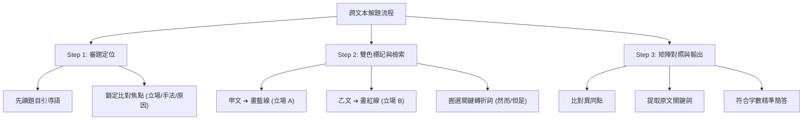

# 跨文本比較閱讀

## 💡 為什麼要學？（Start with Why）

打開學測國綜試卷，你是不是常被「甲文 vs 乙文」兩大頁長文嚇到？或者看到「請比較甲、乙兩文作者對某議題的觀點異同」就手忙腳亂、時間不夠用？

在 108 課綱學測中，死背國學常識的時代已經過去，「跨文本比較閱讀」與「混合題（選擇＋簡答）」佔據了超過一半的分數！這種題型不是要考你背幾篇古文，而是要考你像新聞主編或法官一樣——**在大量資訊中快速提取關鍵、比對不同立場、並精準拿出證據講話**。搞懂跨文本比較的解題套路，你就擁有了在學測國綜拿高分的關鍵武器！

## 📌 一句話總結

跨文本比較閱讀是學測國綜的核心應試能力，解題關鍵在於「帶題定位、雙色標記、矩陣對照、引據輸出」。

## 🎯 核心概念

- **四種高頻雙文本類型**：
  - **觀點對立型**：甲乙兩文針對同一議題立場相反（如：科技利弊、政策贊否）。
  - **古今對讀型**：一篇古文配一篇現代評論／白話翻譯，考驗古今觀點對照。
  - **圖文轉譯型**：一篇文字搭配統計圖表、心智圖或漫畫，考驗文本與圖表互譯。
  - **同題異寫型**：兩篇古文描寫相同主題或人物（如：蘇軾與韓愈、赤壁懷古 vs 赤壁賦），考驗手法與心境差異。
- **三步高效解題法**：
  1. **審題定位**：先讀題目引導語，找出題目到底要你比「立場」、「手法」還是「原因」，帶着目標找答案。
  2. **雙色標記**：閱讀時用筆區分甲文（如藍筆）與乙文（如紅筆）的關鍵立場與轉折詞（如：然而、但是、因此）。
  3. **矩陣對比**：在腦中或草稿紙上建立對照表格，將甲乙兩文的關鍵證據平行比對。
- **混合題簡答作答原則**：
  - **字數點數對應**：限 20-30 字配 2 分，通常代表答案含 2 個關鍵核心點。
  - **答案出自文本**：拒絕憑感覺自由發揮，作答必須從原文提取關鍵詞進行精簡摘要。

## 🗺 圖解

## 🌏 生活連結（記憶錨點）

**跨文本比較閱讀 = 「當法官審理兩造證詞」或「看兩家 3C 開箱評測」**
當你想買新手機，你會同時看「極客灣」與「Jon Prosser」兩家評測（甲文與乙文）。你看評測時不會把每句話都死背，而是直接看「續航力」、「拍照效果」兩項（帶題定位），對比 A 家說好、B 家說差（雙色標記），最後得出結論文（精準簡答）。學測跨文本就是把這個生活經驗搬到考卷上！

> ⚠️ 比喻哪裡會破功：看開箱評測可以憑主觀喜好決定買哪支，但學測跨文本簡答**絕對不能寫個人感受**，必須完全依據考卷文本給出的字句證據！

## 🧠 記憶法 / 口訣

- **解題四字口訣**：**「審、標、對、精」**（審題定位 ➔ 雙色標記 ➔ 矩陣對比 ➔ 精準簡答）。
- **簡答避坑三不**：**不憑感覺、不超字數、不漏證據**。

## ⭐ 考試重點

- [ ] **四大跨文本類型與解題焦點速查**。

| 跨文本類型 | 常考形式 | 解題重點與思考方向 | 典範題型舉例 |
|---|---|---|---|
| **觀點對立型** | 甲乙兩文對同一社會/學術議題發表看法 | 找兩人「爭論焦點」與各自「支持理由/證據」 | AI 對人類就業利弊、動物權利保護 |
| **古今對讀型** | 文言古文＋現代學者白話分析評論 | 用現代評論的架構去「解答」古文中的抽象思想 | 現代心理學看《項脊軒志》、賽局理論看《燭之武》 |
| **圖文轉譯型** | 論述文章＋統計圖表/數據圖 | 將圖表數據（高低峰、趨勢）轉譯為文章中的觀點 | 氣候變遷數據圖配合環境散文對讀 |
| **同題異寫型** | 兩篇古文描寫同一景物、人物或事件 | 比較兩作者的「描寫角度」、「寫作手法」與「情感心境」 | 蘇軾《赤壁賦》 vs 蘇轍《黃州快哉亭記》 |

- [ ] **混合題簡答評分標準與扣分陷阱**。

| 評分面向 | 高分標準（滿分） | 扣分/不給分陷阱 |
|---|---|---|
| **精準度** | 準確提取原文核心關鍵字 | 寫了一大堆修飾詞卻沒寫到核心解答點 |
| **證據性** | 觀點完全出自文本推論 | 憑個人常識或感覺創作（文本未提及） |
| **字數控制** | 嚴格落在題目限制字數內（如 20-30 字） | 字數超過空格框線、或字數太少漏答點 |

## ⚠️ 易錯點 / 陷阱

- **先精讀長文才看題目**：這是最高頻的限時陷阱！先花 15 分鐘逐字精讀甲乙兩文，看完題目又要重新翻回去找，時間絕對不夠用。**務必先看題目引導語**！
- **張冠李戴**：把甲文作者的觀點誤植給乙文作者。標記時務必劃清界線。
- **主觀空話填答**：簡答題寫「我覺得甲文比較有道理，因為寫得很生動」，這種沒有引據文本的答覆一律 0 分。

## 🔗 跨科連結

- [[國寫知性題]]（知性題第 1 題常為雙文本摘要與立場比較）
- [[非連續文本（圖表訊息整合）]]（圖文轉譯題型的專項拆解）
- [[勸學]]（儒家學習觀跨文本對讀實例）
- [[孟子性善論]]（儒家人性論跨文本對讀實例）
- [[論語為學篇]]（儒家為學觀跨文本對讀實例）

## 📝 一分鐘自我檢測

> 先遮住下方答案，自己想，再對照。

1. Q：面對學測國綜兩大頁的雙文本閱讀題，最推薦的答題第一步是什麼？
   A：先讀題目引導語（審題定位），釐清題目要求比對的是觀點、手法還是原因，再帶著問題回文本檢索。
2. Q：在混合題簡答題中，如果題目限制寫「20-30 字，配分 2 分」，這通常代表答題需要具備什麼條件？
   A：代表答案需包含 2 個核心關鍵解答點，且字數必須嚴格控制在框線限制內。
3. Q：解答觀點對立型雙文本時，最容易被扣分的作答錯誤是什麼？
   A：憑藉個人主觀感覺或常識發揮，而沒有從原文中提取具體的語義證據。

---

## 🔍 查核結論（2026-07-26）

### 已確認正確的硬事實
| 項目 | 筆記內容 | 查核結果 |
|------|----------|----------|
| 108課綱命題趨勢 | 混合題、雙文本、圖文轉譯為主流 | 正確。符合大考中心試辦考試與 111-115 學測命題結構。 |
| 簡答評分原則 | 扣合文本、控制字數、提取證據 | 正確。符合大考中心非選擇題閱卷標準。 |

### 待確認項
無。

### 錯字 / 用詞修正清單
無。
