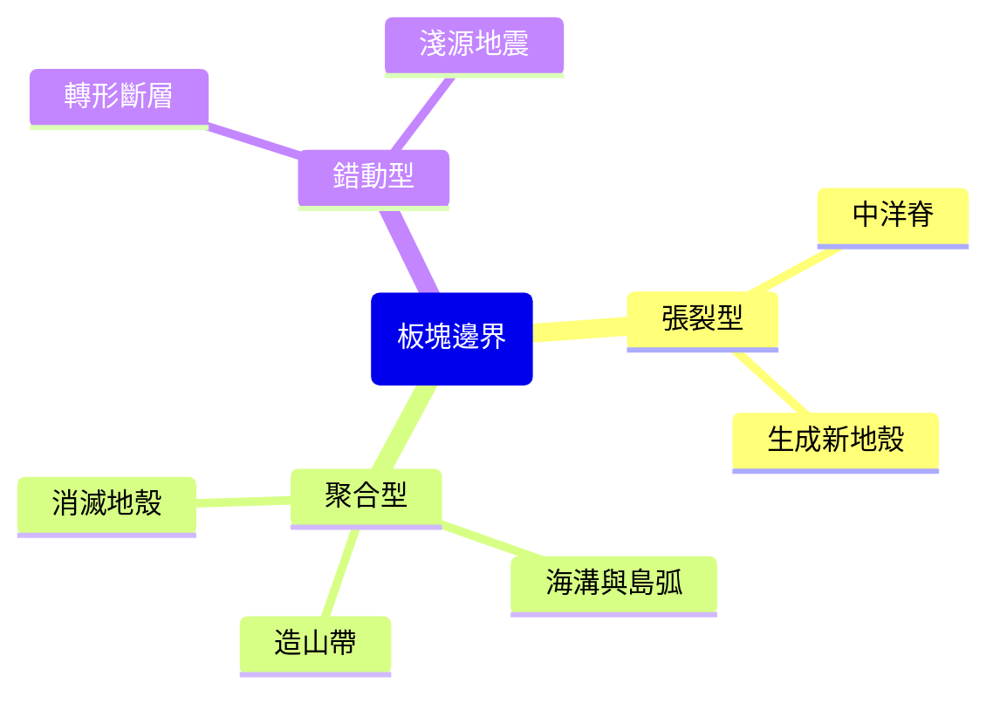

# 板塊運動

## 💡 為什麼要學？（Start with Why）
> 為什麼台灣這麼常地震，卻也有溫泉、高山與美麗地景？因為我們正坐在兩個板塊推擠的交界上。板塊運動一口氣解釋了地震、火山、海嘯與造山——讀懂它，你會明白腳下這片土地怎麼形成、為何防災如此重要，也看懂日本、土耳其強震的新聞。

## 📌 一句話總結
> 地球最外層的岩石圈被分裂成數塊「板塊」，騎在會緩慢流動的軟流圈上移動，板塊交界處（邊界）就是地震、火山、造山的舞台。

## 🎯 核心概念
- 板塊＝岩石圈（地殼＋上部地函最頂的剛硬層）被切割成的大塊，漂在塑性的軟流圈之上。
- 驅動力來自地函對流（板塊推力、隱沒帶的板塊隱沒拉力 slab pull 等），不是板塊自己「想動」。
- 三種板塊邊界依相對運動分類：張裂型（分離）、聚合型（碰撞/隱沒）、錯動型（平移）。
- 張裂型：兩板塊分離，地函物質湧升生成新海洋地殼，如中洋脊、東非裂谷。
- 聚合型：兩板塊相向靠近，密度大者隱沒，形成海溝、火山島弧、造山帶（含海洋-海洋、海洋-陸、陸-陸三種次型）。
- 錯動型：兩板塊水平錯開，不生不滅地殼，以淺源地震為主，如轉形斷層。
- 台灣位於歐亞板塊與菲律賓海板塊的聚合型邊界帶，屬碰撞造山與隱沒並存區（隱沒極性轉換細節待查）。
- 地震、火山、年輕造山帶幾乎都沿板塊邊界呈帶狀分布（如環太平洋帶）。

## 🗺 圖解
> 三種板塊邊界與各自的地形/活動。

## 🌏 生活連結（記憶錨點）
> - 軟流圈上的板塊：像一鍋濃稠麥片粥，表面結了硬殼（板塊），下面熱粥慢慢翻滾（地函對流），把硬殼推著走、撞在一起或裂開。
>   - ⚠️ 比喻破功處：板塊移動每年僅數公分、肉眼不可見；且軟流圈不是液態岩漿，而是接近熔點、可緩慢塑性流動的「固態」，別寫成「板塊浮在液態岩漿上」。
> - 三種邊界：兩台車的三種互動——迎面對撞（聚合）、各自倒退拉開（張裂）、並排擦身錯車（錯動）。

## 🧠 記憶法 / 口訣
- 三種邊界：「**分、合、錯**」對應「**生、滅/擠、平**」。
  - 分（張裂）→ 生新地殼（中洋脊）；合（聚合）→ 滅舊地殼或擠成山；錯（錯動）→ 不生不滅，只平移。
- 聚合三次型：「**海海生島弧、海陸生陸弧、陸陸擠高山**」。

## ⭐ 考試重點
- [ ] **必背**：三種邊界的相對運動、對應地形、地殼生滅關係（最高頻，常以剖面圖判讀）。
- [ ] **必背**：台灣處於歐亞板塊與菲律賓海板塊聚合帶（最常考的在地化連結）。
- [ ] **常考題型**：給剖面/箭頭圖判斷邊界類型與地震深度分布；以地震分布圖反推板塊邊界；判讀岩石新舊（離中洋脊愈遠愈老）。
- [ ] **地科 vs 地理**：地科問「為什麼會地震/造山（成因機制）」，地理問「地震災害分布與防災」。

## ⚠️ 易錯點 / 陷阱
- 板塊 ≠ 地殼：板塊是「岩石圈」（地殼＋上部地函剛硬層），比地殼厚。
- 軟流圈不是「岩漿海」：可塑性緩慢流動的固體。
- 張裂型不只在海底：陸上也有（東非裂谷）。
- 隱沒的是「密度較大」者（本質是密度與厚度，非「海一定沉、陸一定浮」的口訣）。
- 錯動型不生不滅地殼、通常無火山，別誤答會造山。

## 🔗 跨科連結
- [[世界氣候類型]]
- [[地震波與地球內部圈層]]
- [[岩石循環]]

## 📝 一分鐘自我檢測
> 先遮答案再想。
1. Q：剖面圖中兩板塊相向靠近、一方下沒並在上方形成火山，是哪種邊界？地殼生成或消滅？　A：聚合（隱沒）邊界；舊地殼被消滅。
2. Q：台灣位於哪兩板塊交界？哪種邊界？　A：歐亞板塊與菲律賓海板塊；聚合（碰撞）型。
3. Q：「板塊就是地殼」對嗎？更正。　A：錯。板塊是岩石圈，含地殼與上部地函最頂剛硬部分，比地殼厚。

---
> 📋 待確認項（內容檢查 Agent 填寫，人工複核後刪除）：
> - 〔已查證，建議補入正文，無錯誤〕台灣兩板塊隱沒極性「反向」：南部歐亞板塊向東隱沒至菲律賓海板塊之下（呂宋火山島弧→蘭嶼、綠島、海岸山脈，馬尼拉海溝側）；北部/東北部菲律賓海板塊向西北隱沒至歐亞板塊之下（琉球火山島弧→龜山島、大屯火山，琉球海溝）。正文第 29 行現以「隱沒極性轉換細節待查」帶過，並無錯誤，僅資訊不足，可由人工決定是否補述（學測層級通常只要求「聚合帶」即可）。來源：台大個人網頁、教育研究院電子報。
> - 〔已查證〕「班尼奧夫帶／班氏帶」目前正文與圖解皆未出現，僅原本列於本待確認項；屬大學/進階名詞，學測必修地科不要求，無須補入。已從正文確認無誤用。
> 〔內容檢查 Agent 結論〕事實、課綱對齊、結構、Mermaid 語法、Why 真實性均通過；無錯字、無單位/標點/亂碼問題；未做任何正文事實改寫。
