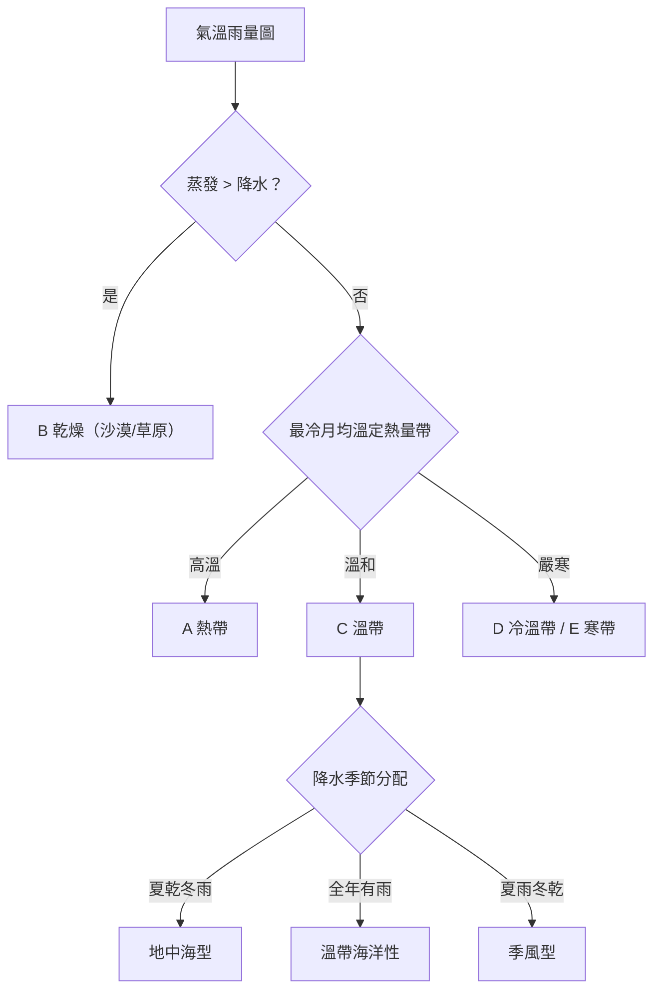

# 世界氣候類型

## 💡 為什麼要學？（Start with Why）
> 為什麼撒哈拉是沙漠、亞馬遜是雨林、地中海一帶夏天總是乾爽？為什麼咖啡、紅酒、稻米各自長在不同地方？氣候默默決定了一地的農作物、建築與生活方式。讀懂世界氣候，你不只會解學測判圖題，更能看懂旅遊、移民、糧食、氣候變遷新聞背後的「為什麼」——這是理解整個世界如何運作的一把鑰匙。

## 📌 一句話總結
> 緯度（決定熱量）＋海陸位置與氣壓帶風帶（決定水分）兩把鑰匙，把全球氣溫與降水組合成柯本五大類氣候，氣候型態又框住了人類的農業、聚落與生活方式。

## 🎯 核心概念
- 氣候三要素：氣溫（受緯度、高度、距海遠近影響）與降水（受氣壓帶、風帶、洋流、地形影響）共同決定氣候類型。
- 柯本氣候分類以「氣溫＋降水的數值門檻」做客觀分類，分為 A 熱帶、B 乾燥、C 溫帶、D 冷溫帶（大陸性）、E 寒帶五大群；另有 **H 高地氣候**（非柯本原始五類，但台灣必修地理納入，且是大考圖表判讀與跨科整合的重點）。
- 理想大陸西岸由赤道往極大致為：熱帶雨林→莽原→沙漠→地中海型→溫帶海洋性，反映氣壓帶與風帶的季節移動。
- A 熱帶：終年高溫，雨林全年多雨、莽原乾濕季分明。
- B 乾燥：蒸發量大於降水量，分沙漠與草原。
- C 溫帶：地中海型（夏乾冬雨）、溫帶海洋性（終年溫和有雨）、溫帶季風／夏雨型（夏雨冬乾）。
- D 冷溫帶大陸性：中高緯大陸內部，冬寒夏暖、年溫差大；南半球幾乎沒有。
- E 寒帶：苔原與冰原。
- **H 高地氣候**：高山隨海拔上升氣溫遞減，形成「垂直氣候帶」（如安地斯山、喜馬拉雅），可與由赤道往極的緯度氣候帶類比；大考常考垂直分層判讀與「地形×氣候」跨科整合。
- 人地關係：氣候決定農業型態、人口稠密區與災害型態。

## 🗺 圖解
> 判讀決策樹：先排乾燥型，再用溫度定熱量帶，最後看降水季節定型。

## 🌏 生活連結（記憶錨點）
> - 把地球想成「灑水系統」：赤道水龍頭（低壓帶）一直噴水＝雨林；副熱帶高壓帶是「擰乾的毛巾」（下沉氣流），陸地被擰乾成沙漠。
>   - ⚠️ 比喻破功處：副高並非「主動擰乾」，而是下沉氣流增溫、相對濕度下降使雲難形成；沙漠成因還包括雨影、寒流沿岸（如阿他加馬）、深處內陸，不能一概而論。
> - 地中海型像「員工放暑假」：夏天副高來上班（乾），冬天副高放假西風補位（雨）。

## 🧠 記憶法 / 口訣
- 柯本五大群：「A熱、B乾、C溫、D冷、E寒」（B 乾燥為水分準則，是熱量序的例外）。
- 大陸西岸由赤道往極：「林莽漠地海」＝雨林、莽原、沙漠、地中海型、溫帶海洋性。
- 地中海型：「夏乾冬雨，副高換西風」。
- 季風氣候：「夏濕冬乾，海陸對吹」。

## ⭐ 考試重點
- [ ] **必背**：氣溫雨量圖判讀 SOP——先看年溫差與最冷/最暖月定熱量帶，再看降水多寡＋季節分配定水分型。
- [ ] **常考題型**：給氣溫雨量圖反推氣候類型與地點；給農作物/產業反推氣候；南北半球判讀（看 7 月 vs 1 月誰是夏季）。
- [ ] **常考**：地中海型「夏乾冬雨」vs 溫帶季風「夏雨冬乾」對比；雨影與寒流沿岸沙漠成因。

## ⚠️ 易錯點 / 陷阱
- 判半球：雨柱在 6–8 月不必然是「夏雨」，要先用氣溫曲線確認該地當時是否為夏季（南半球相反）。
- B 乾燥依「降水 vs 蒸發」判定，沙漠不等於熱帶（中亞也有）。
- 地中海型 vs 溫帶海洋性：都在大陸西岸，但前者夏乾、後者全年有雨，地中海型緯度較低。
- 別把所有沙漠都歸因副高（忽略雨影、寒流、內陸）。
- D 型南北半球都有？南半球中高緯缺大面積陸地，幾乎不發育。

## 🔗 跨科連結
- [[大氣環流與氣壓帶風帶]]
- [[洋流]]
- [[世界區域地理]]

## 📝 一分鐘自我檢測
> 先遮答案再想。
1. Q：某地最冷月約 8°C、夏季幾乎不降雨、冬季降雨集中，是哪種氣候？屬柯本哪群？　A：地中海型，屬 C 溫帶群。
2. Q：副高帶為何常對應沙漠？用氣流垂直運動說明。　A：副高為下沉氣流，空氣下沉增溫、相對濕度降低，雲雨不易形成。
3. Q：判斷氣溫雨量圖在南或北半球，第一步看什麼？　A：先看氣溫最高（夏季）落在哪幾月；12–2 月最熱為南半球，6–8 月最熱為北半球。

---
> 📋 複核紀錄：
> - ✅【已確認｜2026-06-28 人工複核】H 高地氣候**必須納入**：屬現行台灣必修地理（地表景觀與環境）範圍，且是大考（學測、分科測驗）圖表判讀與跨科整合的重點。已於核心概念補為正式一類（H 高地氣候，垂直氣候帶），原「待查」已解除。
> - 〔次要〕本筆記 frontmatter 未標冊別；氣候單元通常在高一地理第一冊，各版本章次不同，可由人工依採用版本補上。
>
> 已查證無誤（供人工複核參考）：
> - 柯本五大群 A 熱帶／B 乾燥／C 溫帶／D 冷溫帶（大陸性）／E 寒帶，及「B 為水分準則、是熱量序例外」之敘述正確。來源：維基百科柯本氣候分類法。
> - D 型「冬寒夏暖、年溫差大、南半球幾乎不發育」與門檻（最暖月≥10°C、最冷月≤0°C）相符；南半球中高緯缺大面積陸地，敘述正確。
> - 理想大陸西岸由赤道往極「林莽漠地海」（雨林→莽原→沙漠→地中海型→溫帶海洋性）排列與地中海型（30–45°）、溫帶海洋性（35–55°）緯度位置一致。
> - 判讀 SOP（先排乾燥型→定熱量帶→定降水季節）與 Mermaid 決策樹內容一致、無誤導；副高沙漠成因「下沉氣流增溫、相對濕度下降」之比喻破功處說明科學正確。
>
> 校對結果：未發現錯別字、用詞混淆、單位符號或亂碼問題；標點與全形/半形一致。Mermaid 語法正確（中文與含括號節點均以 `"..."` 包住），可在 Obsidian 正常渲染。💡 Why 段位於開頭、具體且其應用宣稱（咖啡/紅酒/稻米分布、看懂氣候新聞）真實不誇大。
