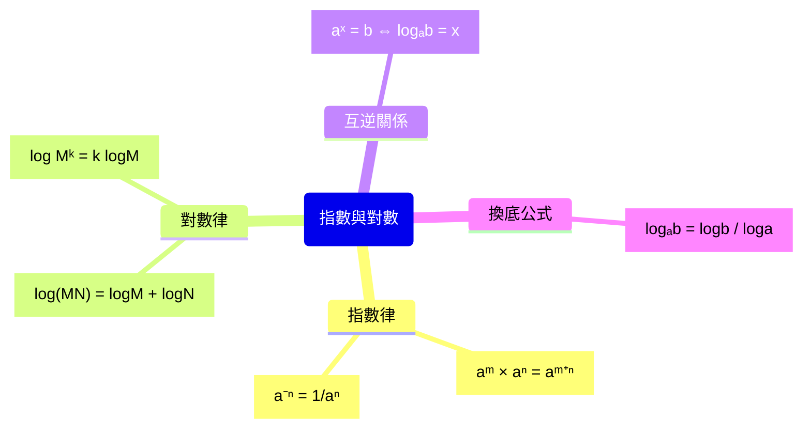

# 指數與對數

## 💡 為什麼要學？（Start with Why）
> 為什麼**地震規模** 7 比規模 5 可怕**那麼多**？為什麼 **pH** 差 1 就差 10 倍酸鹼？為什麼存錢的「複利」會像滾雪球愈滾愈大？背後是同一個工具：**指數與對數**——科學家用來「壓縮並比較巨大數字」的尺。學會它，你會看懂地震、聲音分貝、藥物半衰期、銀行利息共通的語言，也拿到高中數學通往自然科與財經的鑰匙。

## 📌 一句話總結
> 指數與對數是同一件事的正反面（互為反函數），把「重複相乘」和「要乘幾次」用兩套符號互相翻譯。

## 🎯 核心概念
- 指數 $a^x$ 是「a 連乘 x 次」的推廣，由正整數次方擴張到 0、負數、分數、實數。
- 規定 $a>0$ 且 $a\neq1$ 才談對數。
- 對數 $\log_a b = c$ 的白話：「a 的幾次方等於 b」，即 $a^c=b$。
- 指對互逆：$a^{\log_a x}=x$、$\log_a a^x=x$，兩函數圖形對 $y=x$ 對稱。
- 指數律：$a^m\cdot a^n=a^{m+n}$、$(a^m)^n=a^{mn}$、$a^{-n}=\frac{1}{a^n}$、$a^{m/n}=\sqrt[n]{a^m}$。
- 對數律：$\log(MN)=\log M+\log N$、$\log\frac{M}{N}=\log M-\log N$、$\log M^k=k\log M$。
- 換底公式：$\log_a b=\dfrac{\log_c b}{\log_c a}$。
- 常用對數 $\log x$（底 10）：整數部分「首數」、小數部分「尾數」，用來判斷位數與首位數字。

## 🗺 圖解
> 單元觀念統整：指數律、對數律、互逆關係、換底。

## 🌏 生活連結（記憶錨點）
> - 對數像「換算位數的尺」：地震規模、聲音分貝、pH 都是「差一級其實差十倍」——規模 7 比規模 5 不是大一點，而是能量 100 倍。
> - 指數成長像「對折紙張」：每折厚度乘 2，折 n 次是 $2^n$，幾十折就能到月球——指數可怕在「乘」不是「加」。
> ⚠️ 比喻破功處：對折紙只描述「離散、整數次」成長，但課本指數函數是「連續」的（x 可為 $\sqrt2$、$\pi$），圖形是平滑曲線，不是階梯。

## 🧠 記憶法 / 口訣
- 對數三律：「**乘變加、除變減、次方搬到前面當係數**」。
- 換底：「**新底取對數，原數在上、原底在下**」。
- 互逆：「log 和指數是一對手套，套上再脫下還是原來那隻手」。
- 首數記位數：正數 N 的整數位數 = 首數 + 1（首數 = $\log N$ 取高斯記號）。

## ⭐ 考試重點
- [ ] **課綱分布**：高一上（必修）—指數與對數的定義、計算性質（log 乘變加）、科學記號與生活應用（分貝/地震規模/pH）；高二（數A/數B 分流）—對數函數圖形、複雜對數不等式。
- [ ] **數A**：高二重點章。換底、對數律化簡、指對數方程式與不等式、求位數/首位、指對函數圖形與單調性、與數列（複利、半衰期）結合——全部要熟。
- [ ] **數B**：偏定義、基本運算律、生活情境（複利、pH、分貝）資料判讀；複雜不等式與繁複化簡比重低、素養題多。
- [ ] **必背**：指數律 5 條、對數律 3 條、換底公式。（$\log 2\approx0.3010$、$\log 3\approx0.4771$ 等數值學測通常於卷末附參考數值，**重點在會運用、不在死背**。）
- [ ] **常考題型**：用 $\log2$、$\log3$ 求對數；判斷 $2^{100}$ 幾位數；解 $a^x=b$（兩邊取 log）；複利/半衰期應用（非選重過程分）。

## ⚠️ 易錯點 / 陷阱
- $\log(M+N)\neq\log M+\log N$——加法不能拆，只有乘除可（最高頻錯誤）。
- $(\log M)^2\neq\log M^2$；後者 $=2\log M$。
- 真數必須 > 0：解對數方程式後一定要**驗根**，丟掉使真數 ≤0 的解。
- 底 $a$ 介於 0 與 1 時函數遞減，解不等式時**不等號要變向**。
- 求位數首數用「高斯(floor)」不是四捨五入；負首數要小心。
- $a^0=1$（$a\neq0$），但 $0^0$ 未定義。

## 🔗 跨科連結
- [[酸鹼與pH值]]
- [[地震規模]]
- [[數列級數與複利]]

## 📝 一分鐘自我檢測
> 先遮答案再想。
1. Q：化簡 $\log_2 24-\log_2 3$。　A：$\log_2 8=3$。
2. Q：已知 $\log2\approx0.3010$，$2^{30}$ 是幾位數？　A：$30\times0.3010=9.03$，首數 9，位數 = 10。
3. Q：判斷 $\log(5+5)=\log5+\log5$ 對嗎？　A：錯。左 $=\log10=1$，右 $=2\log5\approx1.398$；加法不可拆。

---
> 📋 複核紀錄：
> - ✅【已確認｜2026-06-28 人工複核】課綱定位：常用對數與指數的「定義、計算性質、生活應用（科學記號/分貝/地震規模/pH）」在**高一上必修**；「對數函數圖形」與「複雜對數不等式」在**高二（數A/數B 分流）**。frontmatter 與考試重點已據此修正。
> - ✅【已調整】$\log2$、$\log3$ 等數值由「必背」改為「會運用為主」——學測卷末通常附參考數值，重點在運用。來源：大考中心學測數學試卷作答注意事項。
> - 〔提醒〕Mermaid mindmap 公式節點以 Unicode 上下標＋ `["..."]` 包住可正常渲染；切勿在 mindmap 節點放裸 LaTeX `$...$`（無法渲染）。
>
> 【硬事實查證皆正確】指數律、對數律、換底、互逆、3 題自我檢測答案均無誤；無錯字（已修「繁化簡→繁複化簡」）。
