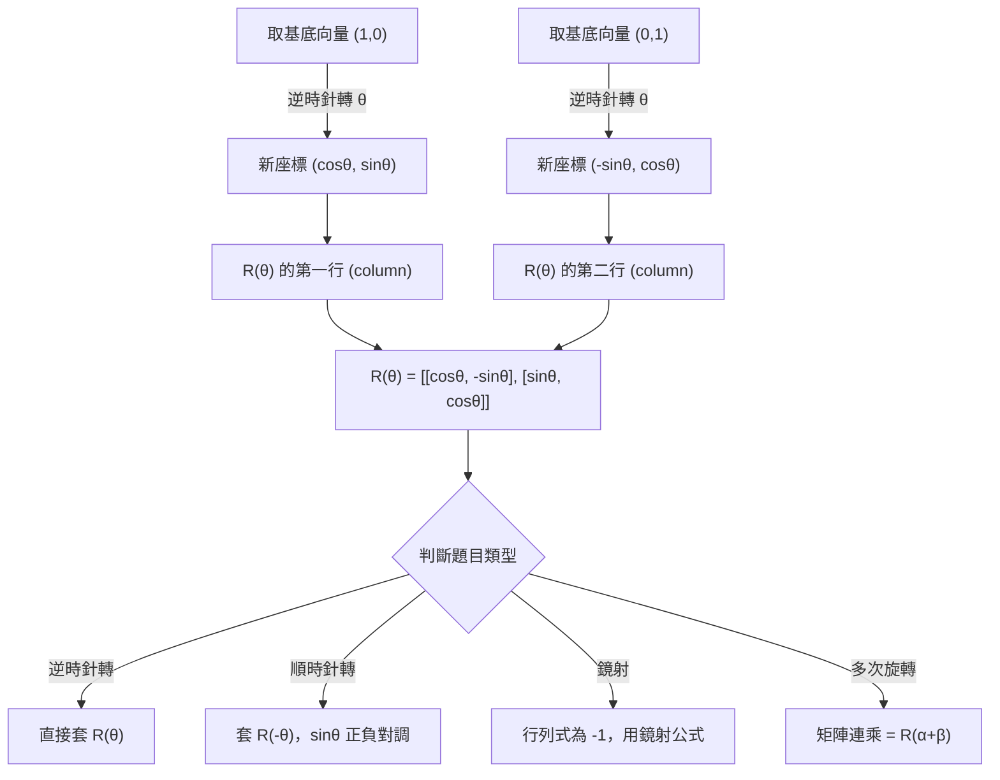

# 旋轉矩陣

## 💡 為什麼要學？（Start with Why）

你有沒有想過，電腦是怎麼把畫面上的圖片「轉個角度」給你看的？手機裡每一幀 3D 遊戲畫面、每一次地圖視角切換、每一段 GIF 旋轉動畫，背後都在執行同一套計算：把原本的座標餵進一組數字組成的「盒子」，輸出就是旋轉後的新座標。這個盒子就是旋轉矩陣。

旋轉矩陣是矩陣乘法最漂亮的真實應用——不是為了考試而存在的符號遊戲，而是幾何直覺與代數計算的真正交會點。學懂它，你就同時打通了「矩陣乘法的幾何意義」、「三角函數的座標詮釋」、以及「向量的線性變換」，這三條脈絡在學測與大學數學都反覆出現。

反直覺鉤子：旋轉一個點，你只需要「兩個三角函數值」就夠了。為什麼不是四個獨立數字，偏偏 cosθ 和 sinθ 就能同時決定所有旋轉？

## 📌 一句話總結

旋轉矩陣是把平面上的點繞原點逆時針旋轉 θ 角的線性變換，由 cosθ 與 sinθ 完全決定，形式為 $\begin{bmatrix} \cos\theta & -\sin\theta \\ \sin\theta & \cos\theta \end{bmatrix}$。

## 🎯 核心概念

- 旋轉矩陣定義：平面上繞原點逆時針旋轉 θ 角的線性變換矩陣，記作 R(θ)。
- 公式來源：對基底向量 (1,0) 和 (0,1) 分別旋轉 θ，讀出新座標即為矩陣的兩行（column）。
- 標準形式：$R(\theta) = \begin{bmatrix} \cos\theta & -\sin\theta \\ \sin\theta & \cos\theta \end{bmatrix}$，作用為 $[x', y']^\top = R(\theta)[x, y]^\top$。
- 逆旋轉：R(-θ) = R(θ)⁻¹ = R(θ)ᵀ——旋轉矩陣是正交矩陣。
- 行列式恆為 1：det R(θ) = cos²θ + sin²θ = 1，保持圖形面積不變。
- 矩陣連乘 = 角度相加：R(α)·R(β) = R(α+β)，旋轉可疊加。
- 鏡射矩陣的差異：鏡射矩陣行列式為 -1；旋轉矩陣行列式為 +1。

## 🗺 圖解



## 🌏 生活連結（記憶錨點）

比喻：時鐘指針的搬家規則。想像你站在時鐘中心，手指向 3 點方向（正 x 軸，座標 (1,0)）。逆時針轉 θ 角後，手指的終點就是 (cosθ, sinθ)——這正是單位圓的定義。旋轉矩陣不過是把「單位圓上兩個基準點轉完後的新位置」整理進一個 2×2 的表格。

⚠️ 比喻哪裡會破功：時鐘習慣「順時針為正」，但數學標準旋轉方向是「逆時針為正」。別把日常順時針直覺帶進公式——符號會反掉。

## 🧠 記憶法 / 口訣

口訣——「cos 守對角，sin 交叉負在右上」

```
| cos  -sin |
| sin   cos |
```

- 對角（左上、右下）都是 cosθ。
- sin 出現在左下（正）與右上（負）。
- 負號只在右上角，其餘三格全正。

常用角度速查表（務必背熟）：

| θ | cosθ | sinθ |
|---|---|---|
| 30° | √3/2 | 1/2 |
| 45° | √2/2 | √2/2 |
| 60° | 1/2 | √3/2 |
| 90° | 0 | 1 |
| 180° | -1 | 0 |

快速驗算：代 θ=90° 後，(1,0) 應變成 (0,1)——用矩陣乘法確認一次，確保符號沒抄反。

## ⭐ 考試重點

- [ ] 必背：$R(\theta) = \begin{bmatrix} \cos\theta & -\sin\theta \\ \sin\theta & \cos\theta \end{bmatrix}$，以及 30°/45°/60°/90° 四組 cos/sin 值。
- [ ] 常考題型 1：給一個點 (x, y)，求繞原點逆時針旋轉 θ 後的新座標。
- [ ] 常考題型 2：給旋轉矩陣求旋轉角度（反推 cosθ、sinθ 後查角度）。
- [ ] 常考題型 3：多次旋轉的合成——用 R(α+β) 化簡。
- [ ] 常考題型 4：旋轉矩陣的行列式、逆矩陣、轉置（正交矩陣性質）。
- [ ] 學測落點：屬數A範圍；數B 不考旋轉矩陣（待查：108課綱數B是否完全無矩陣內容）。

## ⚠️ 易錯點 / 陷阱

1. 正負號混淆（最高頻）：右上角是 -sinθ，左下角是 +sinθ。每次寫完代 θ=90° 驗算一次。
2. 順時針 vs. 逆時針：題目說「順時針轉 60°」，要改成 R(-60°)，sinθ 全部變號。
3. 旋轉矩陣 ≠ 鏡射矩陣：det = +1 是旋轉，det = -1 是鏡射。
4. 矩陣乘法不可交換：旋轉矩陣 R(α)·R(β) = R(α+β) 是特例，不要誤以為通則。
5. 旋轉中心不在原點：標準旋轉矩陣只適用於繞原點旋轉。

## 🔗 跨科連結

- [[矩陣]]（上層概覽：矩陣主題群入口，含線性變換全貌）
- [[矩陣運算]]（旋轉矩陣的運算基礎）
- [[三角函數]]（cosθ、sinθ 的值與角度關係）
- [[向量]]（旋轉矩陣作用於行向量的幾何意義）
- [[行列式]]（det R(θ) = 1 的幾何意義：保面積）
- [[線性變換]]（旋轉是典型的保長度線性變換）
- [[鏡射矩陣]]（與旋轉矩陣的對照：det = -1 vs +1）

## 📝 一分鐘自我檢測

> 先遮住下方答案，自己想，再對照。

1. Q：寫出繞原點逆時針旋轉 45° 的旋轉矩陣，並計算點 (2, 0) 旋轉後的新座標。　A：$R(45°) = \begin{bmatrix} \sqrt{2}/2 & -\sqrt{2}/2 \\ \sqrt{2}/2 & \sqrt{2}/2 \end{bmatrix}$。新座標 = $(\sqrt{2},\ \sqrt{2})$。
2. Q：已知矩陣 $M = \begin{bmatrix} 0 & 1 \\ -1 & 0 \end{bmatrix}$，對應旋轉角度是幾度？逆時針還是順時針？　A：cosθ = 0，-sinθ = 1 → sinθ = -1，故 θ = -90°，即順時針旋轉 90°。
3. Q：R(30°)·R(60°) 的結果是什麼？不需展開計算，說明理由。　A：利用 R(α)·R(β) = R(α+β)，故結果為 $R(90°) = \begin{bmatrix} 0 & -1 \\ 1 & 0 \end{bmatrix}$。
4. Q（挑戰）：旋轉矩陣 R(θ) 的逆矩陣是什麼？用兩種方法說明。　A：幾何法：逆旋轉即 R(-θ)，sinθ 正負對調。代數法：正交矩陣 A⁻¹ = Aᵀ，故 $R(\theta)^{-1} = \begin{bmatrix} \cos\theta & \sin\theta \\ -\sin\theta & \cos\theta \end{bmatrix}$。兩方法結果相同。

---
> 📋 待確認項（內容檢查 Agent 填寫，人工複核後刪除）：
>
> **查核日期：2026-06-28**
>
> **已查證（無需人工複核）：**
> - 旋轉矩陣標準形式 `R(θ)=[[cosθ,-sinθ],[sinθ,cosθ]]`：正確。來源：維基百科〈旋轉矩陣〉、科學Online。
> - 逆旋轉 R(θ)⁻¹ = R(-θ) = R(θ)ᵀ（正交矩陣性質）：正確。
> - det R(θ) = cos²θ + sin²θ = 1：正確。
> - R(α)·R(β) = R(α+β)：正確。
> - 常用角度 30°/45°/60°/90°/180° 的 cosθ、sinθ 值：正確。
> - θ=90° 代入驗算，(1,0)→(0,1)：符合公式，正確。
> - 114年學測數A（第18-20題）確實出現旋轉矩陣考題，印證本主題屬學測重點，「考試頻率：中」合理。來源：大考中心 114學年度學測數學A試題。
>
> **待人工複核：**
> - 108課綱數B 的矩陣範圍：查證結果為數B 有「矩陣與資料表格、矩陣基本運算」等基礎矩陣內容，但**不含線性變換（旋轉矩陣）**。因此第93行「數B 不考旋轉矩陣」描述正確；但若要確認數B 矩陣完整範圍，建議人工核對官方課綱或大考中心考試說明後刪除此項。來源：高雄市立金獅湖國中數A數B差異一覽表（109.05.01）。
> - 旋轉矩陣在108課綱中的確切定位（數A必修、加深加廣或選修）：搜尋結果顯示屬數A線性代數單元，但確切冊別（高二上/下）未完全確認，建議人工對照教科書目錄確認後刪除此項。
