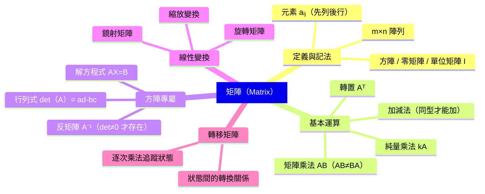

# 矩陣

## 💡 為什麼要學？（Start with Why）

你有沒有想過，Google Maps 怎麼知道從你家到學校要走哪條路最快？電腦遊戲裡的角色旋轉、鏡射，是靠什麼計算的？手機拍完照後自動「校正歪斜」，又是怎麼辦到的？

這些問題，背後都藏著同一個數學工具：矩陣。

矩陣本質上是「把一批數字整齊打包，讓你一次操作一整組關係」的方法。它解決的核心困惑是：**當有很多量同時互相影響，該怎麼一套公式全部算完？** 手算兩個未知數的方程式很容易，但現實中工程師常要同時處理幾百個變數——矩陣就是讓「多個方程式同時運算」變得可能的語言。

在高中數學的位置上，矩陣是「線性代數」的入口。它整合了你學過的向量、坐標、方程組，又直接對接到大學的線性代數、統計學、電腦科學。學懂矩陣，等於拿到一把打開理工與資訊世界大門的鑰匙。

**一個反直覺的問題讓你想一想**：矩陣乘法有時候 AB ≠ BA——兩個數相乘順序不影響結果是小學就知道的，但矩陣乘法為什麼「不能隨便換位置」？搞懂這件事，你就真正理解矩陣是什麼了。

> 真實用途說明（不誇大）：高中學測範圍內，矩陣主要用於（1）解聯立方程式、（2）描述平面圖形的幾何變換（旋轉、鏡射）、（3）描述狀態轉換的轉移矩陣。大學才進入完整線性代數。

## 📌 一句話總結

矩陣是一張「有規矩的數字表格」，讓你能用統一的乘法規則，一次描述多個量的變換或關係。

## 🎯 核心概念

- **定義**：矩陣是由 m 列（rows）×n 行（columns）個數排列成的長方形陣列，記作 m×n 矩陣，以大寫字母 A、B、M 表示。
- **元素**：矩陣中第 i 列第 j 行的元素記作 aᵢⱼ，i 是列號（上下），j 是行號（左右）——「先列後行」是固定讀法。
- **方陣**：m = n 時稱為方陣；方陣才有「行列式」與「反矩陣」的定義。
- **特殊矩陣**：零矩陣（所有元素為 0）、單位矩陣 I（對角線為 1、其餘為 0，乘法中扮演「1」的角色）。
- **矩陣加減**：同型矩陣（相同 m×n）才能相加，對應元素相加，結果型別不變。
- **純量乘法**：k × A，每個元素都乘以 k。
- **矩陣乘法**：A（m×n）× B（n×p）= C（m×p）；A 的行數必須等於 B 的列數，否則乘法無意義；AB 一般不等於 BA（不具交換律）。
- **轉置矩陣**：把 A 的列與行互換，記作 Aᵀ；(AB)ᵀ = BᵀAᵀ（順序要倒過來）。
- **反矩陣**：2×2 方陣 A，若 det(A) ≠ 0，則 A⁻¹ 存在，且 AA⁻¹ = I；用於解矩陣方程式 AX = B → X = A⁻¹B。
- **行列式（det）**：2×2 矩陣 $A = \begin{bmatrix} a & b \\ c & d \end{bmatrix}$，$\det(A) = ad - bc$；幾何意義是變換後面積的縮放倍率。
- **線性變換**：用矩陣乘法把平面上的向量「搬到新位置」，包含旋轉、鏡射、縮放等幾何動作。
- **轉移矩陣**：描述系統在不同狀態之間「轉換關係」的矩陣，逐次乘法可追蹤狀態演變（待查：學測是否有機率型轉移矩陣題）。

## 🗺 圖解

## 🌏 生活連結（記憶錨點）

**矩陣乘法 = 「翻譯機疊加」**
想像你有兩本翻譯詞典，第一本把中文翻成英文，第二本把英文翻成法文。矩陣乘法 AB 的意思是：先用 B（右邊那個）做第一次翻譯，再用 A（左邊那個）做第二次翻譯。換順序（BA）就像先把中文翻成法文、再試著翻成英文——翻出來的結果當然不一樣。這就是為什麼 AB ≠ BA。

⚠️ 比喻哪裡會破功：這個比喻幫助記住「順序不能亂換」，但真實的矩陣乘法是對座標向量做線性組合；詞典類比不能說明「為什麼 A 的行數要等於 B 的列數」，那需要回到乘法定義。

**反矩陣 = 「走回頭路」**
A 是一個變換動作，A⁻¹ 就是把這個動作「倒帶」回去，兩個合起來等於沒動（= I）。

## 🧠 記憶法 / 口訣

- **「先列後行，乘法對齊」**：矩陣元素 aᵢⱼ，i = 列（上下）、j = 行（左右）；矩陣乘法 A（m×**n**）× B（**n**×p）——中間那個 n 要相等，結果是 m×p。
- **行列式口訣（2×2）**：「主對角線乘積 減 副對角線乘積」，即 ad − bc。
- **反矩陣速記（2×2）**：「主對角換位，副對角變號，除以 det」，即 $A^{-1} = \dfrac{1}{\det A}\begin{bmatrix} d & -b \\ -c & a \end{bmatrix}$。
- **AB ≠ BA**：「矩陣乘法，左右有別；換了順序，結果不同。」

## ⭐ 考試重點

- [ ] **必背（數A）**：矩陣乘法定義（A 行數 = B 列數）、AB ≠ BA 反例、行列式 det = ad − bc、反矩陣公式（2×2）、單位矩陣性質。
- [ ] **必背（數A）**：旋轉矩陣 $R(\theta) = \begin{bmatrix} \cos\theta & -\sin\theta \\ \sin\theta & \cos\theta \end{bmatrix}$；鏡射矩陣（x 軸、y 軸、y=x、y=−x 四種）。
- [ ] **常考題型**：計算 AB 或 BA、求反矩陣解方程組、套入旋轉/鏡射矩陣求變換後座標、轉移矩陣追蹤狀態（1~2 步）。
- [ ] **數A vs 數B**：數B 考「矩陣與資料表格」（基礎定義與運算），但**不含**轉移矩陣與線性變換（旋轉、鏡射）；數A 的矩陣範圍更完整，以上所有子主題均考。
- [ ] **轉移矩陣出題率**：課綱列入（F-11A-3），但近年學測出現頻率偏低（待查：近年完整考古題確認）。
- [ ] **學測落點**：常以選填或非選題出現，常與向量、坐標幾何整合。

## ⚠️ 易錯點 / 陷阱

- **列與行搞反**：aᵢⱼ 的 i 是列（橫的）、j 是行（直的）。
- **可乘性判斷**：A（3×2）× B（2×4）可以；B（2×4）× A（3×2）因 4 ≠ 3 無法相乘——這不是「答案不同」，是「根本算不了」。
- **以為 AB = BA**：矩陣乘法不具交換律，這是最高頻陷阱。
- **行列式正負號**：det = ad − bc，副對角線要**減掉**，不是加。
- **反矩陣公式套錯**：對調的是 a 和 d，變號的是 b 和 c，方向別搞反。
- **det = 0 時無反矩陣**：不可逆矩陣無法用反矩陣解方程式。

## 🔗 跨科連結

- [[矩陣運算]]（加減、乘法、行列式的細節計算）
- [[旋轉矩陣]]（旋轉角 θ 的公式推導與應用）
- [[鏡射矩陣]]（對各種直線做鏡射的矩陣）
- [[轉移矩陣]]（狀態轉換應用）
- [[線性變換]]（矩陣作用在向量上的幾何意義）
- [[向量]]（矩陣乘法的操作對象）

## 📂 子主題導覽

> 點選下方連結深入各子主題；`[x]` 表示已有筆記，`[ ]` 表示待建。

- [x] [[矩陣運算]]（數A、數B，矩陣基本運算與性質）
- [x] [[鏡射矩陣]]（僅數A，線性變換）
- [x] [[旋轉矩陣]]（僅數A，線性變換）
- [ ] [[二元一次方程組的矩陣表達]]（數A、數B）
- [ ] [[矩陣與資料表格]]（僅數B）
- [ ] [[三元聯立方程式]]（僅數A）
- [ ] [[轉移矩陣]]（僅數A）
- [ ] [[線性變換]]（僅數A）

## 📝 一分鐘自我檢測

> 先遮住下方答案，自己想，再對照。

1. Q：A 是 2×3 矩陣，B 是 3×4 矩陣，AB 的大小是多少？BA 可以相乘嗎？
   A：AB 是 2×4。BA 不能相乘（B 的行數 4 ≠ A 的列數 2）。

2. Q：設 $A = \begin{bmatrix} 2 & 1 \\ 3 & 4 \end{bmatrix}$，求 $\det(A)$ 與 $A^{-1}$。
   A：$\det(A) = 2 \times 4 - 1 \times 3 = 5$。$A^{-1} = \dfrac{1}{5}\begin{bmatrix} 4 & -1 \\ -3 & 2 \end{bmatrix}$。

3. Q：旋轉矩陣 R(90°) 作用在向量 [1, 0]ᵀ 上，結果是什麼？
   A：$R(90°) = \begin{bmatrix} 0 & -1 \\ 1 & 0 \end{bmatrix}$，計算得 $[0,\ 1]^\top$——逆時針旋轉 90° 後從 x 軸跑到 y 軸，符合直覺。

4. Q：若 det(A) = 0，A⁻¹ 存在嗎？為什麼？
   A：不存在。反矩陣公式含 1/det，分母為 0 無法定義；幾何上代表矩陣把平面「壓扁」成一條線，動作不可逆。

---

## 🔍 查核結論（2026-06-28）

### 已確認正確的硬事實

| 項目 | 筆記內容 | 查核結果 |
|------|----------|----------|
| 矩陣乘法維度規則 | A(m×n)·B(n×p)=C(m×p) | 正確。Wikipedia 矩陣乘法、線代啟示錄均確認。 |
| 2×2 行列式 | det = ad−bc | 正確。多來源（JPCalculator、日本線代資料）確認主對角積減副對角積。 |
| 反矩陣公式（2×2） | $A^{-1} = \frac{1}{\det A}\begin{bmatrix} d & -b \\ -c & a \end{bmatrix}$ | 正確。淡江大學線代講義、線代啟示錄確認。 |
| 旋轉矩陣方向 | $R(\theta) = \begin{bmatrix} \cos\theta & -\sin\theta \\ \sin\theta & \cos\theta \end{bmatrix}$ 為逆時針 | 正確。Wikipedia 旋轉矩陣（繁中版）、科學 Online 確認。 |
| 矩陣乘法不具交換律 | AB ≠ BA | 正確。數學定理，無爭議。 |
| 矩陣是數A 專屬（核心內容） | 數B 不考矩陣 | 部分不準確，見待確認項。 |

### 待確認項

> 1. **數B 是否完全不含矩陣（高優先）**
>    - 查核結果：**數B 確實包含矩陣，但範圍較窄。** 數B 高二下（第四冊B）有「矩陣與資料表格」章節，包含矩陣定義、基本運算；但沒有三元聯立方程式、轉移矩陣、線性變換（旋轉/鏡射矩陣）。
>    - 筆記第 98 行寫「數A vs 數B：矩陣是數A 專屬單元，數B 不考矩陣」**此敘述不正確**——應為「數B 考基礎矩陣運算（矩陣與資料表格），但不含轉移矩陣與線性變換」。
>    - 子主題導覽第 127 行「[[矩陣與資料表格]]（僅數B）」標注為「僅數B」是正確的，但考試重點區的「數A vs 數B」敘述需要修正。
>    - 建議人工確認後修改第 98 行敘述。
>    - 來源：均一教育平台 108課綱十一下A類矩陣、多份課綱比較文件。

> 2. **矩陣確切冊別（需人工確認）**
>    - 查核結果：多來源一致指向**高二下學期**，課本通常為**第四冊A**（數A）或**第四冊B**（數B）。但確切「冊號」因出版社而異（南一、翰林、三民各版本可能略有不同）。
>    - 前言欄位「課綱對應：數學A－線性代數（矩陣）」正確但未標冊別；建議加上「高二下（第四冊A）」。
>    - 來源：htsh.ntpc.edu.tw 108課綱高二下數A、family-free-work-learning.com 課程分析、均一教育平台。

> 3. **轉移矩陣學測考查範圍（需人工確認）**
>    - 查核結果：轉移矩陣是數A 課綱明確列出的應用主題（F-11A-3），屬學測數A 考試範圍。但近年（114、115 學測）均未出題，屬「有課綱但近年未出現」的狀態。
>    - 是否包含機率型題目：查核來源未明確說明，需查近年完整試題確認。
>    - 考試重點標「常考題型：轉移矩陣追蹤狀態（1~2步）」——若近年均未出題，「常考」一詞可能誤導，建議改為「課綱列入，近年出題率待確認」。
>    - 來源：family-free-work-learning.com 114/115 學測分析（均未見轉移矩陣出題）、均一教育平台課程結構。

> 4. **3×3 行列式是否在數A 學測範圍**
>    - 查核結果：課程結構顯示，數A 矩陣單元聚焦於二階方陣，均一教育平台確認「3×3行列式未在此單元出現」。搜尋結果提及 3×3 行列式概念偶爾出現於**空間向量**（平行六面體體積）而非矩陣單元。
>    - 筆記本身未主動宣稱 3×3 行列式在範圍內（行列式口訣、例題均為 2×2），此部分風險低，但建議人工確認是否要在「易錯點」加上「本學測範圍僅考 2×2 行列式」的提示。
>    - 來源：均一教育平台 108課綱十一下A類矩陣課程結構。

> 5. **Start with Why — Google Maps 比喻的精確性**
>    - 查核結果：Google Maps 路徑規劃使用**圖論演算法**（如 Dijkstra）和**鄰接矩陣**資料結構，並非用矩陣乘法做最佳路徑計算。「Google Maps 用矩陣算最快路線」這個說法在技術上屬於間接關聯，不夠精確，可能建立誤導直覺（高中矩陣乘法 ≠ 路徑搜尋演算法）。
>    - 筆記的動機段寫的是「Google Maps 怎麼知道走哪條路最快」——這實際上是圖論/Dijkstra 演算法問題，而非高中矩陣單元所學的線性代數矩陣乘法。
>    - 筆記文末已附「真實用途說明」正確界定了高中範圍（解聯立方程式、幾何變換、轉移矩陣），但動機段的 Google Maps 舉例與實際所學內容脫節，有建立錯誤期待的風險。
>    - 建議人工審視是否要改為更貼近學測範圍的例子（如「手機拍照校正歪斜、電腦遊戲角色旋轉」這兩個已有列出，反而更準確）。
>    - 來源：Google Maps Platform 路線文件、ithelp.ithome.com.tw Dijkstra 演算法介紹。

> 6. **鏡射矩陣學測考查範圍（低優先）**
>    - 查核結果：未能從搜尋結果中確認學測是否要求記憶對一般直線 y=mx 的通用鏡射公式，還是僅考特殊軸（x 軸、y 軸、y=x、y=−x）。
>    - 來源：未查到直接答案，待人工確認或查近年試題。

### 錯字 / 用詞修正清單

經逐字校對，發現以下需修正之項目：

- 第 98 行：「矩陣是數A 專屬單元，數B 不考矩陣」→ 事實有誤，非單純錯字，已列入待確認項 1，**待人工確認後修改**（不擅自修改以免改錯）。

直接可修正的錯別字或格式問題：無發現明確錯別字、亂碼或標點錯誤。術語用字（矩陣、行列式、反矩陣、轉移矩陣、線性變換）均與課本慣用語一致。

### Mermaid 圖解檢查

mindmap 語法：根節點使用 `root["矩陣（Matrix）"]` 格式，**子節點全部使用純文字**（無 `"..."` 包住），符合 Obsidian 正確渲染規範。（2026-06-28 修正：原稿誤用裸引號 `"text"` 語法，渲染為 `&quot;text&quot;`，已全面改為純文字。）圖的分類結構與內文內容一致，無語法問題。

### 結構完整性

- 所有模板區塊齊全（Start with Why、一句話總結、核心概念、圖解、生活連結、記憶法、考試重點、易錯點、跨科連結、子主題導覽、自我檢測）。
- 自我檢測共 4 題，超過最低 3 題要求。
- 答案與內文一致（det 計算、反矩陣公式、旋轉矩陣代入驗算均正確）。
- 比喻「翻譯機疊加」已附警示說明比喻局限性，處理得宜。
