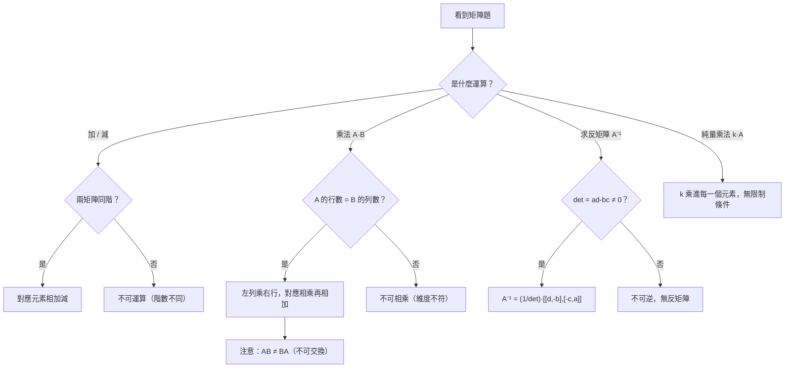

# 矩陣運算

## 💡 為什麼要學？（Start with Why）

你有沒有想過，Netflix 是怎麼猜到你想看哪部片的？Google 又是怎麼同時排序幾十億個網頁的？答案都是同一件事：**矩陣運算**。

現代電腦每次執行「對大量資料做同一套操作」，都把資料塞進矩陣、把規則壓縮成另一個矩陣，然後用一次乘法搞定全部。數千張圖片的批次旋轉？矩陣乘法。大型考試的成績加權？矩陣乘法。AI 的每一層神經網路？還是矩陣乘法。

但在高中，矩陣的第一個用途更直接：**用「乘以反矩陣」來解聯立方程組**，把你原本要消去的手算步驟，變成一個公式一口氣搞定。

反直覺鉤子——「`AB ≠ BA`，乘法不是可以換序嗎？」當你第一次發現 2×2 的兩個矩陣相乘順序不能交換，直覺會覺得不對勁。但想想：「先穿鞋再穿襪」和「先穿襪再穿鞋」，結果明顯不同。矩陣乘法的不可交換性，正是它能表達「有順序的操作」的關鍵所在。

## 📌 一句話總結
> 矩陣就是一張會做運算的 Excel 表格：加減要逐格對齊（同階），乘法是「左列乘右行、對應相乘再相加」，而且乘法不可交換。

## 🎯 核心概念
- **矩陣與階數**：`m×n` 矩陣＝m 列（橫, row）× n 行（直, column）。
- **相等**：同階且對應元素皆相等。
- **加減**：必須同階，對應元素相加減。
- **純量乘法**：`k` 乘進每一個元素。
- **矩陣乘法**：`A(m×n)·B(n×p) = C(m×p)`，`c_ij` = A 第 i 列與 B 第 j 行對應相乘後相加。可乘條件：前者行數 = 後者列數。
- **特殊矩陣**：零矩陣 O、單位矩陣 I（`AI = IA = A`）。
- **2×2 反矩陣**：`A=[[a,b],[c,d]]`，`det = ad−bc`；若 `det≠0`，`A⁻¹ = (1/det)·[[d,−b],[−c,a]]`。

## 🗺 圖解

## 🌏 生活連結（記憶錨點）
> - 矩陣 = 試算表：每一列是一筆資料、每一行是一個欄位。
> - 矩陣乘法 = 算總價：數量列向量 `[2  1]` ×單價行向量 `[[50],[30]]` = `[2×50 + 1×30] = [130]`。「對應相乘再相加」就是乘法的由來。
> ⚠️ 比喻邊界：Excel 不會強制「行數=列數才能乘」，這條維度規則是矩陣乘法特有的，別被試算表直覺帶偏。

## 🧠 記憶法 / 口訣
- 乘法：「**左列乘右行**」；維度「**中間相等、取兩端**」`(m×n)(n×p)→m×p`。
- 2×2 反矩陣：「**主對角線交換、副對角線變號、除以行列式**」。
- 列行不分？「**列是橫躺的、行是直立的**」（列＝row, 行＝column）。

## ⭐ 考試重點
- [ ] **必背**：矩陣乘法定義與可乘條件；2×2 反矩陣公式與 `det = ad−bc`。
- [ ] **常考題型**：乘法運算、`AB` vs `BA` 判斷、反矩陣存在性、用反矩陣解二元一次聯立。
- [ ] **數A 加考**：線性變換、轉移矩陣（馬可夫鏈狀態轉移）、三元一次聯立。數B 不考這些。
- [ ] **學測落點**：高二下單元；常以選填或混合題出現（出現頻率待人工對近年考古題確認）。

## ⚠️ 易錯點 / 陷阱
- `AB ≠ BA`（乘法**不可交換**），順序不能隨意對調。
- 加減**必須同階**；乘法要**維度對齊**（內維相等）。
- `AB = O` **不代表** A=O 或 B=O。
- **消去律不成立**：`AB = AC` 且 A≠O，也推不出 `B = C`。
- `det = 0` 時**沒有反矩陣**（不可逆）。
- 混淆「列（row）」與「行（column）」。

## 🔗 跨科連結
- [[矩陣]]（上層概覽：矩陣主題群入口，含所有子主題導覽）
- [[行列式]]（det 的計算與意義）
- [[二元一次聯立方程式]]（反矩陣解法）
- [[向量]]（線性組合的觀念基礎；點入可見向量主題群全貌）
- [[鏡射矩陣]]（矩陣乘法與反矩陣的幾何應用：鏡射變換）
- [[旋轉矩陣]]（矩陣乘法的幾何應用：旋轉變換）

## 📝 一分鐘自我檢測
> 先遮答案再想。
1. Q：`A` 是 `2×3`、`B` 是 `3×4`，`AB` 是幾階？`BA` 可以算嗎？
   A：`AB` 是 `2×4`；`BA` 不行（B 的行數 4 ≠ A 的列數 2）。
2. Q：`A=[[1,2],[3,4]]` 的反矩陣？
   A：`det = 1×4−2×3 = −2`；`A⁻¹ = (1/−2)·[[4,−2],[−3,1]] = [[−2,1],[1.5,−0.5]]`。
3. Q：已知 `AB = AC` 且 A 不是零矩陣，能否說 `B = C`？
   A：不能，矩陣沒有消去律（除非 A 可逆，左乘 `A⁻¹` 才能消）。

---
> 📋 待確認項（內容檢查 Agent 填寫，人工複核後刪除）：
> - 「考試頻率」暫標「中」：需人工對照近年學測（111 起新制）矩陣題實際出現頻率後定稿。
> - 數B 範圍刪減（線性變換/轉移矩陣/三元一次聯立）依課綱差異說明，建議對照最新大考中心考試說明再確認版本細節。
> - `[[行列式]]`、`[[二元一次聯立方程式]]` 連結目標尚未建檔（交知識串連 Agent）。
