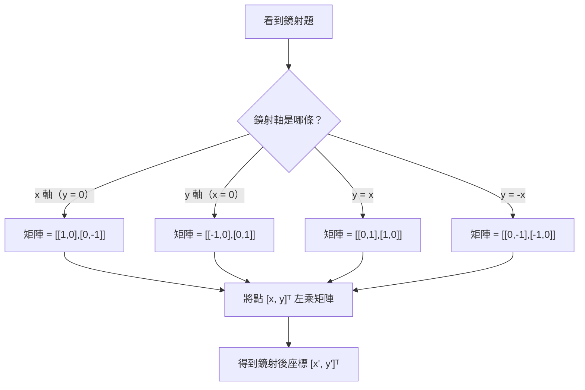

# 鏡射矩陣

## 💡 為什麼要學？（Start with Why）

你有沒有想過，電腦遊戲裡的角色動作、特效電影的翻轉鏡頭、手機照片的「水平翻轉」按鈕，背後都藏著同一件事？

每一次翻轉，電腦都在對螢幕上成千上萬個像素座標做同一件事：把每個點 `(x, y)` 按照某條軸線「照鏡子」，算出新的 `(x', y')`。如果每次翻一個點都要重新想一遍，速度會極慢。而矩陣的魔法在於：**把整個「照鏡子的規則」壓縮成一個 2×2 的矩陣，一次乘法就搞定任意一點的翻轉**——這就是鏡射矩陣。

學會這個你就能理解：為什麼 3D 遊戲、導航地圖、圖像處理軟體都用矩陣表示空間變換；同時這也是大學線性代數的入口觀念，數A 考生必須掌握。

鉤子——反直覺提問：「把 `(3, 5)` 對 `y = x` 照鏡子，答案是 `(5, 3)`；但如果是對 `y = -x` 呢？直覺告訴你是 `(-5, -3)` 嗎？是的話你答對了——但你能解釋為什麼嗎？用矩陣，你不需要每次靠直覺猜。」

## 📌 一句話總結

鏡射矩陣就是「把照鏡子的規則包成一個 2×2 矩陣」，任意一點乘上它就能算出對應鏡射後的座標。

## 🎯 核心概念

- **線性變換的本質**：平面上每個點 `(x, y)` 可寫成行向量 `[x, y]ᵀ`，線性變換就是「乘上一個矩陣」來移動這個點。
- **鏡射矩陣定義**：對某條直線做鏡射的線性變換，其對應矩陣稱為鏡射矩陣（reflection matrix）。
- **推導關鍵**：找出兩個基底向量 `[1,0]ᵀ`、`[0,1]ᵀ` 鏡射後落在哪，排成矩陣的兩行（column）即為所求。
- **對 x 軸鏡射**：`y → -y`，矩陣為 `[[1,0],[0,-1]]`。
- **對 y 軸鏡射**：`x → -x`，矩陣為 `[[-1,0],[0,1]]`。
- **對 y = x 鏡射**：x 與 y 互換，矩陣為 `[[0,1],[1,0]]`。
- **對 y = -x 鏡射**：x 與 y 互換後各取反號，矩陣為 `[[0,-1],[-1,0]]`。
- **鏡射矩陣的重要性質**：
  - 鏡射兩次等於不動：`M² = I`（單位矩陣）。
  - 鏡射矩陣的反矩陣就是它自己：`M⁻¹ = M`。
  - 行列式值恆為 `−1`（旋轉矩陣 `det = +1`，這是兩者的重要差異）。
- **與旋轉矩陣的關係**（待查：課綱是否明確要求兩者比較）：旋轉矩陣 `det = +1`，保持方向；鏡射矩陣 `det = −1`，翻轉方向。

## 🗺 圖解

## 🌏 生活連結（記憶錨點）

- **手機照片翻轉**：點「水平翻轉」相當於對 y 軸做鏡射，矩陣 `[[-1,0],[0,1]]` 讓每個像素的 x 座標取反號、y 不動。
- **鏡中文字**：「S」看起來像「Ƨ」，就是 y 軸鏡射；「b」和「d」的關係是 y 軸鏡射，「b」和「p」是 x 軸鏡射。
- **舞台對稱佈景**：設計師要左右對稱擺放燈光時，計算每盞燈的對稱位置，本質上就是對稱軸鏡射。

⚠️ 比喻哪裡會破功：生活中「照鏡子」是三維空間的操作，鏡子裡的像其實是沿著某個平面的反射；而這裡的鏡射矩陣是純粹二維平面上的操作，不要把「鏡子縱深感」帶進來造成混淆。

## 🧠 記憶法 / 口訣

**口訣：「軸上的點不動，法線方向取反號」**——推導時先問「這個點若在鏡射軸上，變換後不應該動」，再問「垂直軸方向的分量變號」，兩個條件就能重建任何鏡射矩陣。

**四個矩陣圖像記憶法**：

| 鏡射軸 | 記法 | 矩陣 |
|---|---|---|
| x 軸 | y 變號，x 不動 | `[[1,0],[0,−1]]` |
| y 軸 | x 變號，y 不動 | `[[−1,0],[0,1]]` |
| y = x | x、y 互換（轉置） | `[[0,1],[1,0]]` |
| y = −x | 互換再全部變號 | `[[0,−1],[−1,0]]` |

**y = x 記憶鉤**：「轉置矩陣（Transpose）就是對 y = x 的鏡射」——記「T 取自 Transpose，也取自對角線（沿 y = x 翻）」。

**驗算快法**：把 `(1, 0)` 和 `(0, 1)` 代進去確認落點合理；再把一個落在鏡射軸上的點（如 y = x 的點 `(2, 2)`）代進去確認它不動。

## ⭐ 考試重點

- [ ] **必背**：四條常見軸（x 軸、y 軸、y = x、y = -x）對應的 2×2 鏡射矩陣。
- [ ] **必背性質**：`M² = I`、`M⁻¹ = M`、`det(M) = −1`。
- [ ] **常考題型**：
  - 給一個點，求鏡射後的像（代入計算）。
  - 給一個矩陣，判斷是哪種幾何變換（鏡射？旋轉？其他？）。
  - 連續兩次線性變換的矩陣合成（先做 A 再做 B，矩陣為 BA）。
  - 求讓某幾何圖形（線段、三角形）做鏡射後的像，再回答面積是否改變。
- [ ] **數A 限定**：線性變換（含鏡射矩陣）是數A 範圍；數B **不考**。
- [ ] **學測落點**：高二下矩陣單元，數A 選填或混合題（待查：請對照大考中心 111 起考試說明確認細節）。

## ⚠️ 易錯點 / 陷阱

- **乘法順序**：點是「行向量（column vector）」，變換是「矩陣左乘向量」：`M · v`；不是 `v · M`，順序不能反。
- **y = x 與 y = -x 混淆**：`y = x` 的矩陣是「互換」（`[[0,1],[1,0]]`）；`y = -x` 是「互換後全負號」（`[[0,-1],[-1,0]]`）。記錯是最常見的失分點。
- **鏡射 ≠ 旋轉**：旋轉矩陣 `det = +1`，鏡射矩陣 `det = −1`。看到行列式值是判斷變換種類的捷徑。
- **兩次變換的矩陣合成**：先做鏡射 A、再做鏡射 B，合成矩陣是 `B·A`（注意是 B **左乘** A，順序與直覺相反）。
- **面積不守恆的誤解**：鏡射雖然改變方向，但面積（長度、距離）守恆；行列式絕對值 = 面積縮放倍率，`|det| = 1` 代表面積不變。
- **邊界值**：如果題目問「對原點鏡射」，那不是鏡射矩陣，而是「中心對稱」，矩陣是 `[[-1,0],[0,-1]]`（等同旋轉 180°），`det = +1`，不要和鏡射混淆。

## 🔗 跨科連結

- [[矩陣]]（上層概覽：矩陣主題群入口，含線性變換全貌）
- [[矩陣運算]]（鏡射矩陣的基礎：矩陣乘法、反矩陣、行列式）
- [[線性變換]]（鏡射是線性變換的一種，旋轉矩陣同屬此類）
- [[向量]]（鏡射的操作對象是向量，座標表示法要熟）
- [[旋轉矩陣]]（與鏡射矩陣的 det 差異是常考比較點）

## 📝 一分鐘自我檢測

> 先遮住下方答案，自己想，再對照。

1. Q：點 `P = (3, −2)` 對 x 軸做鏡射，求鏡射後的像 P'。
   A：對 x 軸鏡射矩陣 `[[1,0],[0,−1]]` 乘以 `[3, −2]ᵀ`，得 `[3, 2]ᵀ`，即 `P' = (3, 2)`。

2. Q：矩陣 `M = [[0, −1],[−1, 0]]`，這是對哪條直線的鏡射？
   A：對 y = −x 的鏡射。驗算：軸上的點 `(1, −1)` 代入得 `[1, −1]ᵀ`，不動，符合。

3. Q：先對 y 軸做鏡射，再對 x 軸做鏡射，求合成矩陣，並說明相當於哪種幾何變換。
   A：`B·A = [[-1,0],[0,-1]]`，相當於對原點做 180° 旋轉（中心對稱）。

4. Q：鏡射矩陣的行列式值是多少？它告訴你什麼？
   A：恆為 `−1`。絕對值 = 1 代表面積不變；負號代表方向（定向）被翻轉。

---
> 📋 待確認項（內容檢查 Agent 填寫，人工複核後刪除）：
>
> ### 已查證（可信，無需人工複核）
>
> - **四個鏡射矩陣公式**：x 軸 `[[1,0],[0,-1]]`、y 軸 `[[-1,0],[0,1]]`、y=x `[[0,1],[1,0]]`、y=-x `[[0,-1],[-1,0]]` 均經多來源確認正確。來源：[Reflections and Rotations](https://digestiblenotes.com/further_maths/linear_transformations/reflect_rotate.php)、[PlanetMath derivation](https://planetmath.org/derivationof2dreflectionmatrix)、[Physics Forums y=-x](https://www.physicsforums.com/threads/standard-matrix-for-reflection-across-the-line-y-x.807163/)。
> - **M²=I、M⁻¹=M、det(M)=-1**：三個性質均正確，為鏡射矩陣標準性質，與 det=-1 ⟺ 翻轉方向一致。
> - **對原點鏡射 = 中心對稱 = 旋轉 180°，det = +1**：正確。`det([[-1,0],[0,-1]])` = (-1)(-1)-(0)(0) = 1。旋轉矩陣行列式恆為 +1 已由 [Cuemath](https://www.cuemath.com/algebra/rotation-matrix/) 及 [Wikipedia Rotation matrix](https://en.wikipedia.org/wiki/Rotation_matrix) 確認。
> - **數A 限定、數B 不考**：已查證。108 課綱數A 明確包含「平面變換（旋轉、鏡射、伸縮、推移）及線性變換面積比」，數B 不含此單元。來源：108課綱數A數B差異一覽表（高雄市立旗山國中）。
>
> ### 仍需人工複核
>
> - **考試頻率「中」**：需人工對照 111 起學測（數A）考古題，確認鏡射矩陣以獨立題型出現的實際頻率；若多為附帶考點（如矩陣合成題的一部分），頻率標註可能需調整。
> - **大考中心考試說明對「旋轉與鏡射 det 比較」的明確要求**：搜尋確認此為課綱內容，但「考試說明是否明確點名必須比較兩者 det 差異」這個細節未能從網路直接取得考試說明原文確認，建議比對大考中心官網最新考試說明（111 或 113 起適用版本）。
