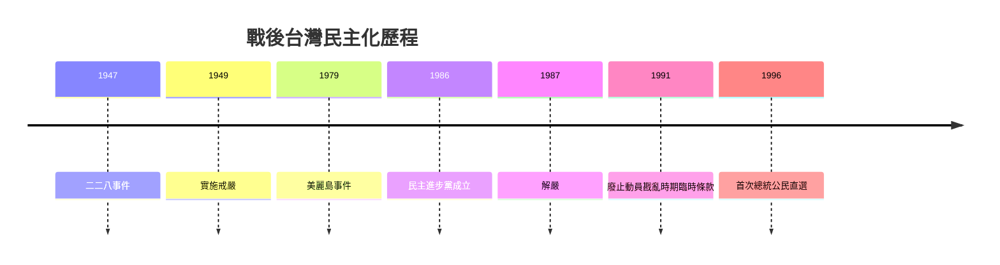

# 戰後台灣的民主化

## 💡 為什麼要學？（Start with Why）
> 為什麼你現在能自由投票、上網批評政府、看到各種立場的新聞？這些「理所當然」在 40 年前的台灣全都不行。讀懂民主化歷程，你會知道手上的自由是多少人冒險爭取來的，也更能判斷今天的政治爭論——這是身為台灣人的共同記憶。

## 📌 一句話總結
> 戰後台灣從一黨威權、白色恐怖的高壓統治，歷經黨外人士前仆後繼的衝撞，最終走向解嚴、政黨政治與總統直選的民主化歷程。

## 🎯 核心概念
- 戰後初期國民政府接收台灣，1947 年因接收失政與經濟崩壞爆發二二八事件。
- 1949 年實施戒嚴（1949/5/19 頒布、5/20 零時生效），全台進入長達 38 年的戒嚴體制（至 1987/7/15 解嚴）。
- 以《動員戡亂時期臨時條款》與相關法令構築威權體制，凍結部分憲法權利。
- 白色恐怖：以「反共」「肅清匪諜」為名，透過軍法審判整肅異議分子。
- 黨外運動：不能組黨的限制下，反對人士以「黨外」之名參選、辦政論雜誌集結力量。
- 1979 年美麗島事件是黨外運動重大轉折，公開大審反而擴大社會關注。
- 1986 年民主進步黨突破黨禁成立，1987 年宣布解嚴。
- 1990 年代多次修憲，廢除臨時條款、國會全面改選，1996 年完成首次總統公民直選。

## 🗺 圖解

## 🌏 生活連結（記憶錨點）
> - 把戒嚴體制想成「只准一個老闆、不准員工另組工會」的公司：員工抗議只能用個人名義（黨外），不能掛招牌（組黨），直到老闆被迫鬆手（解嚴）。
> - 黨外辦雜誌像「沒有粉專就先發傳單」：不能正式組織，就靠政論雜誌串連聲量。
> ⚠️ 注意：把威權簡化成「壞老闆 vs 員工」會抹掉省籍、冷戰結構、國際局勢等複雜因素，答非選時不能只用善惡二分。

## 🧠 記憶法 / 口訣
- 里程碑年序：「**47** 二二八、**49** 戒嚴起、**79** 美麗島、**86** 民進黨、**87** 解嚴開、**96** 選總統」（西元末兩碼）。
- 階段三步走：「**高壓**（戒嚴＋白色恐怖）→ **衝撞**（黨外＋美麗島）→ **轉型**（解嚴＋修憲＋直選）」。

## ⭐ 考試重點
- [ ] **必背**：二二八(1947)、戒嚴(1949)、美麗島(1979)、民進黨成立(1986)、解嚴(1987)、首次總統直選(1996)的年代與因果順序。
- [ ] **必懂**：《動員戡亂時期臨時條款》與《憲法》、戒嚴令的差別（常考概念混淆）。
- [ ] **常考題型**：史料判讀（政論雜誌、政府公告、口述歷史，判讀立場與目的）；社會科混合題組（搭公民「民主與人權」）；因果排序與轉折點評析。

## ⚠️ 易錯點 / 陷阱
- 混淆「解除戒嚴(1987)」與「終止動員戡亂／廢止臨時條款(1991/5/1 生效)」——民主化是逐步完成。
- 誤以為解嚴後立即直選：解嚴(1987)到首次直選(1996)間還隔多次修憲與國會改選。
- 二二八(1947 特定事件) ≠ 白色恐怖(1950 年代起長期整肅體制)。
- 史料題只憑「史實正確」卻不引用題目史料線索作答 → 非選失分。

## 🔗 跨科連結
- [[政府體制比較]]
- [[民主政治與人權保障]]
- [[冷戰與兩岸關係]]

## 📝 一分鐘自我檢測
> 先遮答案再想。
1. Q：台灣實施戒嚴與宣布解嚴分別是哪一年？　A：戒嚴 1949、解嚴 1987（約 38 年）。
2. Q：1979 年哪起事件是黨外運動重大轉折？影響為何？　A：美麗島事件；公開軍法大審反而擴大社會關注與同情，催化反對運動集結。
3. Q：「解嚴」等於「總統直選」嗎？　A：不等於。解嚴 1987、首次直選 1996，中間歷經廢止臨時條款、國會改選等修憲，逐步完成。

---
> 📋 待確認項（內容檢查 Agent 填寫，人工複核後刪除）：
> - （已查證，無待確認硬事實）七大年代全部核對正確，與 timeline 圖一致。
> - 已解決：戒嚴起算日＝1949/5/20 零時生效（1949/5/19 頒布），解嚴 1987/7/15，戒嚴共 38 年；廢止《動員戡亂時期臨時條款》＝李登輝 1991/4/30 發布總統令、5/1 生效。來源：維基百科〈臺灣省戒嚴令〉、全國法規資料庫〈動員戡亂時期臨時條款〉沿革、聚珍臺灣。
> - 課綱冊別：本主題屬 108 課綱台灣史「現代國家的形塑」下「追求自治與民主的軌跡」，一般編排於高中歷史第一冊。教科書版本（南一/三民/翰林/龍騰）章節編號略有差異，建議人工依採用版本標註確切冊別頁碼。
