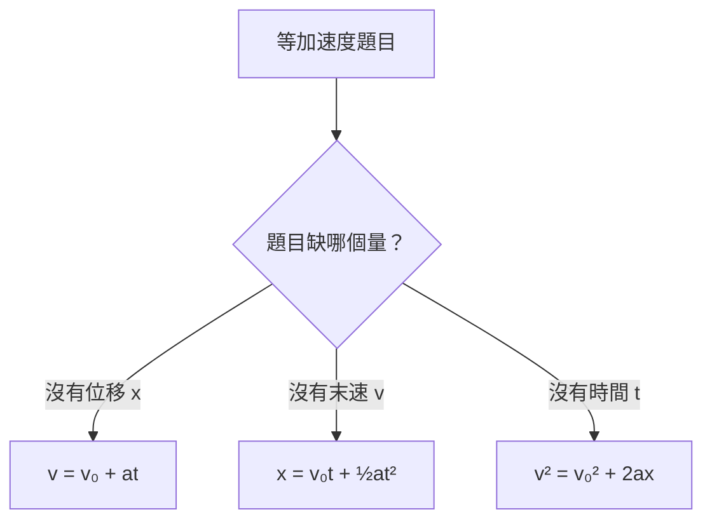

# 等加速度運動

## 💡 為什麼要學？（Start with Why）
> 為什麼開車要保持安全距離？為什麼高處掉落的東西特別危險？因為等加速度下速度愈來愈快、距離不是等比增加。搞懂等加速度與自由落體，你能估算煞停距離、理解交通安全，也看懂運動、太空與遊樂設施背後的運動學。

## 📌 一句話總結
> 等加速度運動就是「速度每秒都增加固定量」的運動，所有題目都能用三條運動學公式或 v-t 圖的面積與斜率解出。

## 🎯 核心概念
- 加速度 a 是「速度的變化率」，等加速度代表 a 為定值（大小與方向都不變）。
- 速度 v、位移 x 是向量，有方向與正負號；先設正方向再代值。
- 三條運動學公式（a 為定值時適用）：
  - v = v₀ + at
  - x = v₀t + ½at²
  - v² = v₀² + 2ax
- v-t 圖：**斜率＝加速度**，**圖線與時間軸所圍面積＝位移**。
- 自由落體是「a = g（約 9.8 m/s²，向下）的等加速度運動」，與質量無關。
- 拋體在「只受重力、忽略空氣阻力」下，上升與下降都是同一加速度 g（方向恆向下）。

## 🗺 圖解
> 選公式決策圖——「缺哪個量，就用不含它的那條」。

## 🌏 生活連結（記憶錨點）
> - 開車踩油門定速增速：車速表每秒固定多跳幾格，就是等加速度；讀數的「上升速率」就是加速度。
>   - ⚠️ 破功處：真實踩油門加速度會隨速度變化（非定值），且這比喻只給「加速」畫面，易忘記「減速也是等加速度（a 與 v 反向）」。
> - 往上拋的球：飛上去、變慢、停一下、再掉下來。
>   - ⚠️ 破功處：最高點「速度為零」常被誤以為「加速度也為零」——錯！最高點瞬間 v=0 但 a 仍是 g（向下），球才會繼續往下掉。

## 🧠 記憶法 / 口訣
- 三公式選擇：「**缺啥用啥那條**」——沒有 x 用 v=v₀+at；沒有 v 用 x=v₀t+½at²；沒有 t 用 v²=v₀²+2ax。
- v-t 圖：「**斜率是 a，面積是 x**」。
- 自由落體：「**輕重一起落，真空一樣快**」（忽略空氣阻力）。

## ⭐ 考試重點
- [ ] **必背**：三條運動學公式、適用條件（a 定值）、v-t 圖斜率與面積意義。
- [ ] **常考題型**：v-t 圖判讀（求 a、求位移、判斷運動方向是否改變）；自由落體/鉛直上拋的時間、最高點高度、落地速度。
- [ ] **探究實作**：打點計時器、頻閃照片或位置-時間數據反推平均速度與加速度（圖表判讀比重上升）。

## ⚠️ 易錯點 / 陷阱
- 「速度為零」≠「加速度為零」（最高點 v=0 但 a=g）。
- 忘記設正方向 → v₀、a、x 正負號混用算錯。
- 誤以為「重的掉得比較快」（無空氣阻力時與質量無關）。
- 等加速度的 v-t 圖必為**直線**；曲線代表 a 在變。
- v-t 圖面積是「位移」不是路程：速度有正有負時需分段加減。
- 平均速度公式 x=½(v₀+v)t 只在等加速度下成立。

## 🔗 跨科連結
- [[牛頓運動定律]]
- [[一元二次方程式]]
- [[函數圖形與斜率]]

## 📝 一分鐘自我檢測
> 先遮答案再想。
1. Q：以 20 m/s 鉛直上拋（g≈10，忽略空氣阻力），到最高點需幾秒？該點加速度多少？　A：0=20−10t → t=2 s；加速度仍 ≈10 m/s² 向下（不是零）。
2. Q：v-t 圖為過原點、斜率 3 的直線，加速度多少？前 4 秒位移？　A：a=3 m/s²；位移=½×4×12=24 m。
3. Q：1 kg 與 5 kg 鉛球同高同時釋放（忽略空氣阻力），誰先落地？　A：同時。自由落體 a=g 與質量無關。

---
> 📋 待確認項（內容檢查 Agent 填寫，人工複核後刪除）：
> - 近年探究實作題型（打點/頻閃數據判讀）出現方式——屬複習方向參考，非事實錯誤；建議人工對近年大考中心試題確認比重。
> - 涉及二次式求時間時與數學冊別的對應——跨科連結 [[一元二次方程式]] 的冊別對應建議由人工確認該數學筆記是否已建立。
>
> ✅ 內容檢查 Agent 檢查紀錄（2026-06-28）：
> - 硬事實全數通過查證：三條運動學公式（v=v₀+at、x=v₀t+½at²、v²=v₀²+2ax）正確；g≈9.8 m/s² 向下、與質量無關正確；最高點 v=0 但 a=g 觀念正確；v-t 圖斜率=a、面積=位移、x=½(v₀+v)t 僅等加速度成立皆正確。來源：維基百科「自由落體/重力加速度」、王一哲 108 課綱物理教學網。
> - 課綱對齊：等加速度/一維運動屬必修物理「物體的運動」，在 111 學年起學測範圍內，冊別標註合理。
> - 生活比喻：踩油門增速、上拋球兩例皆已自附「⚠️ 破功處」破除錯誤直覺（油門加速度非定值、最高點 a≠0），未埋錯誤直覺。
> - Mermaid flowchart：語法正確，所有中文/含特殊符號節點均以 "..." 包住，可在 Obsidian 渲染；類型（決策流程）恰當、內容與內文一致。
> - Why 段：置於開頭、具體（煞停距離、交通安全），宣稱應用真實不誇大。
> - 逐字校對：未發現錯別字、單位符號錯誤、亂碼或語病；自我檢測 3 題答案與內文一致。無需修正。
