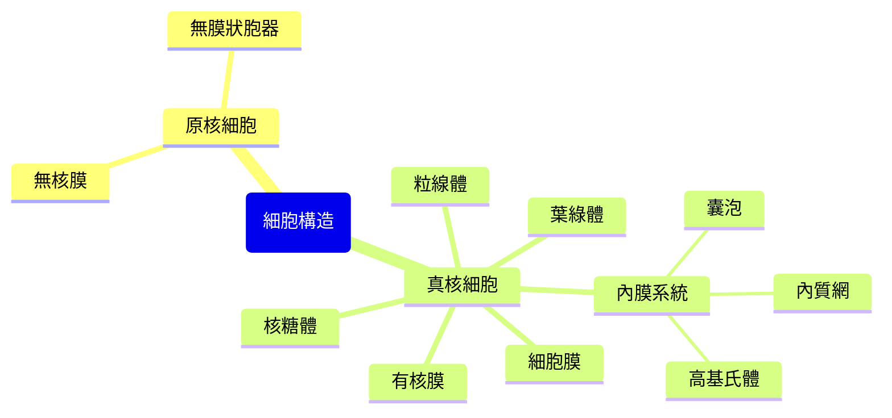

# 細胞的構造與功能

## 💡 為什麼要學？（Start with Why）
> 你的身體由約 37 兆個細胞組成，每個都是一座微型工廠。為什麼喝酒傷肝、運動要大口呼吸、植物曬太陽能長大？答案都藏在胞器的分工裡。讀懂細胞，是理解所有生命運作、疾病成因，以及疫苗、癌症治療等生物科技的起點。

## 📌 一句話總結
> 細胞是生命的基本單位，內部各胞器像分工合作的工廠部門，由細胞膜決定「什麼能進出」並維持內外環境的差異。

## 🎯 核心概念
- 細胞學說：所有生物由細胞構成、細胞是生命最小單位、細胞由既存細胞分裂而來。
- 依有無核膜分原核細胞（無核膜、無膜狀胞器）與真核細胞（有核膜、有膜狀胞器）。
- 細胞核是 DNA 儲存與遺傳指令中心，核膜上有核孔供物質進出。
- 內膜系統（核膜→內質網→高基氏體→囊泡→細胞膜）構成蛋白質與分泌物的「生產—加工—包裝—運送」流水線。
- 粒線體是有氧呼吸產能（ATP）場所；葉綠體是光合作用場所，兩者皆有雙層膜與自身 DNA。
- 核糖體合成蛋白質，無膜，原核與真核皆有。
- 細胞膜為磷脂雙層加鑲嵌蛋白，具選擇性通透。
- 植物細胞特有：細胞壁（纖維素）、葉綠體、大液胞；動物細胞特有：中心體。

## 🗺 圖解

## 🌏 生活連結（記憶錨點）
> 把細胞想成一座工廠：細胞核是「總經理辦公室＋藍圖檔案室」，內質網是「生產線」，高基氏體是「包裝出貨部」，粒線體是「發電廠」，細胞膜是「警衛室＋大門」。
> ⚠️ 比喻破功處：工廠的牆是死的，但細胞膜是「活的、會選擇」的動態結構（磷脂可流動、靠膜蛋白主動運輸耗能），不是單純擋與不擋。

## 🧠 記憶法 / 口訣
- 內膜系統流水線：「**核 → 網 → 高 → 泡 → 膜**」。
- 雙層膜＋自帶 DNA：「**粒葉雙身**」（粒線體、葉綠體）。
- 植物比動物多三樣：「**壁、綠、大液胞**」。
- 「**核膜有無定真原**」——有核膜是真核，無是原核。

## ⭐ 考試重點
- [ ] **必背**：原核 vs 真核差異（核膜、膜狀胞器之有無）。
- [ ] **必背**：各胞器構造對應功能（粗糙內質網有核糖體→合成蛋白；平滑型→脂質代謝）。
- [ ] **常考題型**：給胞器構造圖/電顯圖判讀名稱功能；混合題以「分泌型蛋白質從合成到分泌」串接內膜系統運輸順序；細胞膜物質運輸（擴散、滲透、主動運輸）。

## ⚠️ 易錯點 / 陷阱
- 核糖體無膜、不屬膜狀胞器，原核也有——常被誤判為真核專屬。
- 細胞壁 ≠ 細胞膜：細胞壁是支持結構（纖維素），動物細胞沒有細胞壁但有細胞膜。
- 粒線體與葉綠體是雙層膜；且非所有植物細胞都有葉綠體（根部細胞無）。
- 原核「無核」指無核膜包被，並非沒有 DNA。
- 主動運輸需耗能、可逆濃度梯度；滲透描述的是「水」的擴散，別寫成溶質。

## 🔗 跨科連結
- [[細胞分裂]]
- [[酵素與代謝]]
- [[生物大分子]]

## 📝 一分鐘自我檢測
> 先遮答案再想。
1. Q：原核與真核最主要區別？(A)有無細胞膜 (B)有無核膜包被的核 (C)有無核糖體 (D)有無DNA　A：B。
2. Q：分泌型蛋白質送出細胞外，依序經過哪些構造？　A：內質網 → 高基氏體 → 囊泡 → 細胞膜。
3. Q：粒線體和葉綠體「特別」在哪？寫兩點共同特徵。　A：皆雙層膜，且都有自己的 DNA。

---
> 📋 待確認項（內容檢查 Agent 填寫，人工複核後刪除）：
> - 原核 DNA 環狀、無組蛋白等細節是否列入學測必修範圍。（本筆記未提及此細節，僅留待釐清深度；建議確認後決定是否補充或刪此項）
> - 細胞膜物質運輸（擴散、滲透、主動運輸）對應冊別與是否屬必修學測範圍——⭐考試重點與⚠️易錯點皆引用此主題，宜確認冊別歸屬以免複習方向誤導。來源：108 課綱生物必修（教育部）需以官方課綱比對，本次未取得逐條原文確認。
>
> 【已查證且通過的硬事實（信心度高，供複核參考）】
> - 「約 37 兆個細胞」：與 Bianconi et al. 2013（約 37.2 兆，不含腸道菌）一致，用「約」字保守，無誇大。https://pansci.asia/archives/113183
> - 分泌型蛋白質運輸順序「內質網→高基氏體→囊泡→細胞膜」：正確。https://zh.wikipedia.org/zh-tw/%E5%85%A7%E8%86%9C%E7%B3%BB%E7%B5%B1
> - 內膜系統含核膜（核膜→內質網→…）：正確，核膜屬內膜系統。同上來源。
> - 粒線體/葉綠體皆雙層膜且有自身 DNA、核糖體無膜且原核真核皆有、原核無核膜包被但有 DNA：與一般高中生物教材一致。
> - Mermaid mindmap 語法：`root("…")` 為合法的圓角矩形根節點寫法，中文已用 " " 包住，可在 Obsidian 閱讀模式渲染；圖內容與內文分類一致，無誤導。https://mermaid.js.org/syntax/mindmap.html
>
> 【逐字校對結果】未發現錯別字、音近/形近誤用、單位符號或全形半形問題；術語用字（高基氏體、磷脂雙層、纖維素、滲透 vs 擴散 vs 主動運輸、產能 ATP）均正確。無修正項。
