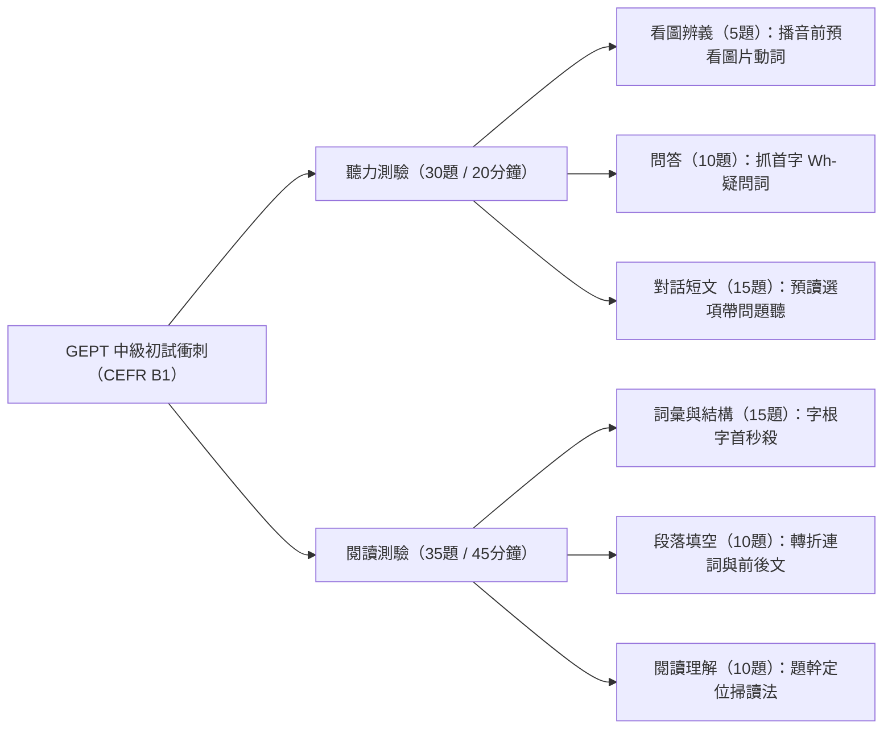

# GEPT中級初試準備指南

## 💡 為什麼要學？（Start with Why）
> 先想「為什麼」，再學「是什麼」——點燃動機與好奇心。
- **回答什麼問題／解決什麼困惑**：如何在 1～2 個月內高效通過 GEPT 全民英檢中級初試（CEFR B1 程度，相當於高中畢業／學測通用英語能力）？
- **用在哪裡**：高中學測英文實力檢驗、大學免修英文門檻、備審資料加分及職場基礎英語溝通能力證明。
- **學會的價值**：掌握「聽力預讀技巧」與「閱讀速解結構」，建立穩定的英語音感與文法語感，避免盲目刷題。

## 📌 一句話總結
> GEPT 中級初試衝刺關鍵：聽力靠「預讀問題抓疑問詞」，閱讀靠「詞性分析與段落定位」，雙科目標 160 分達成。

## 🎯 核心概念
- **聽力三題型破解**：看圖辨義（預想動詞/介系詞）、問答（鎖定 Wh-疑問詞）、簡短對話與短文（先讀選項帶著問題聽）。
- **閱讀三題型速解**：詞彙結構（分析詞性與常用搭配詞）、段落填空（抓前後句轉折連詞）、閱讀理解（先讀題幹關鍵字回文定位）。
- **黃金作答配速**：聽力跟隨播音步調不猶豫；閱讀 35 題在 45 分鐘內完成，詞彙題控制在 20 秒/題。

## 🗺 圖解

## 🌏 生活連結（記憶錨點）
- **聽力問答如同「排球接殺」**：第一個字（Wh- 疑問詞）就是對方發球的方向，一聽到 *Where...* 腦中立刻準備接「地點」，聽到 *Why...* 立刻準備接「原因」，絕不能等整句聽完才想。
- **閱讀速解如同「超市快查標籤」**：遇到詞彙題不需從頭到尾念完，看空格前後的詞性與搭配詞（Collocations）就像看食品成分表一樣直接抓目標。

## 🧠 記憶法 / 口訣
- **聽力口訣**：「看圖找動詞，問答聽首字，對話先讀題，過題不回頭」。
- **閱讀口訣**：「詞彙看詞性，填空看轉折，長文先看題，定位秒找答案」。

## ⭐ 考試重點
- [ ] **必背單字量**：GEPT 中級核心 2,600～3,500 字，掌握常見前綴與後綴。
- [ ] **高頻文法點**：動詞時態與被動語態、關係代名詞 / 關副、假定法與分詞構句。
- [ ] **通過門檻**：聽力與閱讀總分 $\ge 160$ 分，且單科不低於 $72$ 分。

## ⚠️ 易錯點 / 陷阱
- **聽力陷阱**：遇到沒聽懂的題目卡住思考，導致連續漏聽後續 2～3 題。正確做為：立刻猜一個答案並專注下一題。
- **閱讀陷阱**：閱讀理解題先逐字閱讀整篇文章，導致時間用盡。正確做法：先讀題幹關鍵字，再回文章進行掃讀（Scanning）。

## 🔗 跨科連結
- [[GEPT中級核心字]]（5大字根家族串聯記憶法，含一字多義陷阱）
- [[核心字彙與字根字首]]（GEPT 中級單字快速擴充重點）
- [[字根字首字尾入門]]（拆解中級長單字的核心能力）
- [[字首（Prefix）定方向]]（判斷單字褒貶與方向）
- [[字根（Root）定核心]]（掌握單字核心意義）
- [[字尾（Suffix）定詞性]]（秒殺詞彙題詞性判斷）
- [[時態與語態]]（聽力與閱讀填空高頻文法點）
- [[重要文法句型]]（閱讀長難句結構拆解）
- [[克漏字與綜合測驗]]（段落填空與轉折連詞解題策略）
- [[閱讀測驗策略]]（閱讀理解題幹定位與掃讀技巧）

## 📝 一分鐘自我檢測
1. Q：GEPT 中級初試聽力「問答題」最重要的收聽策略是什麼？
   A：播音開始的第一個字（Wh- 疑問詞或助動詞），它決定了答句的核心類型（地點、時間、原因或 Yes/No）。
2. Q：閱讀測驗中「詞彙與結構題」合理的平均解題時間是多少？
   A：每題約 20 秒，透過判斷詞性與常見搭配詞快速答題，為後續長篇閱讀爭取時間。
3. Q：聽力測驗如果遇到不確定的題目該如何處理？
   A：果斷劃記最可能的答案後立刻放棄思考，把握極短間隔預讀下一題的選項。

---
> 📋 待確認項（內容檢查 Agent 填寫，人工複核後刪除）：
> - 
