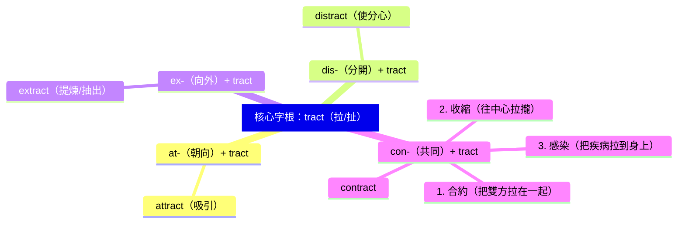

# GEPT中級核心字

## 💡 為什麼要學？（Start with Why）

面對 GEPT 中級與學測龐大的 5000–6000 字彙海，死背單字就像在沙灘上建城堡，背了又忘。學會「字根拆解」，等於掌握了英文單字的「造字原始碼」。你不必再孤立地記憶每個字母，而是能像拼樂高一樣，透過邏輯推演出單字的意思，甚至在考場上遇到沒看過的生字，也能精準猜出語意，大幅提升閱讀速度與答題自信！

## 📌 一句話總結

掌握字首、字根、字尾的「樂高拆解法」，就能一字記整串，無痛破解英檢中級與學測的核心字彙！

## 🎯 核心概念

- GEPT 中級與高中學測範圍高度重疊，用字根法可以一次準備兩種考試，投資報酬率最高。
- **字根（Root）** 是單字的心臟，決定了字彙的最核心意義（如 `spect` = 看）。
- **字首（Prefix）** 放在前面，用來改變方向、數量或狀態（如 `in-` = 進入，`re-` = 回/再）。
- **字尾（Suffix）** 放在後面，決定單字的詞性（如 `-tion` = 名詞，`-ive` = 形容詞）。
- 結合「字首＋字根＋字尾」，遇到多義字也能推敲出其底層邏輯，不再死記硬背。

## 🗺 圖解

## 🌏 生活連結（記憶錨點）

字根拆解就像是中文裡的「部首」加上「偏旁」。當你看到「氵」（水部），你就知道這個字（如：河、海、流）一定跟水有關；同理，當你在英文裡看到字根 `ject`（投擲），無論是 `project`（投影/計畫）、`reject`（拒絕）還是 `inject`（注射），你就知道它們的核心動作都是「丟、投」。只要抓住核心，外掛不同的零件（字首/字尾），就能組合出不同的工具。

## 🧠 記憶法 / 口訣

**「字首抓方向，字根定語意，字尾變詞性！」**

精選 GEPT 中級 / 學測必考 5 大字根家族，串聯記憶：

1. **spect (看)**：
   - `inspect` = in (內) + spect (看) = 往裡面仔細看 ➔ **檢查**
   - `expect` = ex (外) + spect (看) = 往外看等著發生 ➔ **期待**
   - `respect` = re (再) + spect (看) = 值得看兩眼 ➔ **尊敬**
2. **ject (投/擲)**：
   - `reject` = re (回) + ject (丟) = 把東西丟回去 ➔ **拒絕**
   - `project` = pro (前) + ject (丟) = 把光或想法往前丟 ➔ **投影 / 計畫**
   - `inject` = in (內) + ject (丟) = 往體內丟 ➔ **注射**
3. **struct (建立/構造)**：
   - `construct` = con (共同) + struct (建) = 一起蓋 ➔ **建造 / 建設**
   - `instruct` = in (內) + struct (建) = 在心智內建立觀念 ➔ **教導 / 指示**
   - `destruct` = de (下/反) + struct (建) = 往下拆毀 ➔ **破壞** (常考名詞 destruction)
4. **mit/miss (送/派)**：
   - `admit` = ad (去) + mit (送) = 送進門 ➔ **允許進入 / 承認**
   - `submit` = sub (下) + mit (送) = 由下往上送交 ➔ **提交 / 屈服**
   - `emit` = e (外) + mit (送) = 送出去 ➔ **散發 (氣體/光)**
5. **tract (拉/扯)**：（參見圖解）
   - `attract` (吸引), `distract` (分心), `extract` (萃取), `contract` (合約/收縮/感染)

## ⭐ 考試重點

- [ ] **🔥 必背題型：同字根易混淆字（字彙題 / 克漏字）**。例如考卷常把 `respectful` (充滿敬意的)、`respectable` (值得尊敬的) 與 `respective` (各自的) 放在四個選項中誘答。
- [ ] **💡 閱讀拆字法**：在閱讀測驗中遇到長單字，先遮住字尾，找字首和字根。例如遇到 `unprecedented` (史無前例的)，拆出 `un-` (不) + `pre-` (前) + `cede` (走)，就能猜出是「之前沒走過的/沒發生過的」，不被生字卡住。
- [ ] **📝 寫作替換詞**：多用字根字（通常源自拉丁文，較正式）替換基礎詞彙，例如用 `construct` 替換 `build`，用 `attract` 替換 `draw`，可提升作文句型亮度。

## ⚠️ 易錯點 / 陷阱

- **陷阱一：一字多義的死角**。
  - 例如 `contract`，多數人只背「合約」，但學測與英檢常考「收縮」（如金屬熱脹冷縮）或「感染（疾病）」。解法是回歸字根：`con` (一起) + `tract` (拉) ➔ 物理上拉在一起是「收縮」，生理上把病毒拉過來是「感染」。
- **陷阱二：詞性變形的拼字陷阱**。
  - 很多字根在轉為名詞時會有不規則拼字變化。例如 `mit` 結尾遇名詞常變成 `miss`（admit ➔ admission ; submit ➔ submission），翻譯與寫作時極易拼錯。

## 🔗 跨科連結

- [字根字首字尾入門](字根字首字尾入門.md)（字根拆解記憶的入門基礎）
- [字根（Root）定核心](字根（Root）定核心.md)（更深入的字根學習）
- [字首（Prefix）定方向](字首（Prefix）定方向.md)（更深入的字首學習）
- [字尾（Suffix）定詞性](字尾（Suffix）定詞性.md)（更深入的字尾學習）
- [高中常用 4500 字彙表（大考中心參考詞彙）](高中常用 4500 字彙表（大考中心參考詞彙）.md)（大考中心分級攻略與高效記憶法）

## 📝 一分鐘自我檢測

> 先遮住下方答案，自己想，再對照。

1. Q：在英檢閱讀測驗中看到 "The loud noise outside ________ my attention from studying." 根據字根判斷，空格應填入？
   (A) attracted (B) distracted (C) extracted (D) contracted
   A：**(B)**。dis (分開) + tract (拉) = 把注意力拉開 ➔ 使分心。

2. Q：單字 `reject`（拒絕）是由 `re-` + `ject` 組成。請問字根 `ject` 的意思是？
   (A) 拉 / 扯 (B) 看 (C) 投 / 擲 (D) 建立
   A：**(C)**。re (往回) + ject (丟) = 丟回去 ➔ 拒絕。

3. Q：（一字多義陷阱題）"Metals ________ when they are cooled." 這裡的 contract 是什麼意思？
   (A) 簽訂合約 (B) 感染疾病 (C) 互相吸引 (D) 體積收縮
   A：**(D)**。金屬冷卻時會「收縮」。con (一起) + tract (拉) = 往中心拉在一起。

---
> 📋 待確認項（內容檢查 Agent 填寫，人工複核後刪除）：
> - 無（已查證GEPT中級字彙量約5000字，字根語源與單字拆解皆正確）
