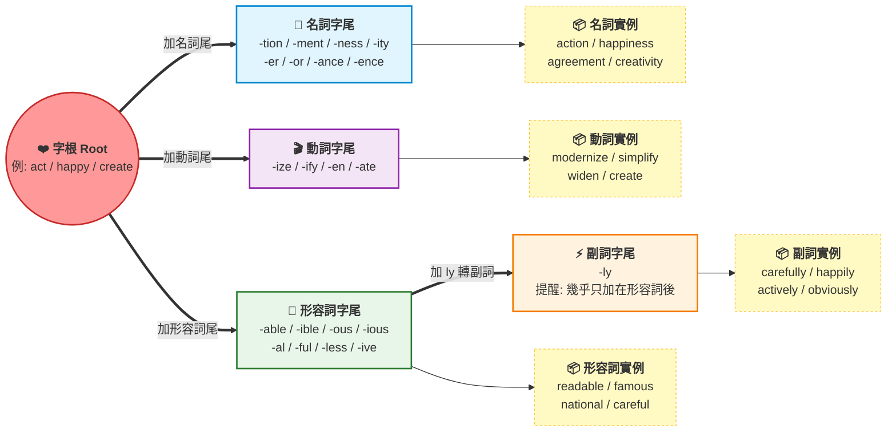

# 字尾（Suffixes）與詞性轉換

## 💡 為什麼要學？（Start with Why）
> [!🚀 助教團複習定調] 字首定方向、字根定核心、**字尾定詞性**。
> **字尾幾乎「不改變」單字的底層核心意思，它唯一的任務就是**決定單字的「詞性與規格」。
### 🎯 核心理由 1：學測「文意選填」的秒殺外掛
學測最拉分的「文意選填（綜合測驗）」，核心考點就是「詞性配對」。
- **考場實戰：** 看到空格前後的語法，大腦判定「這裡缺一個名詞」。
- **你的降維打擊：** 你根本不需要把選項中 10 個長單字的中文意思全背出來。你只要掃視字尾，看到 `-tion`、`-ment`、`-ness`，就判定它們是名詞，直接填入空格。**別人還在痛苦翻字典，你靠「字尾規格」5 秒內秒殺一題！**

### 🎯 核心理由 2：英文寫作的「文法防錯盾牌」
很多孩子在寫學測作文時，常常出現 `He is very create.`（把動詞當形容詞用）這種嚴重的扣分文法錯誤。
- 只要收服字尾，你的大腦會自動配備「語法校正器」：
    - 要用動詞？字尾切換成 `-ize` → `modernize`（現代化）。
    - 要用形容詞？字尾切換成 `-ive` → `creative`（有創造力的）。
    - 要用名詞？字尾切換成 `-ity` → `creativity`（創造力）。 **同一個心臟（字根），隨時為你換上正確的零件規格，讓你的作文文法零瑕疵。**
### 🎯 核心理由 3：解鎖「1 比 4」的單字複製超能力
英文單字量之所以膨脹，就是因為同一個行為有四種詞性。死背清單要背四次，學會字尾只要記一次！
- 掌握一個字根（例如：字根 act  動作），配上字尾公式，瞬間複製出四個大考高頻字：
    - act (字根)+-tion (名詞尾)→action (n.) 行動
    - act (字根)+-ive (形容詞尾)→active (adj.) 積極的
    - active+-ly (副詞尾)→actively (adv.) 積極地
    - act (字根)+-ate (動詞尾)→activate (v.) 啟動/活化
- 只靠換字尾就能變成動詞 act、名詞 action / actor / activity、形容詞 active / actual、副詞 actively——一根抵五字，這就是字尾的魔法。
## 📌 一句話總結

字尾決定詞性，認識字尾等於同時掌握拼字規則、詞彙辨別與造句語序——是學測英文最划算的投資。

## 🎯 核心概念

- 字尾（Suffix）是加在字根後方、改變詞性或語意的字母組合，不影響字根核心意義。
- 同一字根換不同字尾可產生名詞、動詞、形容詞、副詞四種詞性。
- 名詞字尾：-tion/-sion、-ment、-ness、-ity、-er/-or、-ance/-ence、-ry/-ery 等。
- 動詞字尾：-ize/-ise、-ify、-en、-ate 等。
- 形容詞字尾：-able/-ible、-ous/-ious、-al、-ful、-less、-ive 等。
- 副詞字尾：幾乎只有 -ly，且多加在形容詞後方。
- 加字尾時字根末尾常有拼字變形：去 e（make → making）、去 y 換 i（happy → happiness）、雙寫子音（big → biggest）。
- 學測常考「同根異尾陷阱」：四個選項詞性各不同，只要認出空格詞性就能直接選出正確答案。

## 🗺 圖解

## 🌏 生活連結（記憶錨點）

把字尾想成**衣服的剪裁標籤**。同一塊布料（字根），貼上「上衣標」就是上衣（動詞），貼上「褲子標」就是褲子（名詞），貼上「外套標」就是外套（形容詞）——布料本身沒變，但你穿出門的功能完全不同。

文法也一樣：同樣是 happy 這塊布，加上 -ness（名詞標籤）變成 happiness，加上 -ly（副詞標籤）變成 happily。

這個比喻哪裡會破功：衣服換標籤不改外形，但英文字根加字尾時拼字可能真的改變（happy → happiness，不是 happyness），所以「換標籤」的比喻只說明詞性邏輯，拼字變形必須另外記。

## 🧠 記憶法 / 口訣

**詞性四宮格口訣**：「名動形副，各有地盤；字尾一看，詞性不難。」

**名詞字尾三組分類口訣**：
- 動作/狀態群（-tion/-sion，-ment，-ance/-ence）：「動作變名詞，離不開 tion、ment、ance。」
- 性質/狀態群（-ness，-ity）：「心情性質 -ness/-ity，happiness、ability。」
- 人/物群（-er/-or，-ist）：「做事的人：er/or/ist，teacher、actor、artist。」

**動詞字尾口訣**：「ize 讓它變，ify 讓它化，en 讓它大，ate 讓它動。」
- modernize（使現代化）、simplify（使簡化）、widen（使變寬）、create（創造）

**形容詞字尾口訣**：「able/ible 能，ous/ious 滿，al/ful/ive 有，less 就沒有。」
- readable（能讀的）、famous（充滿名聲的）、national（國家的）、careless（粗心的）

**副詞字尾口訣**：「形容詞加 ly，走路更有禮；careful → carefully，輕鬆記牢裡。」

**拼字三大變形口訣**：「去 e、換 i、雙子音——加字尾前要先確認！」
- 去 e：create → creation（不是 createion）
- y 換 i：happy → happiness（不是 happyness）
- 雙寫子音：big → biggest（但 open → opening，不雙寫，因重音不在末音節）

## ⭐ 考試重點

**學測詞彙題（一字多義/同根選詞）**
- 看空格前後的句子結構判斷詞性，再配合字尾篩選選項——這是最快速的解題路徑。
- 常考題型：四個選項來自同一字根（如 real / realize / reality / realistic），考位置判斷詞性。

**高頻字尾必背清單**（每項附學測常見例字）

| 詞性 | 字尾 | 例字（學測常見） |
|------|------|-----------------|
| 名詞 | -tion / -sion | action, attention, decision, discussion |
| 名詞 | -ment | argument, development, environment, movement |
| 名詞 | -ness | awareness, darkness, happiness, kindness |
| 名詞 | -ity | ability, activity, creativity, possibility |
| 名詞 | -er / -or | teacher, winner, creator, doctor |
| 名詞 | -ance / -ence | performance, importance, difference, influence |
| 動詞 | -ize / -ise | realize, recognize, modernize, organize |
| 動詞 | -ify | identify, simplify, satisfy, modify |
| 動詞 | -en | strengthen, widen, frighten, shorten |
| 形容詞 | -able / -ible | comfortable, available, responsible, possible |
| 形容詞 | -ous / -ious | famous, dangerous, serious, obvious |
| 形容詞 | -ful | careful, powerful, successful, thankful |
| 形容詞 | -less | careless, harmless, endless, hopeless |
| 形容詞 | -ive | active, creative, effective, negative |
| 形容詞 | -al | natural, national, traditional, professional |
| 副詞 | -ly | carefully, finally, recently, surprisingly |

**重要拼字規則**
- create → creation（去 e）
- happy → happiness（y → i）
- responsible → responsibility（去 e，加 -ity）

**課綱落點**：115學測起篇章結構由四選四改為五選四，需更精準辨識詞性以排除誘答選項。
如果說字根是單字的「核心靈魂（本質）」**，字首是**「語意標籤（方向/時間/正負）」**，那麼字尾（Suffix）就是單字的**「變形金剛（詞性開關）」。

字尾在英文中通常不改變核心字義，而是**決定這個字在句子裡要當名詞、動詞、形容詞還是副詞**。掌握了字尾，你就能透過同源字的轉換，讓字彙量呈倍數放大。

以下為你系統化整理最核心的常用字尾，分為**四大詞性大類**，純粹以「詞源歷史的真實畫面」**與**「生活常用字」建立邏輯連結，不使用諧音。

### 第一類：名詞字尾（人/物/狀態/場所）
負責將動作或特質固化為「一個具體的人事物或抽象概念」。
#### 1. -er / -or / -ar = 做...的人或物 (Agent)
- **來源解說：** 來自古英語 `-ere` 與拉丁文 `-or`，代表「執行某種動作的主體」。
- **Teacher (老師)**：執行「教學 (teach)」工作的人。
- **Doctor (醫生/博士)**：源自拉丁文「教導、有學問的人」，現指執行醫療的人。
- **Tractor (耕耘機)**：執行「拖拉 (tract)」動作的機器（物）。
#### 2. -tion / -ion / -ation = 動作、過程、狀態 (Action / State)
- **來源解說：** 來自拉丁文 `-tio`，將動詞轉化為抽象名詞，代表該動作的「過程或結果」。
- **Action (行動/動作)**：動詞 `act`（行動）的名詞狀態。
- **Station (車站/駐點)**：字根 `stat`（站立/設置），人車「站立、停靠的場所或結果」。
#### 3. -ment = 動作的手段、結果、狀態 (Means / Result)
- **來源解說：** 來自拉丁文 `-mentum`，通常接在動詞後面，代表某個動作所帶來的「具體結果」或「狀態」。
- **Investment (投資)**：動詞 `invest`（投資）投入後所產生的「投資總額或結果」。
- **Government (政府)**：動詞 `govern`（統治/治理）的「執行機構與結果」。

#### 4. -ty / -ity = 狀態、特質、性質 (Quality / Condition)
- **來源解說：** 來自拉丁文 `-tas`，主要接在形容詞後，將抽象的「特質」轉化為名詞。
- **Ability (能力)**：形容詞 `able`（能夠的）轉化而來的「具體能力特質」。
- **Security (安全)**：形容詞 `secure`（安全的）轉化而來的「安全狀態」。
#### 5. -ness = 狀態、特質 (純英文原生)
- **來源解說：** 來自日耳曼語族（古英語 `-nes`），專門接在形容詞後，表達某種「處於...的狀態」。
- **Happiness (快樂)**：處於 `happy`（快樂的）心理狀態。
- **Weakness (弱點/虛弱)**：身體或心智處於 `weak`（虛弱的）特質。

### 第二類：形容詞字尾（具有...特性的）
負責將名詞或動詞包裝成「修飾別人的特質描述」。
#### 6. -able / -ible = 可...的、能夠...的 (Capable of)
- **來源解說：** 來自拉丁文 `-abilis`，字面意思就是 `able`（有能力的）。
- **Portable (可攜帶的)**：`port`（搬運）+ `able` →「能夠被搬運移動的」。
- **Incredible (難以置信的)**：`cred`（相信）+ `ible` →「無法被相信的」。
#### 7. -ful = 充滿...的 (Full of)
- **來源解說：** 來自英文原生字 `full`（滿的）的演變。
- **Beautiful (美麗的)**：名詞 `beauty`（美）+ `ful` →「充滿美感的」。
- **Helpful (有幫助的)**：`help`（幫助）+ `ful` →「充滿助益的」。
#### 8. -less = 沒有...的、缺乏的 (Without)
- **來源解說：** 來自古英語 `-leas`，字面意思就是 `less`（較少/沒有），與 `-ful` 互為反義字尾。
- **Wireless (無線的)**：名詞 `wire`（電線/線路）+ `less` →「沒有線路的」（如無線網路 Wireless network）。
- **Careless (粗心的)**：`care`（心思/留心）+ `less` →「缺乏心思的」。
#### 9. -al / -ar = 與...有關的、具有...性質的 (Relating to)
- **來源解說：** 來自拉丁文 `-alis`，是最常用的形容詞字尾，用來建立關聯性。
- **Global (全球的)**：名詞 `globe`（地球/球體）+ `al` →「與全球有關的」。
- **Solar (太陽的)**：名詞 `sol`（拉丁文的太陽）+ `ar` →「與太陽有關的」（如太陽能 solar energy）。
#### 10. -ive = 傾向於...的、具有...特性的 (Tending to)
- **來源解說：** 來自拉丁文 `-ivus`，通常接在動詞後面，表示某個主體「很喜歡做這個動作」或「具有這項動態特質」。
- **Active (活躍的/積極的)**：動詞 `act`（行動）+ `ive` →「傾向不斷行動的」。
- **Attractive (有吸引力的)**：動詞 `attract`（吸引）+ `ive` →「具備吸引特性的」。

### 第三類：動詞字尾（使成為...、做某動作）
負責賦予單字「發動引擎」的力量，讓它變成一個動作。
#### 11. -ate = 使成為、做...動作 (To make / Causative)
- **來源解說：** 來自拉丁文過去分詞字尾 `-atus`，是英文中最核心的動詞製造機。
- **Generate (產生/發電)**：字根 `gen`（產生）+ `ate` →「使其產生出來」。
- **Create (創造)**：源自拉丁文「使生長、製造」的動作。
#### 12. -ize / -ise = 使轉變為、...化 (To make into)
- **來源解說：** 來自希臘文 `-izein`，通常接在名詞或形容詞後，表示將主體變成某種「特定的體制或狀態」。
- **Globalize (全球化)**：形容詞 `global` + `ize` →「使各國轉變為全球一體化」。
- **Memorize (背誦/記住)**：名詞 `memory`（記憶）+ `ize` →「使事物進入記憶的狀態」。
#### 13. -fy = 使...化、做成 (To make)
- **來源解說：** 來自拉丁文動詞 _facere_（做、製造）的縮寫變體。
- **Clarify (澄清/闡明)**：形容詞 `clear`（清晰的，拉丁源為 clarus）+ `fy` →「把它做得很清晰」。
- **Simplify (簡化)**：形容詞 `simple`（簡單的）+ `fy` →「使其變簡單」。

### 第四類：副詞字尾（狀態/方式/方向）
負責說明動作是在「什麼樣的狀態或方式下」發生的。
#### 14. -ly = 以...的方式、地 (In a ... manner)
- **來源解說：** 來自古英語 `-lice`（字面意思是像身體、樣貌一樣），是英文中最具統治力的副詞字尾。
- **Quickly (快速地)**：以 `quick`（快速的）方式執行動作。
- **Badly (糟糕地)**：以 `bad`（壞的）狀態影響某事。
#### 15. -ward / -wards = 朝向...方向 (Direction)
- **來源解說：** 來自日耳曼語族（古英語 `-weard`），專門用來標示「空間或時間的方向軸」。
- **Forward (向前地)**：字首 `fore-`（前方）+ `ward` →「朝向前方」。
- **Backward (向後地/落後地)**：`back`（後面）+ `ward` →「朝向後面」。

#### 💡 字首、字根、字尾的三位一體公式
以字根 **`struct`（建造）** 與字首 **`con-`（一起）** 為例：
- 動詞字尾：`con-` + `struct` + **`-ate`（略去變體）** → **Construct (建造)**
- 名詞字尾：`con-` + `struct` + **`-tion`** → **Construction (建築物/建造過程)**
- 形容詞字尾：`con-` + `struct` + **`-ive`** → **Constructive (建設性的)**
- 副詞字尾：`con-` + `struct` + `-ive` + **`-ly`** → **Constructively (建設性地)**

## ⚠️ 易錯點 / 陷阱

1. **-able vs -ible 無規律可循**：readable 用 -able，responsible 用 -ible，必須個別記憶，無法從字根預測。
2. **-tion vs -sion 的混淆**：字根末尾為 -d 或 -de 時通常用 -sion（decide → decision；divide → division），但例外很多，建議以整字記憶為主。
3. **-ly 不一定是副詞**：lovely、lonely、friendly、elderly 都是形容詞！看到 -ly 要先確認詞性。
4. **-ful 只加一個 l**：beautiful、careful、powerful——不是 beautifull。
5. **-ness 加在形容詞後，但 y 要先換 i**：happy → happiness（非 happyness）、empty → emptiness。
6. **形容詞字尾 -al 誤當名詞用**：proposal、arrival、approval 以 -al 結尾，但這三個是名詞，不是形容詞（national、natural 才是形容詞）。
7. **-ic vs -ical**：historic（歷史上著名的）vs historical（歷史的/關於歷史的）；economic vs economical——意義有細微差異，學測閱讀偶爾出現。

## 🔗 跨科連結

- [[字根（Root）定核心]]
- [[字首（Prefix）定方向]]
- [[核心字彙與字根字首]]
- [[篇章結構解題法]]
- [[閱讀理解策略]]
- [[英文作文句型模板]]

## 📝 一分鐘自我檢測

> 先遮住下方答案，自己想，再對照。

1. Q：下列哪一個 -ly 結尾的單字是**形容詞**而非副詞？(A) quickly　(B) recently　(C) friendly　(D) clearly　A：(C) friendly（朋友般的）是形容詞，其餘皆為副詞。
2. Q：請將 "responsible" 改為名詞形式填入空格："Taking __________ for your actions is part of growing up."　A：responsibility（responsible 去 e，加 -ity）。
3. Q：下列字尾哪一個不形成名詞？(A) -ment　(B) -ness　(C) -ive　(D) -tion　A：(C) -ive 是形容詞字尾（active, creative）；其餘皆為名詞字尾。
4. Q：句中空格需要哪種詞性？"The scientist made a(n) __________ discovery that changed medicine forever." (A) amaze　(B) amazing　(C) amazement　(D) amazingly　A：(B) amazing。空格在不定冠詞與名詞之間，需要形容詞；amazing 是形容詞字尾 -ing（形容詞用法），其餘分別是動詞、名詞、副詞。
5. Q：同一字根 act，換不同字尾後，action / actor / active / actively 各是什麼詞性？　A：action（名詞）、actor（名詞）、active（形容詞）、actively（副詞）。

---
> 待確認項（內容檢查 Agent 填寫，人工複核後刪除）：
>
> **[待人工複核]** 2. 易錯點第1條「-able vs -ible 無規律可循」說法過度絕對：英語語言學界普遍認可一個部分規律——當字根本身是完整的英文單字時，幾乎一律用 -able（如 understand→understandable、enjoy→enjoyable、depend→dependable）；-ible 多用於字根不是完整英文單字的情況（如 terr-ible、horr-ible、vis-ible）。此規律約有 80% 準確率（Pennington Publishing）。筆記寫「無規律可循，必須個別記憶」雖保守但不完整，可能誤導學生放棄尋找規律。建議修改為：「有部分規律（字根為完整英文單字時通常用 -able），但例外仍多，建議以整字記憶為主」。此條涉及語意修改，需人工判斷修正方式。
>
> **[待人工複核]** 3. 自我檢測第4題答案中「amazing 是形容詞字尾 -ing（形容詞用法）」說法不夠精確：-ing 本質上是現在分詞字尾，用於構成分詞形容詞（participial adjective），而非傳統詞性轉換字尾（derivational suffix）。將 -ing 列為「形容詞字尾」與本筆記其他字尾（-able、-ous、-ful 等）並列，概念層次混淆。本筆記核心主題是「詞性轉換字尾」，-ing 嚴格說來不在此分類。建議修改答案說明為「amazing 在此句扮演形容詞功能（由現在分詞轉來），並非詞性轉換字尾」，或改出不涉及 -ing 的第4題。此條涉及語意與概念框架修改，需人工判斷。
>
