# 字根字首入門
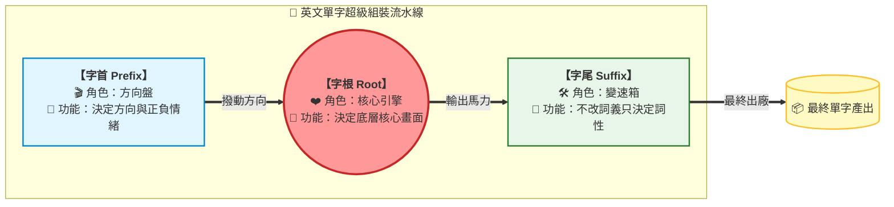
## 💡 為什麼要學？（Start with Why）
> 高中要會 4500+ 單字，硬背到懷疑人生？其實英文單字像樂高，多由「字首＋字根＋字尾」組成。學會拆解，看到沒背過的生字也能猜意思——這不只幫你拿下學測詞彙題，更是讀原文、看影集、查資料能用一輩子的「解碼力」。

## 📌 一句話總結
> 單字不是死背，而是把「字首＋字根＋字尾」三段樂高拼回意思，一次記住一整串同源字。

## 🎯 核心概念
> 先建「拆解工具箱」，再看任何字根清單——沒有工具箱，清單只是另一張要硬背的生字表。

**拆解公式**：`單字 ＝ 字首（方向/正負）＋ 字根（核心動作）＋ 字尾（詞性/狀態）`

- **字首（Prefix）定方向**：改變方向、正負、有無。如 ex-（向外）、in-（向內）、re-（重複/向後）。
- **字根（Root）定核心**：決定這個字最底層的「畫面／動作」，是一群同源字共用的中心。
- **字尾（Suffix）定詞性**：決定詞性與狀態。如 -tion（名詞）、-ate（動詞）、-ive（形容詞）。
- 同一字根可串出一群同源字，記住一個「核心畫面」就帶出五到八個字。
- 拆解的價值在「看到生字也能猜方向」，而非每個字都查中譯。

## 🗺 圖解
> 一個字根帶一串：以 port（搬運）為中心的同源字家族。
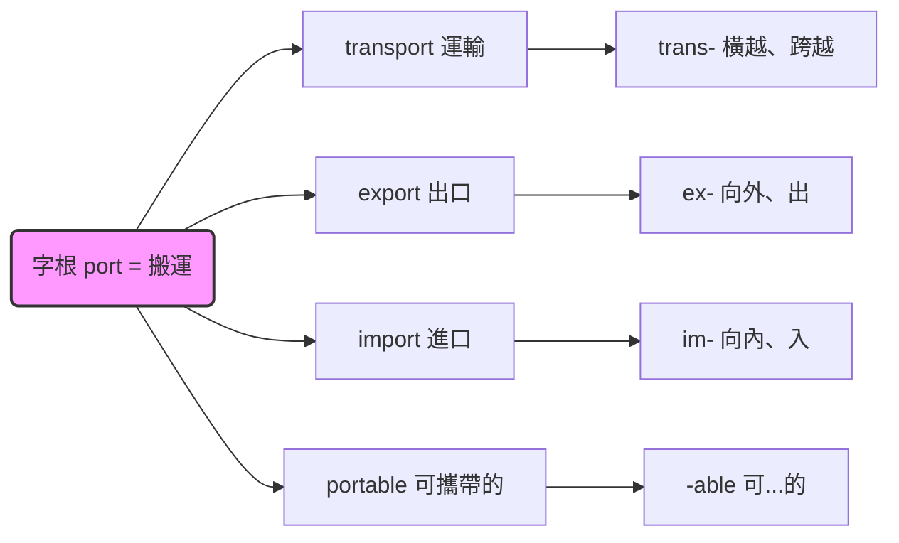
## 🌏 生活連結（記憶錨點）
> - 把單字想成樂高：字首是底座方向、字根是主積木、字尾是裝飾帽。
> - transport：trans-（橫越）＋ port（搬運）→ 把東西搬過去 ＝ 運輸；同 port 串出 export、import、portable。
> ⚠️ 比喻破功處：不是每個字都能乾淨拆三段。有些字根會拼寫變形（spect/spec/spic），有些字首只是「拼湊好唸」沒實義（understand 的 under-），硬拆會誤導——以「常見高頻字根」為主、查證為輔。

## 🧠 記憶法 / 口訣
- 拆字三步：「**先切三段 → 各給意思 → 組回原意**」。
- 字首方向口訣：「**re 回、un 否、ex 出、in 進、trans 越過、pre 先**」。
- 字尾詞性口訣：「**-tion 名、-ate 動、-ive 形、-able 可、-ize 化**」。
- 字根「畫面記憶法」：每個字根先記一個動作畫面（port＝搬東西、spect＝盯著看、ject＝丟出去），畫面對了，整串同源字就跟著浮現（清單見〈考試重點〉）。

## ⭐ 考試重點
- [ ] **能力導向（真正要練的）**：學測不單獨考「字根清單」，考的是「看到生字能拆解、猜對方向」的能力。先練熟拆解工具箱，再用下面的核心字根清單養手感——目標是**反射，不是背數量**。
- [ ] **核心字根清單（起手式，非權威定數）**：坊間對「高頻字根共幾組」沒有單一權威來源，別糾結數量。先吃透這組最常出現的字根，再依讀到的文章自行擴充：

| 字根           | 核心畫面     | 同源字                                  |
| ------------ | -------- | ------------------------------------ |
| port         | 搬運       | transport, export, import, portable  |
| spect/spec   | 看（注視）    | inspect, respect, spectator, suspect |
| dict         | 說        | predict, dictionary, contradict      |
| ject         | 丟        | reject, project, inject              |
| ven/vent     | 來        | prevent, invent, event               |
| scrib/script | 寫        | describe, subscribe, manuscript      |
| duc/duct     | 引導       | conduct, produce, introduce          |
| tract        | 拉        | attract, extract, contract           |
| mit/miss     | 送出       | submit, transmit, dismiss            |
| pos/pon      | 放置       | compose, position, postpone          |
| vid/vis      | 看（視覺/影像） | video, visible, evidence             |
| struct       | 建造       | construct, structure, instruct       |
|              |          |                                      |
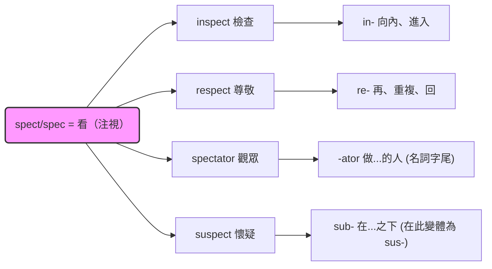
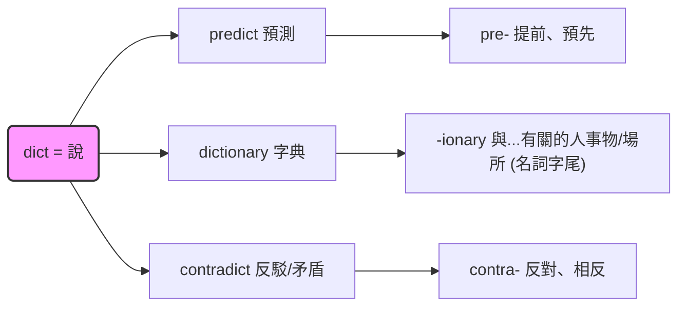

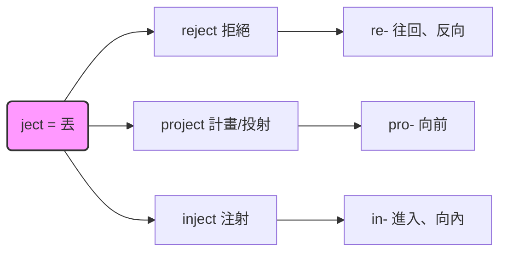

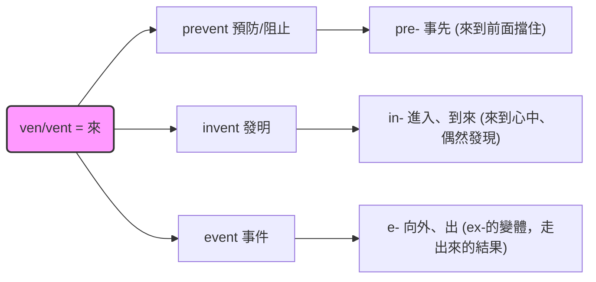
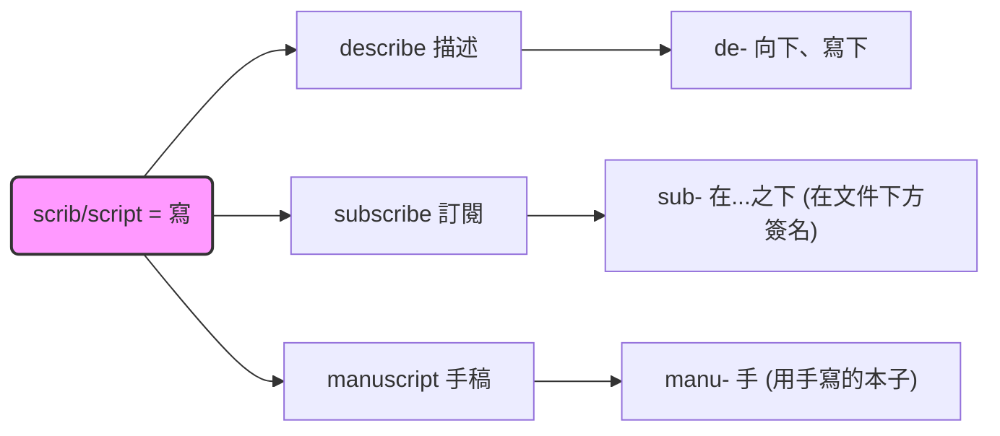
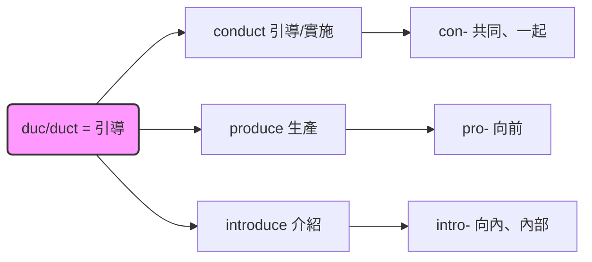
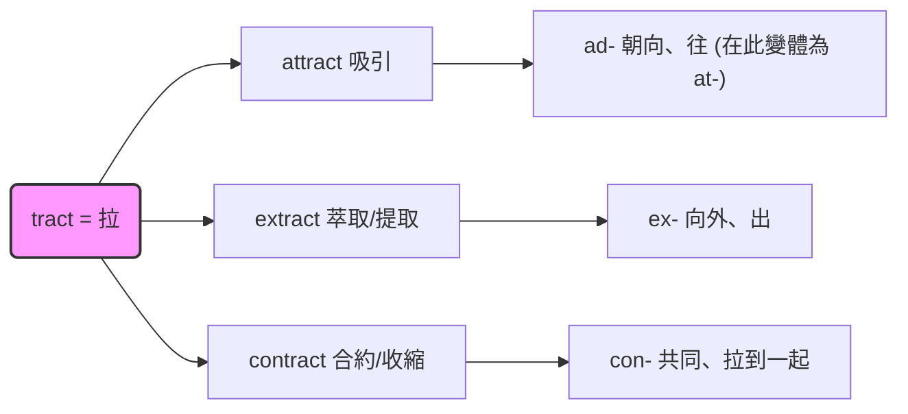
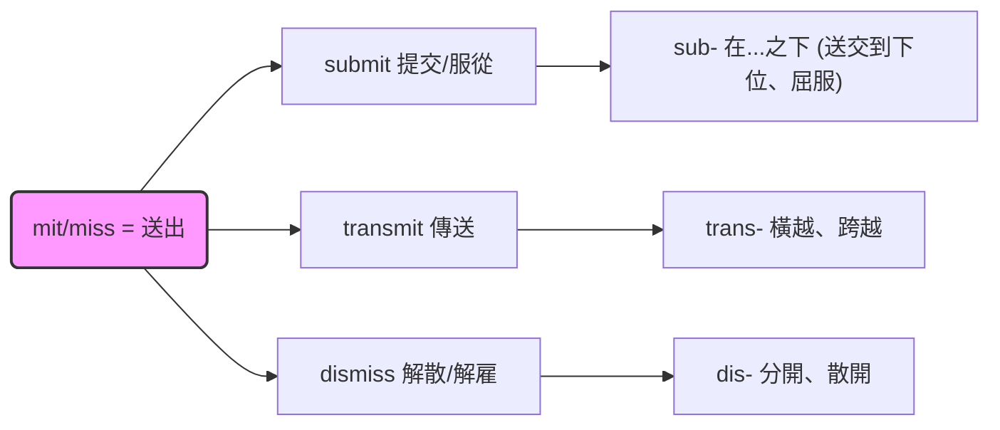
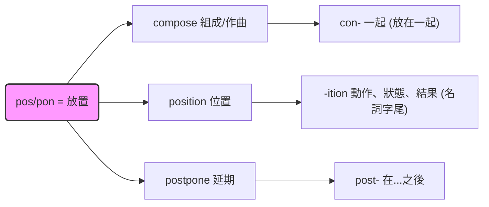
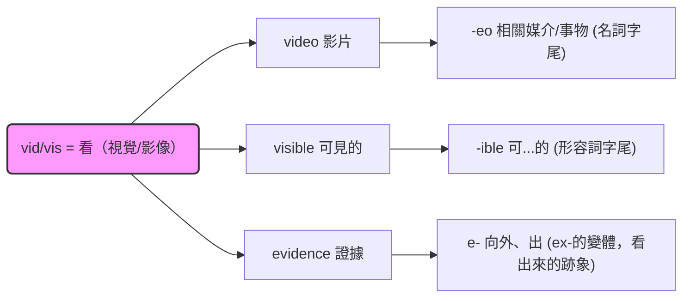
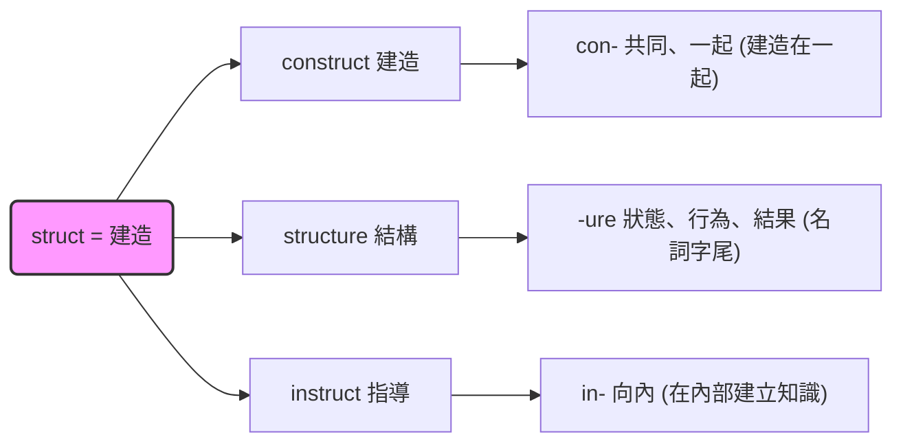

- [ ] **常考題型**：詞彙題直接考同源字辨義；綜合測驗、文意選填靠拆字猜生字。
- [ ] **注意**：同源字「形近義異」是常見誘答（adapt/adopt、affect/effect），須連詞性一起記。

## ⚠️ 易錯點 / 陷阱
- 把所有字硬拆：例外字（understand、example）拆了反而記錯。
- 只記字首、忽略字尾詞性 → 填空詞性錯（名詞填到動詞位）。
- 字首遇字根會「同化變形」：in- 在 p 前變 im-（import）、l 前變 il-（illegal），拼字易錯。
- 拆字只給「語意方向」，精準字義仍要看語境，別只憑拆字硬填。

## 🔗 跨科連結
- [[字根（Root）定核心]]
- [[綜合測驗與文意選填]]
- [[閱讀測驗策略]]
- [[學名與拉丁字根]]

## 📝 一分鐘自我檢測
> 先遮答案再想。
1. Q：拆解 export 並說出意義。　A：ex-（向外）＋port（搬運）→ 出口/輸出。
2. Q：respect 與 inspect 共用哪個字根？各自意義？　A：spect（看）；respect＝反覆看＝尊敬、inspect＝往內看＝檢查。
3. Q：-tion、-able、-ize 各是什麼詞性？　A：名詞、形容詞、動詞。

---
> 📋 參考：大考中心《高中英文參考詞彙表》 https://www.ceec.edu.tw/xmdoc?xsmsid=0K213553204833715309

