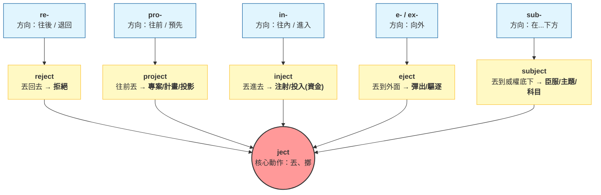

# 字根拆解記憶法

## 💡 為什麼要學？（Start with Why）
### 🚀 為什麼要學字根拆解？單字考場的「降維打擊」

> [!💡 英文老師的靈魂叩問]
> 你還在死背字母順序嗎？`p-r-e-d-i-c-t` 刻五遍叫預測，`p-r-e-v-e-n-t` 刻五遍叫預防？
> 學測 7000 單字如果用硬鋼的方式死記，大腦遲早崩潰。
> 學字根不是多背公式，而是拿一把手術刀，教你在考場上「合法作弊」。
#### 🎯 核心理由 1：背單字不是「背字母」，而是「玩拼圖」
單字不是隨機的火星文，它們是由 **【字首（方向）】+【字根（核心動作）】+【字尾（詞性）】** 組成的樂高積木：
- 死記：`predict` = 預測（花 30 秒死背字母）。
- 拆解：`pre-`（預先）+ `dict`（說）$\rightarrow$ 預先說出來 = 預測。
    大腦不記死板字母，只記邏輯畫面，背單字痛苦度直接暴跌 80%！
#### 🎯 核心理由 2：具備考場上的「文字通靈能力」
學測大魔王是「沒看過的超長閱讀測驗單字」。懂字根的你，能直接對生字進行「現場解剖」。
- 大考遇到巨嬰單字： `unpredictable`（13 個字母，一般人直接放棄）
- 你的大腦解剖路徑：
    1. `un-`（不，否定）
    2. `pre-`（預先）
    3. `dict`（說）
    4. `-able`（能夠...的，形容詞）
- 通靈結論： 不 + 預先 + 說 + 能夠的 = 無法預料的。你一輩子沒背過它，卻能在考場上秒懂它！
#### 🎯 核心理由 3：買一送十的「超高投報率」
英文單字有幾萬個，但核心字根只有 **15–20 組** 掌握了學測 80% 的高級詞彙。
- 死背 15 個單字，你只會 15 個單字。
- 熟練 **15 個核心字根**，就能延伸出 150 個、甚至 300 個單字。

> [!🚀 助教團複習定調]
> > 從今天起，你不再是「背單字的苦工」，而是「拆解單字的密碼專家」。
> 準備好解鎖第一把必備的防身解剖刀了嗎？

## 📌 一句話總結

把單字拆成「字首＋字根＋字尾」三層結構，用一個字根串聯一群同源字，從記一個字變成記一串字。
## 🎯 核心概念

- 字根（Root）是單字的意義核心，通常來自拉丁文或希臘文，決定字義的方向。
- 字首（Prefix）接在字根前，改變字義的「方向或程度」，例如 `un-`（否定）、`re-`（再次）、`trans-`（穿越）。
- 字尾（Suffix）接在字根後，改變詞性（名詞/動詞/形容詞），例如 `-tion`（名詞化）、`-ible`（可⋯⋯的）、`-ly`（副詞化）。
- 同一字根衍生的字群（Word Family）共享核心語意，認識字根等於認識整群字。
- 學測詞彙題常考「同源字陷阱」：外型相似但詞性或語意不同的字（如 `affect` vs `effect`），須先辨字根再看字尾。
- 拆解步驟：先辨字首 → 找字根 → 看字尾判詞性 → 組合語意 → 代入上下文驗證。

## 🗺 圖解

## 🌏 生活連結（記憶錨點）

**字根像漢字的部首。**「江、河、海、泳、泡」都有三點水，你一眼知道和「水」有關——字根就是英文的三點水。看到 `aqua-`（水），就像看到三點水，立刻聯想到 aquarium（水族館）、aquatic（水中的）、aqueduct（水道）。

這個比喻哪裡會破功：漢字部首和語意的對應比字根更穩定；英文字根在借入不同語言時，拼法可能有變形（`spect` / `spec` / `scop` 都源自「看」），不像部首字形固定——所以拆解時要接受「字根可能變形」，不能死板地逐字比對。

## 🧠 記憶法 / 口訣

**「首根尾，三刀切，串一串，記一群」**

- 首（字首）：方向/態度改變器
- 根（字根）：語意核心，背這個最值錢
- 尾（字尾）：詞性判定器，考試靠它選答案
- 串：找到字根後，立刻串三個同源字寫下來，當天就記住

**高頻字根速查記憶組**（學測常考）

| 字根                | 語意   | 串出的字（字首拆解）                                                                                                                                                                                  |
| ----------------- | ---- | ------------------------------------------------------------------------------------------------------------------------------------------------------------------------------------------- |
| `port`            | 搬、帶  | ⋅ ex-（外）+ port → **export**（出口） ⋅ im-（內）+ port → **import**（進口） ⋅ trans-（跨越）+ port → **transport**（運輸） ⋅ port + -able（可…的）→ **portable**（可攜帶的）                                     |
| `spect / spec`    | 看    | ⋅ in-（向內）+ spect → **inspect**（檢查） ⋅ ex-（向外）+ spect → **expect**（期待） ⋅ re-（回）+ spect → **respect**（尊重，回頭看） ⋅ spect + -acle（名詞尾）→ **spectacle**（壯觀景象）                               |
| `duct / duc`      | 引導   | ⋅ con-（共同）+ duct → **conduct**（指揮、行為） ⋅ intro-（向內）+ duc → **introduce**（介紹，帶進來） ⋅ e-（出）+ duc + -ate → **educate**（教育，引出潛能） ⋅ de-（向下）+ duc → **deduce**（推論，引導出結論）                   |
| `mit / miss`      | 送、放  | ⋅ trans-（跨越）+ mit → **transmit**（傳送） ⋅ sub-（在下）+ mit → **submit**（提交、屈服） ⋅ dis-（分散）+ miss → **dismiss**（解散、駁回） ⋅ miss + -ion（名詞尾）→ **mission**（任務，被派送的事）                           |
| `ven / vent`      | 來    | ⋅ pre-（在前）+ vent → **prevent**（預防，在事情來之前擋住） ⋅ inter-（之間）+ vene → **intervene**（介入） ⋅ con-（共同）+ vent + -ion → **convention**（慣例、大會，一起來） ⋅ ad-（朝向）+ vent → **advent**（到來、降臨）         |
| `script / scrib`  | 寫    | ⋅ de-（詳細）+ scrib → **describe**（描述） ⋅ pre-（預先）+ script + -ion → **prescription**（處方，預先寫好） ⋅ manu-（手）+ script → **manuscript**（手稿） ⋅ sub-（在下）+ scribe → **subscribe**（訂閱，在下面簽名）     |
| `fac / fec / fic` | 做、製造 | ⋅ fact + -ory（地點尾）→ **factory**（工廠，製造的地方） ⋅ ef-（出）+ fec + -t → **effect**（效果，做出來的結果） ⋅ ef-（出）+ fic + -ient → **efficient**（有效率的） ⋅ arti-（技藝）+ fic + -ial → **artificial**（人工的，人做的） |
| `cred`            | 相信   | ⋅ cred + -it → **credit**（信用、功勞） ⋅ in-（否定）+ cred + -ible → **incredible**（難以置信的） ⋅ cred + -ible → **credible**（可信的） ⋅ cred + -ibility → **credibility**（可信度）                       |
學習字根最忌諱死記，最有效率的方式是透過「已經刻在你大腦裡的常用字」**或**「日常生活天天看得到的東西」來建立連結。
## 核心動作與物理力量類（7個）
### 1. port = 搬運、攜帶
* **來源解說：** 來自拉丁文 *portare*（運送、攜帶），與 *portus*（港口，搬運貨物的地方）同源。
* **生活連結：**
* **Airport (機場)**：飛機停靠、搬運旅客與行李的「空中港口」。
* **Passport (護照)**：讓你可以「通過 (pass)」各國「港口/關卡 (port)」的合法攜帶證件。
* **Portable (可攜帶的)**：行動螢幕（portable monitor）或外接硬碟，表示具備可隨身攜帶的特性。
### 2. ject = 丟、投擲
* **來源解說：** 來自拉丁文 *jacere*（扔、拋出）。
* **生活連結：**
* **Projector (投影機)**：將光線與畫面強力「向前 (pro-)」「投擲/射出 (ject)」的機器。
* **Reject (拒絕)**：別人向你提議，你把這個提議「往回 (re-)」「丟過去 (ject)」，也就是拒絕接受。
* **Eject (彈出、退出)**：光碟機上的退出鍵，或是戰鬥機的逃生艙，將物體「向外 (ex- 變體為 e-)」「彈射出去 (ject)」。
### 3. mit / miss = 送、派
* **來源解說：** 來自拉丁文 *mittere*（發送、釋放、派遣）。
* **生活連結：**
* **Mission (任務)**：被長官「派遣/送出去 (miss)」必須完成的重要工作。
* **Missile (飛彈)**：被「發射/送出去 (miss)」攻擊敵方目標的武器。
* **Submit (提交)**：把報告或合約「由下往上 (sub-)」「送交出去 (mit)」。
### 4. duc / duct = 引導
* **來源解說：** 來自拉丁文 *ducere*（帶領、引導）。
* **生活連結：**
* **Introduce (介紹)**：將新朋友「引導、帶入 (intro-)」你原本的社交圈子裡。
* **Air duct (風管/風道)**：建築物中用來「引導 (duct)」空氣流通的管線。
* **Produce (生產)**：把原料「向前 (pro-)」「引導/拉出來 (duc)」變成成品。
### 5. tract = 拉、抽
* **來源解說：** 來自拉丁文 *trahere*（拉、拖曳）。
* **生活連結：**
* **Tractor (耕耘機/牽引車)**：在農田或工地裡，專門用來「拖拉 (tract)」重型貨車或農具的車輛。
* **Attract (吸引)**：把別人的目光或注意力「朝向自己 (ad- 變體為 at-)」「拉過來 (tract)」。
* **Extract (萃取/提取)**：將植物或精油精華「向外 (ex-)」「抽取出來 (tract)」。
### 6. pos / pon = 放置
* **來源解說：** 來自拉丁文 *ponere*（擺放、安置）。
* **生活連結：**
* **Position (位置、職位)**：某人或某物被固定「安置、擺放 (pos)」在那裡的地方。
* **Pose (姿勢)**：拍照時，將身體「擺放 (pos)」出來的特定姿態。
* **Postpone (延期)**：將原本定好的行程，往「後面 (post-)」「放置 (pone)」。
### 7. press = 按、壓
* **來源解說：** 來自拉丁文 *premere*（擠壓、施加壓力）。
* **生活連結：**
* **Espresso (濃縮咖啡)**：利用高壓將咖啡精華「向外 (ex- 變體為 es-)」「壓擠 (press)」出來的純咖啡。
* **Express (表達)**：把內心的想法或情感「強力擠壓、推擠 (press)」「向外 (ex-)」讓別人知道。

## 感覺、通訊與認知類（6個)
### 8. spect / spec = 看、注視
* **來源解說：** 來自拉丁文 *specere*（觀看、檢查）。
* **生活連結：**
* **Spectacles (眼鏡)**：用來輔助「觀看 (spect)」的視覺工具。
* **Specification (產品規格，簡稱 Spec)**：買科技產品或硬體時，讓人一目了然「看」清詳細數據的說明書。
* **Inspect (檢查)**：目光「往裡面 (in-)」「仔細審視 (spect)」。
### 9. vis / vid = 看見、視覺
* **來源解說：** 來自拉丁文 *videre*（看見、看得到的結果）。
* **生活連結：**
* **Video (影片)**：由連續動態畫面組成、供眼睛「觀看 (vid)」的影像媒介。
* **Visa (簽證)**：出國旅遊時，讓各國海關「看過 (vis)」並蓋章認可的通關文件。
* **Visible (可見的)**：肉眼能夠「看見 (vis)」的。
### 10. aud = 聽
* **來源解說：** 來自拉丁文 *audire*（傾聽）。
* **生活連結：**
* **Audio (音訊)**：耳機或音響發出來、供耳朵「聆聽 (aud)」的聲音訊號。
* **Auditorium (禮堂/聽眾席)**：設計良好的半圓形或階梯狀空間，專門供聽眾「聆聽 (aud)」演講或音樂的場所。
### 11. dict / dic = 說、命令
* **來源解說：** 來自拉丁文 *dicere*（說話、宣告）。
* **生活連結：**
* **Dictionary (字典)**：收集了所有詞彙，教你這些字該怎麼「說 (dict)」與使用的工具書。
* **Predict (預測)**：在事情發生「之前 (pre-)」，就先將結果「說出來 (dict)」。
* **Dictator (獨裁者)**：在國家中權力至高無上，他說的話就是絕對「命令 (dict)」的人。
### 12. scrib / script = 寫
* **來源解說：** 來自拉丁文 *scribere*（刻劃、書寫）。
* **生活連結：**
* **Script (劇本/腳本)**：演員在舞台或電影上，必須按照上面「寫好 (script)」的台詞演出的文字本。
* **Prescription (醫生處方籤)**：在拿藥「之前 (pre-)」，由醫生親手「寫下 (script)」的藥單。
### 13. cred = 相信
* **來源解說：** 來自拉丁文 *credere*（信任、交付）。
* **生活連結：**
* **Credit card (信用卡)**：銀行基於對你財務能力的「信任 (cred)」，允許你先消費後付款的卡片。
* **Incredible (難以置信的)**：事情太過驚人，讓人「無法 (in-)」「相信 (cred)」。

## 移動、空間與時間類（7個)
### 14. ven / vent = 來、到達
* **來源解說：** 來自拉丁文 *venire*（來到、碰面）。
* **生活連結：**
* **Avenue (大道)**：一條寬闊、筆直，引導人車一路「走過來 (ven)」通往某處的主幹道。
* **Revenue (營收)**：企業提供服務後，資金與獲利源源不絕地「流回來 (re-)」公司口袋。
* **Event (事件/活動)**：時間到了，事情「走出來、發生了 (e- 來自 ex-)」。
### 15. ced / cess = 走、前進
* **來源解說：** 來自拉丁文 *cedere*（行走、移動、讓步）。
* **生活連結：**
* **Process (程序、處理)**：不論是電腦跑晶片運算，還是工廠製程，都是步驟一步步「向前 (pro-)」「推進 (cess)」。
* **Access (接近、管道)**：朝著某個目標「走過去 (ced/cess)」，引申為獲取權限或進入的通道。
### 16. cur / curs = 跑、流動
* **來源解說：** 來自拉丁文 *currere*（奔跑、流動）。
* **生活連結：**
* **Cursor (游標)**：在電腦螢幕上隨著滑鼠控制，到處「奔跑、點選 (curs)」的閃爍箭頭。
* **Current (潮流、目前的)**：正在時間或空間中不斷「流動、奔跑 (cur)」的水流、電流或趨勢。
### 17. grad / gress = 步、前進
* **來源解說：** 來自拉丁文 *gradi*（跨步、行走）。
* **生活連結：**
* **Graduate (畢業)**：在學業的階梯上，成功向前「跨出重要一步 (grad)」。
* **Progress (進步)**：技術或計畫打破停滯，持續「向前 (pro-)」「跨步走 (gress)」。
### 18. ped = 腳
* **來源解說：** 來自拉丁文 *pes*（腳）。
* **生活連結：**
* **Pedal (踏板)**：腳踏車上專門用來讓「腳 (ped)」踩踏、驅動車輪前進的物件。
* **Pedestrian (行人)**：在馬路上不用交通工具，純粹用「雙腳 (ped)」走路的人。
### 19. vers / vert = 轉向
* **來源解說：** 來自拉丁文 *vertere*（旋轉、改變方向）。
* **生活連結：**
* **Convert (轉換)**：將檔案格式（如 PDF 轉 Word）或信仰，徹底「轉變方向 (vert)」。
* **Universe (宇宙)**：萬事萬物圍繞著「單一 (uni-)」軸心「旋轉 (verse)」，聚合在一起的整體。
### 20. struct = 建造
* **來源解說：** 來自拉丁文 *struere*（層層堆疊、建造）。
* **生活連結：**
* **Structure (結構)**：建築物或文章一層層「建造 (struct)」起來的骨架與組織。
* **Construct (建造)**：將各種建材「聚集在一起 (con-)」「蓋起來 (struct)」。        
## ⭐ 考試重點

- [ ] **必背觀念**：字根拆解是「猜字」的核心技術，學測閱讀測驗遇到陌生字時，靠字根＋上下文猜意是必要能力。
- [ ] **必背觀念**：詞彙題（第一大題，10題）幾乎每年出現同源字干擾選項，認識字根可直接排除錯誤選項。
- [ ] **必背觀念**：篇章結構題（五選四）中，連接詞和轉承詞的字根也是線索（如 `consequently`、`nevertheless`）。
- [ ] **常考題型——詞彙題**：看到選項像兄弟（affect/effect/defect），先切字尾判詞性，再看字首定方向。
- [ ] **常考題型——綜合測驗**：遇到不認識的空格詞，切三段，字根語意代入句子驗證。
- [ ] **常考題型——閱讀測驗**：陌生字先猜字根，再看前後句，不要卡住。
- [ ] **常考題型——翻譯題**：輸出時用確定認識字根的字，別硬套發音相似的錯字。
- [ ] **課綱落點**：英文學測全範圍，字根記憶法是跨冊、跨題型的工具性能力，非單一章節。

## ⚠️ 易錯點 / 陷阱

- **拼字相似但字根不同的陷阱**：`moral`（道德，`mor-` = 習俗）vs `mortal`（會死的，`mort-` = 死亡）——外形接近，字根不同，語意完全無關，不要因為長得像就猜同族。
- **字根變形陷阱**：`spect`、`spec`、`scop` 都源自「看」，但拼法不同；`mit`、`miss` 都源自「送」。遇到不熟的拼法，先想「有沒有哪個字根和它接近」。
- **字尾詞性混淆**：`affect`（動詞）vs `effect`（名詞）——`af-` 和 `ef-` 都是字首變體（來自 `ad-` 和 `ex-`），字根同是 `fec`（做），但字首不同導致詞性和用法完全不同。考試最常考這對。
- **過度拆解**：有些字外型像字根組合，但其實是整個借來的詞，強行拆反而誤導（例如 `candle` 裡的 `can` 不是「能」的意思）。不確定時，先查字典確認字源再記。
- **只記字根忘記驗證上下文**：字根猜字是輔助，最終仍需代回句子看合不合邏輯，不能只靠字根就選答案。

## 🔗 跨科連結

- [[字首（Prefix）定方向]]
- [[閱讀理解策略]]
- [[篇章結構解題法]]
- [[學測詞彙題攻略]]
- [[上下文猜字策略]]
- [[字首（Prefix）定方向]]
- [[字尾（Suffix）定詞性]]
- [[字尾（Suffixes）詞性判斷]]
- [[同源字與一字多義陷阱]]

## 📝 一分鐘自我檢測

> 先遮住下方答案，自己想，再對照。

1. Q：把 `incredible` 拆成三段，並說出每段的意思與整個字的中文意思。　A：`in-`（否定）＋ `cred`（相信）＋ `-ible`（可⋯⋯的）→「不可置信的、難以相信的」。
2. Q：以下四個字中，哪一個字的字根和其他三個**不同**？ (A) export　(B) transport　(C) portable　(D) inspire　A：(D) inspire。`inspire` 的字根是 `spir`（呼吸、精神），其餘三個字根均為 `port`（搬、帶）。
3. Q：學測詞彙題出現「The doctor wrote a ___ for the patient.」，選項為 (A) prescription (B) description (C) subscription (D) inscription，請用字根法說明如何選出正確答案。　A：四個字字根同為 `script`（寫），靠字首區分——`pre-`（預先）→ 預先寫好的指示 = 處方；`de-`（向下/詳細）= 描述；`sub-`（在下）= 訂閱；`in-`（刻入）= 銘文/題詞。醫生為病人「寫」的是預先指定的用藥指示，答案選 (A) prescription。
4. Q：`affect` 和 `effect` 是學測最常考的同源字混淆對，請說明兩者字根與詞性差異，並各造一個例句。　A：兩者字根同為 `fec/fac`（做、製造）。`affect`（動詞）字首 `af-`（= `ad-`，朝向）→「對⋯⋯產生作用」，例：Stress can **affect** your health.　`effect`（名詞）字首 `ef-`（= `ex-`，出來）→「產生出來的結果」，例：The medicine had a positive **effect**.　選答案時先判詞性（空格前後需要動詞還是名詞），即可快速排除。

---
> 待確認項（內容檢查 Agent 填寫，人工複核後刪除）：
>
> **[1] `scop` 與 `spect/spec` 並列為同一字根「變形」之說法語源不精確**
> 位置：⚠️ 易錯點「字根變形陷阱」及 🌏 生活連結括號說明（`spect / spec / scop` 都源自「看」）。
> 問題：`spect/spec` 來自拉丁文 *specere*（to look），`scop` 來自希臘文 *skopein*（to look）。兩者雖同源自 PIE *spek-，但進入英文的路徑不同（一為拉丁借字、一為希臘借字），嚴格的詞源學不應把它們列為同一字根的「拼法變形」。這樣寫容易讓學生誤以為 telescope 裡的 `-scop` 只是 inspect 裡 `-spect` 的另一種拼法，實際上兩者分屬兩套詞根系統。建議：說明兩者「意思相同（皆為『看』），但一源自拉丁、一源自希臘」，而非並列為同一字根變體。
> 查證來源：[Etymonline: *spek-](https://www.etymonline.com/word/*spek-)；[Etymonline: -scope](https://www.etymonline.com/word/-scope)
>
> **[2] `affect` 僅為動詞、`effect` 僅為名詞的表述不完整**
> 位置：⚠️ 易錯點「字尾詞性混淆」及 📝 自我檢測第 4 題。
> 問題：筆記寫「`affect`（動詞）」「`effect`（名詞）」，但兩者均可跨詞性使用：`effect` 可作動詞（effect a change = 促成改變），`affect` 在心理學中也可作名詞（positive affect = 正向情感）。學測情境下以動詞/名詞的分法教學是常見且實用的簡化，但若學生閱讀英文原文遇到「to effect change」可能因此困惑。建議在易錯點加一句「學測情境以動詞/名詞為主要用法，但 effect 亦可作動詞，如 effect a change」，避免過度絕對化。
> 查證來源：[Etymonline: affect](https://www.etymonline.com/word/affect)；[Etymonline: effect](https://www.etymonline.com/word/effect)
>
> **[3] `ambi-` 解釋為「兩邊」之精確度**
> 位置：💡 為什麼要學（`ambi-`（兩邊）＋ `ag-`（走、驅動）→「往兩個方向走」）。
> 問題：`ambi-` 的拉丁/PIE 原意為「around/about（周圍）」，「兩邊」是常見的教學簡化。Etymonline 顯示 *ambi-* 源自 PIE *ambhi-（around）。這個簡化在高中教學上普遍且可接受，但若有學生深究「為何 ambidextrous 是兩手都用」，「兩邊」比「周圍」更直覺，衝突不大。建議維持現有說法但可加附注，或確認台灣高中英文教材對 `ambi-` 的標準定義後再決定是否調整。
> 查證來源：[Etymonline: ambiguous](https://www.etymonline.com/word/ambiguous)
