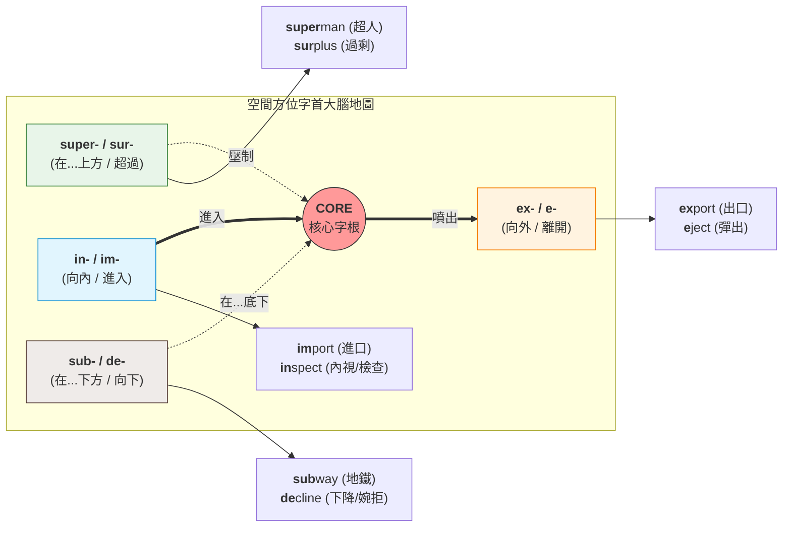
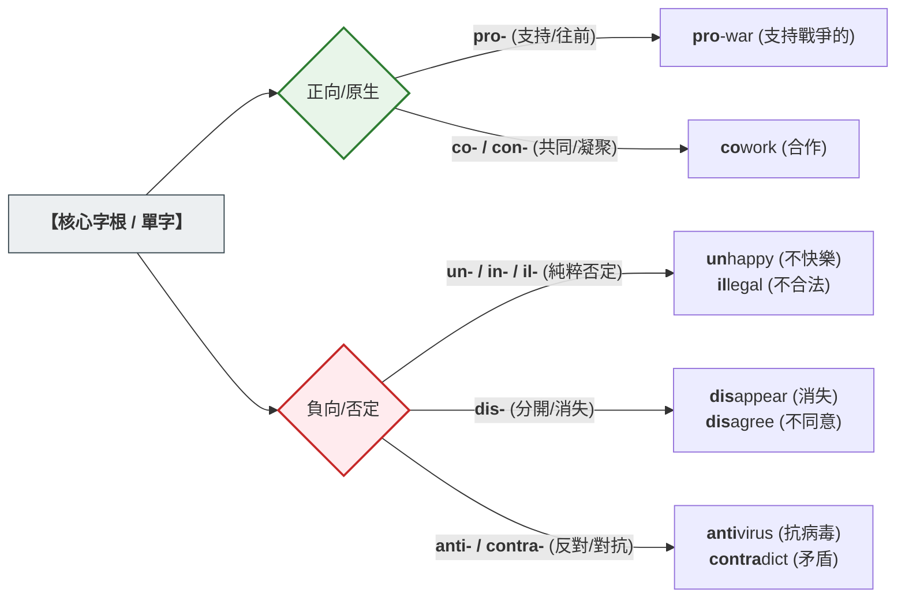
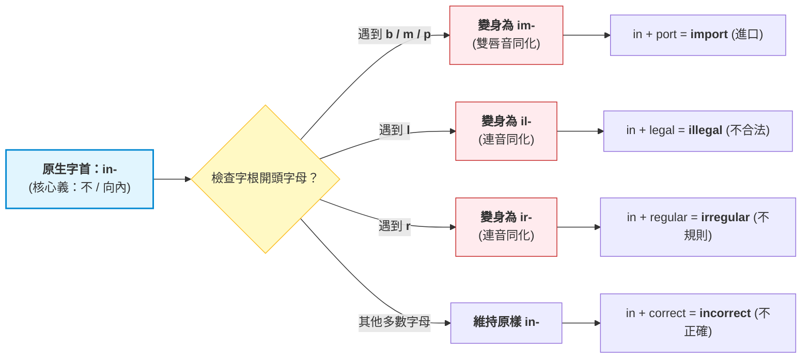

# 字首（Prefixes）完整表
## 💡 為什麼要學？（Start with Why）
解鎖單字的「方向鍵」與「情緒探測器」
> [!💡 英文老師的靈魂叩問] 如果字根是單字的**「心臟」**（決定核心意義），那字首（Prefix）就是單字的**「方向盤」**。 很多時候，你根本不需要知道一個長單字的完整意思，只要看一眼它的「字首」，就能在學測考場上秒懂它的**「前進方向」**與**「正負情緒」**！
###  核心理由 1：字首是單字的「空間方向鍵」
英文單字的物理移動與空間感，高達 90% 由字首掌控。掌握字首，單字就會變成「3D 立體圖」。
- 以核心字根 **`port`（搬運）** 為例：
    - `ex-`（向外） + `port` → **export**（出口）
    - `im-`（向內） + `port` → **import**（進口）
    - `trans-`（跨越） + `port` → **transport**（運輸）
    - `sup-`（在...下方） + `port` → **support**（在下方撐住 → 支持） 字根從未改變，你只要撥動前方的「字首方向鍵」，就能掌控單字的移動！
### 核心理由 2：閱讀測驗的「正負情緒探測器」
學測閱讀測驗常考作者態度或選詞填空，字首自帶強烈的「正負電極」，是猜字的防身符：
- **正電極（前進/支持/共同）：** `pro-`（支持/往前）、`con- / co-`（共同）。
- **負電極（否定/反對/破壞）：** `un- / in-`（不）、`dis-`（分開/消失）、`anti-`（對抗）。
- **考場實戰：** 看到 `anti-globalization`，一眼看穿 `anti-`（反對）+ 全球化 = **反全球化**。光靠正負電碰撞，3 秒內就能抓到文章衝突點！
###  核心理由 3：看穿「同化規則」，告別拼字粗心
為什麼不合法是 `illegal` 變 l、進口是 `import` 變 m？這不是隨機亂碼，而是大腦為了好發音的「同化機制（編碼）」。
- 戴上大腦還原鏡：看穿 `im-`、`il-`、`ir-` 本質上全都是 `in-`（不/向內）的偽裝。
- 掌握這個規則，你不是在死記字母，而是在理解造字邏輯，拼字正確率瞬間暴升！

> [!🚀 助教團複習定調] 字根決定單字「是誰」，字首決定單字「要去哪、是好是壞」。

## 📌 一句話總結
字首是單字的「語意標籤」，認識 20 個核心字首，就能用「拆解 + 猜義」策略秒殺學測生字。

## 🎯 核心概念

- 字首（prefix）黏在字根之前，改變或強化整個單字的意思，但不改變詞性。
- 學測高頻字首可依「語意功能」分為四大類：否定類、方向/位置類、數量類、時間類。
- 同一字首可能有多種拼法（同化變形）：例如 `ad-` 遇到 c/f/g/l/p/r 等開頭的字根，會同化為 `ac-`、`af-`、`ag-`、`al-`、`ap-`、`ar-`，這是語音省力的結果，不是拼錯字。
- 字首辨義步驟：先認字首語意 → 再猜字根大方向 → 代入句意驗證 → 排除選項。
- 部分字首含義相同但來源不同（拉丁 vs. 希臘），學測以拉丁系為主，希臘系常見於科學字彙（但閱讀測驗偶爾出現）。
- `in-` 在不同語境下可表示「否定」或「向內/進入」，需依字根判斷，是最高頻陷阱字首。
- 字首記憶的最高效路徑：一個字首串出一族同根單字，一次記一串而非逐字硬背。

## 🌏 生活連結（記憶錨點）

**否定類字首 → 交通號誌的「禁止」標誌**
把否定字首想成號誌牌：`un-`、`dis-`、`non-`、`mis-` 都是紅圈加斜線——它們貼在動詞或形容詞前面，意思就翻轉了。`unhappy`（不快樂）、`disconnect`（斷開連線）、`misread`（看錯）——每個都是原本那個動作「被禁止或出錯」的感覺。

**`re-` → 手機「重新整理」按鈕**
`re-` 就是你刷新頁面的那個動作：`reload`（重新載入）、`review`（重新看）、`restart`（重新開始）。每次頁面卡住按重整，就想到 `re-`。

**`sub-` → 潛水艇（submarine）的「sub」**
`sub-` 就是往下潛：`subway` 地鐵往地下跑、`subtitle` 字幕在畫面下方、`submit` 把東西「往下交」給上面的人。

**`trans-` → 台灣的「轉運站」**
`trans-` 是橫越與轉換：`transport` 把東西搬過去、`transform` 形狀換過去、`translate` 語言轉過去。任何「換邊/跨越」的動作都是 `trans-`。

這些比喻哪裡會破功：號誌比喻只適用於「語意否定」，遇到 `in-` 表示「向內進入」（如 `include`、`input`）就失效——此時 `in-` 不是紅燈，而是箭頭朝內，要靠字根判斷方向。

## 🧠 記憶法 / 口訣

四大類記憶口訣：「否定、方向、數量、時間」
字根決定了單字的核心動作或本質（如 `port` = 搬運）
字首就像是**方向方向盤**、**數量計數器**或**正負開關**，精準定義了這個動作發生的時間、空間與狀態。

## 第一類：空間與方向標籤（方向盤）

這類字首負責為單字安裝「導航」，指出動作往哪裡去。
### 1. ex- (e-) = 向外、出來 (Out)
* **來源解說：** 來自拉丁文介係詞 *ex*（從...出來）。
* **Exit (出口)**：建築物裡引導人「向外 (ex-)」走出去的通道。
* **Export (出口貨物)**：把貨物「搬運 (port)」「向外 (ex-)」賣到國外。
### 2. in- (im-, il-, ir-) = 向內、進入 (In)
* **來源解說：** 來自拉丁文介係詞 *in*（在...裡面/進入）。
* **Import (進口貨物)**：把國外的貨物「搬運 (port)」「向內 (im-)」買進國內。
* **Inhale (吸氣)**：把空氣「向內 (in-)」吸入肺部（相對於 exhale 吐氣）。
* *註：在拼字時，若後方字根開頭為 p/b/m，為了發音順暢會同化為 `im-`。*
### 3. pro- = 向前、在前 (Forward)
* **來源解說：** 來自拉丁文 *pro*（向前、在...前面）。
* **Progress (進步/前進)**：腳步「跨步 (gress)」「向前 (pro-)」邁進。
* **Projector (投影機)**：將畫面「投擲 (ject)」「向前 (pro-)」射在牆上。
### 4. re- = 往回、向後、重複 (Back, Again)
* **來源解說：** 來自拉丁文副詞/字首 *re-*（往後、再次）。
* **Return (返回)**：轉身「往回 (re-)」走到原點。
* **Repeat (重複)**：事情再做「一次 (again)」。
* **Reject (拒絕)**：別人遞過來的提議，你「往回 (re-)」「丟 (ject)」過去。
### 5. sub- (sus-, suc-) = 在...之下、從下往上 (Under)
* **來源解說：** 來自拉丁文介係詞 *sub*（在...下方）。
* **Subway (地鐵)**：蓋在馬路「地面之下 (sub-)」的「鐵路/道路 (way)」。
* **Submit (提交)**：把報告「從下層 (sub-)」「送交 (mit)」給上司。
### 6. trans- = 橫越、跨越 (Across)
* **來源解說：** 來自拉丁文介係詞 *trans*（穿越、跨過）。
* **Transport (運輸)**：將貨物「跨越地理障礙 (trans-)」「搬運 (port)」到另一地。
* **Translate (翻譯)**：將語意從 A 語言「跨越界線 (trans-)」轉換到 B 語言。
### 7. de- = 向下、分離、減少 (Down, Away)
* **來源解說：** 來自拉丁文介係詞 *de*（從...往下/離開）。
* **Decline (下降、婉拒)**：數字或曲線「向下 (de-)」「傾斜 (cline)」。
* **Decrease (減少)**：數量「往下 (de-)」減低（相對於 increase 增加）。

## 第二類：時間與順序標籤（時光機）

這類字首負責在時間軸上定位，決定事情發生的先後。
### 8. pre- = 在...之前、預先 (Before)
* **來源解說：** 來自拉丁文介係詞 *prae*（在...之前）。
* **Predict (預測)**：在事情發生「之前 (pre-)」就先「說出來 (dict)」。
* **Prepare (準備)**：在考試或任務「之前 (pre-)」先武裝、整頓好自己。
### 9. post- = 在...之後 (After)
* **來源解說：** 來自拉丁文介係詞 *post*（在...後面）。
* **Postpone (延期)**：將原本定好的日期往「時間後面 (post-)」「放置 (pone)」。
* **Post-war (戰後的)**：發生在戰爭「結束之後 (post-)」的時期。
### 10. fore- = 在最前面、前方的 (Front, Before)
* **來源解說：** 來自日耳曼語族/古英語核心字根 *fore*（前方）。
* **Forehead (額頭)**：長在整張「臉/頭部 (head)」「最前方 (fore-)」的部位。
* **Forecast (預報)**：天氣預報，在氣候來臨「之前 (fore-)」「投射/給出 (cast)」數據。

## 第三類：數量與狀態標籤（計數器與調色盤）

這類字首負責定義人或事物的多寡，或是彼此之間的互動狀態。
### 11. con- (com-, co-, col-, cor-) = 共同、一起、完全 (Together, Completely)
* **來源解說：** 來自拉丁文介係詞 *cum*（與...一起）。
* **Company (公司/夥伴)**：一群人聚「在一起 (com-)」吃「麵包 (panis，源自拉丁文)」一起打拼的組織。
* **Connect (連接)**：把兩條線綁「在一起 (con-)」。
* *註：後方接 p/b/m 時變為 `com-`（如 compose 放在一起）；接 l 變 `col-`（如 collect 聚在一起）。*
### 12. uni- = 單一、獨個 (One)
* **來源解說：** 來自拉丁文 *unus*（一）。
* **Uniform (制服)**：讓所有員工或學生呈現「單一 (uni-)」「形體/樣貌 (form)」的服裝。
* **Unique (獨一無二的)**：世上只有「這一個 (uni-)」的。

### 13. bi- = 兩個、雙重 (Two)
* **來源解說：** 來自拉丁文 *bis*（兩次、雙倍）。
* **Bicycle (腳踏車)**：擁有「兩個 (bi-)」「輪子/圓圈 (cycle)」的交通工具。
* **Bilingual (雙語的)**：能流利使用「兩種 (bi-)」語言的。

### 14. multi- = 許多、多元 (Many)
* **來源解說：** 來自拉丁文 *multus*（許多的）。
* **Multimedia (多媒體)**：結合了文字、影像、聲音等「多種 (multi-)」「媒介 (media)」的技術。
* **Multitask (多工)**：大腦或電腦同時執行「許多 (multi-)」項「任務 (task)」。

### 15. dis- = 分開、散開 (Apart, Away)
* **來源解說：** 來自拉丁文字首 *dis-*（往不同方向、分開）。
* **Dismiss (解散/下課)**：讓大家朝著不同方向「散開 (dis-)」「送走 (miss)」。
* **Distance (距離)**：兩點之間「分開 (dis-)」「站立 (stance)」所產生的長度。

## 第四類：否定與相反標籤（正負開關）

這類字首就像邏輯閘中的 NOT（反向器），一放上去字義直接180度大轉變。
### 16. un- = 不、相反動作 (Not, Un-do)
* **來源解說：** 來自日耳曼語族核心否定字首（英文原生）。
* **Unhappy (不快樂的)**：狀態「不 (un-)」快樂。
* **Unlock (開鎖)**：把鎖住的動作「反向操作/解除 (un-)」。

### 17. in- (im-, il-, ir-) = 否定、不 (Not)
* **來源解說：** 來自拉丁文的否定字首 *in-*（與剛才空間類的 in- 詞源不同，但拼法一樣）。
* **Incredible (難以置信的)**：讓人「無法 (in-)」「相信 (cred)」的。
* **Impossible (不可能的)**：這件事「不 (im-)」「可能的 (possible)」。

### 18. non- = 非、無、不 (Not, Absence)
* **來源解說：** 來自拉丁文 *non*（不），通常表達單純的「不屬於某種類別」或「不存在」。
* **Non-profit (非營利的)**：經營組織的目標「不是 (non-)」為了獲取「利潤 (profit)」。
* **Non-sense (胡說八道/無意義)**：「沒有 (non-)」「常理/邏輯 (sense)」的話。

### 19. anti- = 反對、對抗 (Against)
* **來源解說：** 來自希臘文介係詞 *anti*（對抗、相反、代替）。
* **Antibiotics (抗生素)**：用來「對抗 (anti-)」微「生物/細菌 (bio)」的藥物。
* **Anti-virus (防毒軟體)**：電腦中用來「防範/對抗 (anti-)」「病毒 (virus)」的程式。

### 20. mis- = 錯誤、壞的 (Wrongly, Badly)
* **來源解說：** 來自日耳曼語族（古英語/古諾斯語）核心字首，代表錯誤。
* **Mistake (錯誤)**：直譯是「拿錯了」。「錯誤地 (mis-)」「拿取/接受 (take)」。
* **Misunderstand (誤解)**：「錯誤地 (mis-)」「理解 (understand)」別人的意思。

## ⭐ 考試重點
- [ ] **必背觀念**：否定字首是最高頻考點：`un-`、`in-/im-/il-/ir-`、`dis-`、`mis-` 幾乎年年現身。
- [ ] **必背觀念**：數量字首 `bi-`、`tri-`、`multi-` 偶爾出現在科技或環境類篇章。
- [ ] **必背觀念**：方向字首 `re-`、`ex-`、`trans-`、`sub-`、`inter-` 是閱讀測驗猜字義的關鍵。
- [ ] **常考題型——綜合測驗/文意選填**：遇到空格選字時，先看選項字首：如果空格語意需要「否定」，先刪去無否定字首的選項，縮小範圍。
- [ ] **常考題型——閱讀測驗猜字義題**：題目問「第 X 行的 Y 字最接近哪個意思」時，先拆字首，再看字根，最後代入原句驗證。
- [ ] **常考題型——翻譯/寫作**：注意同化變形拼字正確（`illegal` 不是 `inlegal`）。
- [ ] **課綱落點**：英文學測全範圍，字首記憶法是跨冊、跨題型的工具性能力，非單一章節。

## ⚠️ 易錯點 / 陷阱

- **陷阱一：`in-` 的雙重身份**：`in-` 可以是「否定」（`invisible` 看不見）也可以是「向內/進入」（`include` 包含進去、`input` 輸入）。判斷方式：字根若有「看、能、可能」語意，多半是否定；字根若有「進入、放置」語意，多半是方向。考場上務必代入句意確認。
- **陷阱二：`flammable` vs. `inflammable` 都是「易燃」**：這是歷史演變留下的特例：`in-` 此處來自拉丁字首 `in-`（進入/使燃燒），而非否定。現代英文為避免混淆，警告標語改用 `flammable`。
- **陷阱三：`un-` 與 `dis-` 的對象不同**：`un-` 多加在形容詞前（`unhappy`、`uncertain`）；`dis-` 多加在動詞或名詞前（`disagree`、`disorder`）。兩者並非完全互換。
- **陷阱四：`re-` 不一定是「再次」**：`receive`（接收）、`regard`（看待）、`rely`（依賴）中的 `re-` 是拉丁字首的殘留，不表示「再次」。這類字要整字記憶，不適用拆解策略。
- **陷阱五：同化變形拼字失誤**：`ir-` + `responsible` → `irresponsible`（雙 r），`il-` + `legal` → `illegal`（雙 l），`im-` + `possible` → `impossible`。學測寫作或翻譯若拼錯，可能扣分。

## 🔗 跨科連結

- [[字根（Root）定核心]]
- [[字尾（Suffix）定詞性]]
- [[字尾（Suffixes）詞性判斷]]
- [[核心字彙與字根字首]]
- [[閱讀理解策略]]
- [[篇章結構解題法]]
- [[同源字與一字多義陷阱]]

## 📝 一分鐘自我檢測

> 先遮住下方答案，自己想，再對照。

1. Q：下列哪個單字的 `in-` 表示「否定」而非「向內/進入」？(A) include　(B) input　(C) invisible　(D) inhale　A：(C) `invisible`（看不見）= `in-`（否定）+ `vis`（看）+ `-ible`（能夠）。A、B、D 的 `in-` 皆表示「進入/向內」的方向語意。
2. Q：`ad-` 與字根 `-ply` 結合，正確的同化拼法是？(A) adply　(B) apply　(C) aply　(D) adafly　A：(B) `apply`。`ad-` 遇到 p 開頭字根，同化為 `ap-`。
3. Q：`polygon` 中的字首 `poly-` 表示什麼意思？由此推測 `polyglot` 的意思最接近？(A) 單一語言者　(B) 通曉多種語言者　(C) 兩種語言者　(D) 不會說話的人　A：(B) `poly-`＝多；`glot`（語言/舌頭）；`polyglot`＝通曉多種語言者。
4. Q：填入最適合的否定字首，使句子合乎英文習慣：「The manager ___understood the client's request and sent the wrong product.」　A：`mis-`，即 `misunderstood`（誤解）。此處語意是「做錯/理解錯誤」而非「完全沒有理解」，故用 `mis-` 而非 `un-` 或 `dis-`。

---
> 📋 待確認項（內容檢查 Agent 填寫，人工複核後刪除）：
>
> **【待確認 1】「60–70% 的多音節學術字彙含有拉丁或希臘字首」——統計範圍混淆，需修正或刪除**
> - 問題：查證結果顯示，「約 60% 的英文詞彙來自拉丁或希臘語源」是通行說法，但那指的是「字的來源（origins）」，不是「含有可辨識字首（prefixes）的比例」。兩者概念不同：一個字可以有拉丁語源卻已無法拆出明確字首（如 "great"）；反之亦然。目前筆記的說法把「語源佔比」與「含字首比例」混為一談，可能誤導學生對字首覆蓋率的預期。
> - 建議：刪除此數字，或改為「英文詞彙中有大量來自拉丁或希臘語源，在學術字彙中比例更高，因此認識字首有助於推測字義」——不引用無可靠來源支撐的具體數字。
> - 查證來源：Etymonline、University of Wollongong 學術文件（https://documents.uow.edu.au/content/groups/public/@web/@stsv/@ld/documents/doc/uow195601.pdf）、Quora 討論。
>
> **【待確認 2】`ad-` 同化變形表列不完整**
> - 問題：筆記僅列出 c/f/g/l/p/r 六種同化形（`ac-`、`af-`、`ag-`、`al-`、`ap-`、`ar-`），但完整清單尚包含：`an-`（announce、annex）、`as-`（assign、assume）、`at-`（attract、attend）。目前筆記若用於學測翻譯/拼字複習，遇到 `attract` 可能因查不到規則而困惑。
> - 建議：在口訣段補充「另有 an-/as-/at- 等變形，詳見字典」，或於易錯點列出完整清單，並說明此筆記列常見六種供快速記憶。
> - 查證來源：Quia 字根字首字尾總表（https://www.quia.com/files/quia/users/skrichard/ComSkills2/RootsPrefixesSuffixes）；SuperTeacherWorksheets absorbed prefixes 教材。
>
> **【已查證，無誤】`inflammable` 的 `in-` 語源說明**
> - 筆記說法「`in-` 此處來自拉丁字首 `in-`（進入/使燃燒），而非否定」——查證正確。
> - 來源：Etymonline（https://www.etymonline.com/word/inflammable）；Merriam-Webster（https://www.merriam-webster.com/grammar/flammable-or-inflammable）。
>
> **【已查證，無誤】`re-` 在 `receive`、`regard`、`rely` 中不表「再次」**
> - 筆記說法符合詞源學。Etymonline 明確指出 re- 在許多舊借詞中語意已模糊或消失（"the precise sense of re- is forgotten, lost in secondary senses, or weakened beyond recognition"），receive 是標準例子。
> - 來源：Etymonline（https://www.etymonline.com/word/re-）。
