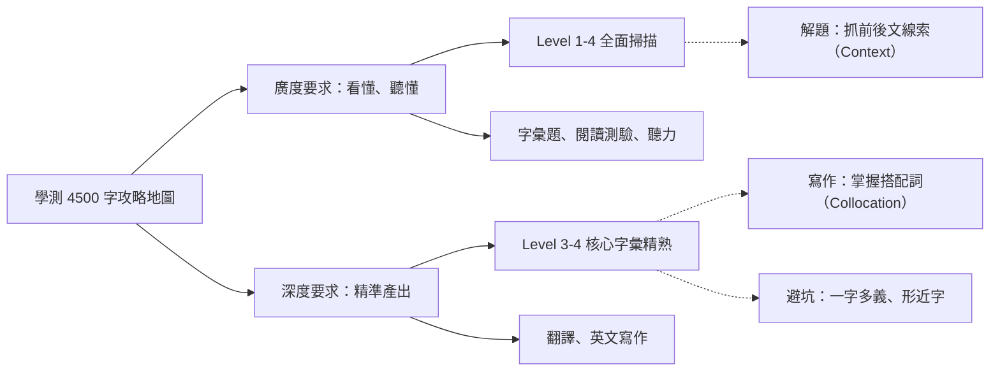

# 高中常用 4500 字彙表（大考中心參考詞彙）

## 💡 為什麼要學？（Start with Why）

學測英文無論是閱讀理解、文意選填還是翻譯寫作，底層邏輯都建立在「字彙量」上。掌握大考中心 1–4 級的 4500 字，就像是取得進入大學殿堂的「基本武裝」。沒有這 4500 字，再好的文法觀念與解題技巧都無用武之地；精熟它們，就能在考試中快速掃描語意、避開陷阱，並在寫作時精準輸出。

## 📌 一句話總結

掌握大考中心 1–4 級 4500 字，是破解學測詞彙題、讀懂長篇閱讀並寫出高分作文的絕對基石。

## 🎯 核心概念

- **分級架構**：大考中心詞彙表共六級，學測範圍主要鎖定第一級至第四級（約 4500 字）。
- **基礎與進階**：Level 1–2 為國中基礎（約 2000 字），Level 3–4 為高中進階，也是學測拉開鑑別度的關鍵。
- **字彙深度要求**：選擇題（閱讀、聽力）考「廣度」（認得即可）；非選題（翻譯、寫作）考「深度」（會拼寫、懂搭配詞與句型）。
- **命題趨勢**：學測字彙題極度重視「一字多義」、「形近字辨析」與「利用前後文語境推敲」。
- **高效學習法**：摒棄死背，應結合「字根字首拆解」、「情境搭配詞」與「間隔重複法」來建立永久記憶。

## 🗺 圖解

## 🌏 生活連結（記憶錨點）

把背單字想像成打 RPG 遊戲的裝備系統。Level 1–2 是你的「新手村裝備」（如蘋果、短劍），能應付基本生存；Level 3–4 是你的「核心魔法與絕招」，用來打敗學測這個大魔王。你在路上遇到怪物的攻擊，只要「認得」就能躲開（閱讀測驗）；但你要反擊時，必須「精熟」你的法術按鍵組合（翻譯寫作的拼寫與搭配詞），按錯一個鍵（拼錯字、用錯介系詞）絕招就發不出來。

## 🧠 記憶法 / 口訣

**四字心法：「拆、串、配、複」**
- **拆**（拆字首字根） / **串**（串聯同源字） / **配**（記搭配詞與語境） / **複**（間隔重複複習）

**字根拆解實戰（以 `spect` 看 為例）**：
- `in` (向內) + `spect` = `inspect` (向內看 → 檢查)
- `ex` (向外) + `spect` = `expect` (向外看 → 期待)
- `re` (回頭) + `spect` = `respect` (回頭看 → 尊敬)
- `pro` (向前) + `spect` = `prospect` (向前看 → 前景/展望)

## ⭐ 考試重點

- [ ] **必背高頻字**：Level 3、Level 4 的動詞與形容詞是詞彙題常客。
- [ ] **常考題型 1（一字多義）**：例如 `address` 不考「地址」，考「處理/發表演說」；`capital` 不考「首都」，考「資本/大寫字母」。
- [ ] **常考題型 2（形近字）**：例如 `adapt` (適應)、`adopt` (採用)、`adept` (熟練) 的混合選項。
- [ ] **常考題型 3（搭配詞）**：考驗單字與特定介系詞或動詞的結合，如 `have access to`（而不是用 `with`）。

## ⚠️ 易錯點 / 陷阱

- **只背中文不看例句**：導致中式英文（Chinglish），例如知道 `open` 是開，就寫出 `open the light`（應為 `turn on`）。
- **忽略詞性變化**：在文意選填中，無法判斷空格該填入名詞還是形容詞，導致即使認得字也選錯。
- **死記硬背不發音**：大腦缺乏聲音連結，導致聽力測驗時明明是學過的字卻聽不懂。

## 🔗 跨科連結

- [GEPT中級核心字](GEPT中級核心字.md)（字根拆解記憶策略與 5 大字根家族）
- [字根字首字尾入門](字根字首字尾入門.md)（字根字首字尾拆解工具箱）
- [字根（Root）定核心](字根（Root）定核心.md)（字根深度學習）
- [字首（Prefix）定方向](字首（Prefix）定方向.md)（字首分類與變形）
- [字尾（Suffix）定詞性](字尾（Suffix）定詞性.md)（詞性判斷與拼字規則）
- 同義字與反義字辨析（字彙深度的進階練習）
- 易混淆字（形近、音近、義近）（形近字辨析專題）

## 📝 一分鐘自我檢測

> 先遮住下方答案，自己想，再對照。

1. Q：學測英文主要測驗大考中心參考詞彙表的哪幾個級別？
   (A) 第 1–2 級 (B) 第 1–4 級 (C) 第 3–6 級 (D) 第 5–6 級
   A：**(B)**。學測主力範圍為 1–4 級約 4500 字。

2. Q：面對學測第一大題「詞彙題」，下列哪一種解題策略最精準？
   (A) 尋找句子中的語意線索與轉折詞來推敲 (B) 挑選字首字母最多的選項 (C) 遇到不會的字直接放棄 (D) 單憑對單字中文解釋的直覺作答
   A：**(A)**。詞彙題極度依賴前後文語意與邏輯轉折推敲。

3. Q：（一字多義陷阱）"The government needs to address the issue of global warming immediately." 句中的 address 意義為何？
   (A) 寫上地址 (B) 寄發 (C) 處理/解決 (D) 穿著
   A：**(C)**。`address an issue/problem` 是大考極高頻的「處理/解決」用法。

4. Q：（形近字辨析）"The company decided to ________ the new technology to improve its efficiency." 應填入何字？
   (A) adapt (B) adopt (C) adept (D) addict
   A：**(B)**。`adopt` 為「採用/收養」；`adapt` 為「適應/改編」；`adept` 為「熟練的」。

---
> 📋 待確認項（內容檢查 Agent 填寫，人工複核後刪除）：
> - 學測對應的 4500 字範圍：108 課綱的大考中心參考詞彙表共六級，總計約 6000 字。網路資料顯示學測核心 4500 字通常指 Level 1–4，但也有部分來源指出涵蓋至 Level 5。請人工確認是否需補充或修改為 Level 1–5。
